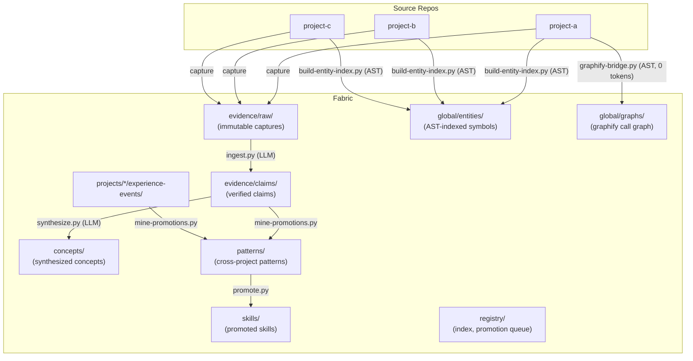
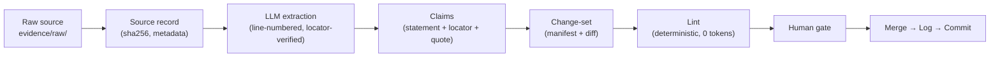
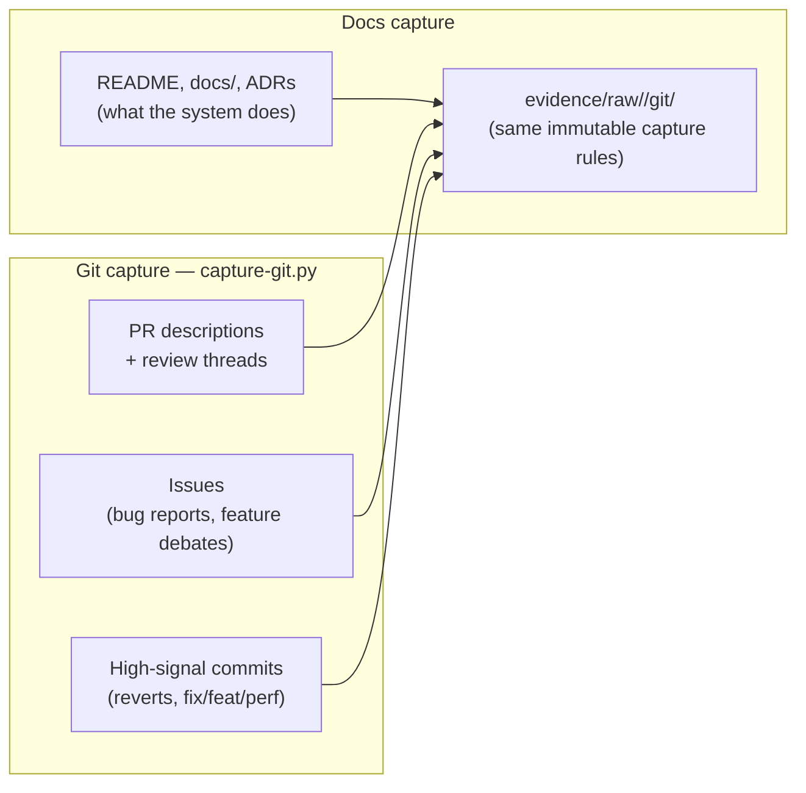
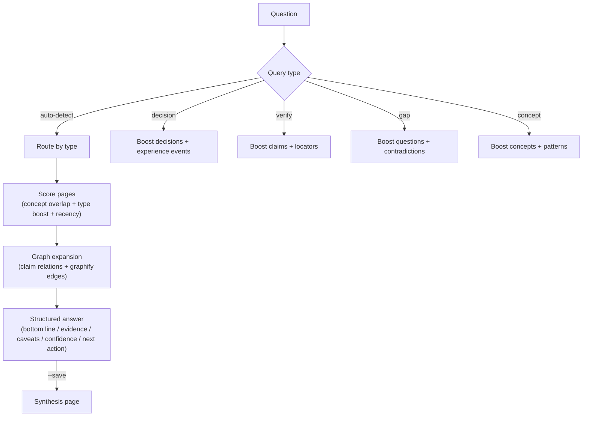
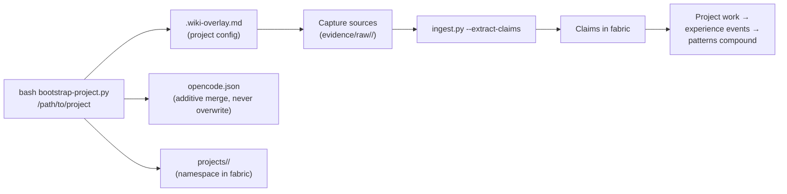
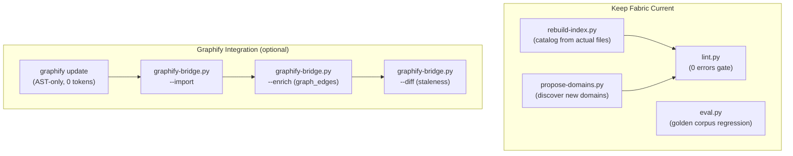
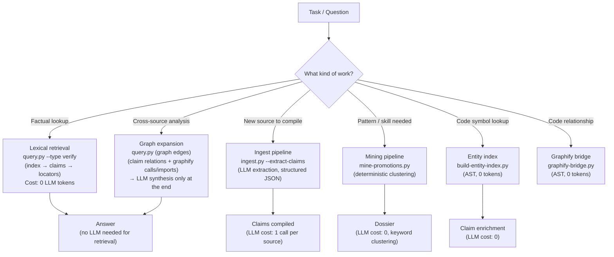
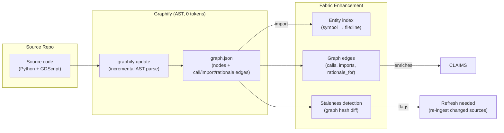

# Wiki Fabric

> **Evidence-first knowledge base that compounds across projects.** Every claim traces to a source locator. Patterns emerge from cross-project experience. The LLM maintains it; you review it.

---

## Why Not Just a Wiki, Notes App, or RAG?

Most knowledge systems fail agents (and humans) in the same ways. Wiki Fabric is designed against those failure modes:

| Common system | Failure mode | Wiki Fabric's answer |
|---|---|---|
| **Wiki / notes app** (Obsidian, Notion, Confluence) | Pages drift from reality; nothing enforces freshness or provenance; orphaned pages rot silently | Every claim carries a `last_verified` date, a source locator, and a verbatim quote. A deterministic linter (14 checks) fails loudly on broken links, orphans, hash drift, and unsupported claims |
| **RAG / vector DB** | Retrieval is opaque; answers cite nothing auditable; stale chunks silently poison results; every question costs tokens | Retrieval is deterministic (lexical + graph expansion, 0 tokens). Answers are structured (`bottom line / evidence / caveats / confidence`) and every evidence item links to a line-level locator you can open and verify |
| **Memory tools** (session memory, auto-summaries) | Unstructured prose; contradicts itself over time; no way to tell "measured" from "guessed" | Claims are atomic and typed: `supported`, `contested`, `superseded`. Contradictions are represented, not collapsed. Confidence and evidence strength are explicit fields, not vibes |
| **ADR collections** | Decisions recorded but never revisited; no feedback loop from outcomes | Decisions connect to experience events (what actually happened), which cluster into patterns with measured maturity. A pattern read but never applied gets flagged |
| **Prompt/skill libraries** | Copied between projects by hand; drift apart; no evidence of what works | Skills and patterns live in one global fabric. Promotion requires replication in ≥2 independent projects. Projects inherit them automatically at session start |
| **Second-brain tools** | Capture is cheap, retrieval and trust are expensive; nothing compounds | Structure from day one: capture → claim → concept → pattern. Each layer is machine-checkable, so the fabric stays queryable as it grows to thousands of pages |

The core bet: **an LLM is a good compiler but a unreliable memory.** So the fabric stores structured, source-anchored claims (not prose summaries), does all retrieval deterministically, and spends LLM tokens only where judgment is needed — extraction and synthesis. You review at defined gates; the machine handles the bookkeeping.

---

## What Is This?

Wiki Fabric is a self-maintaining knowledge system that:

1. **Compiles raw sources into verified claims** — LLM extracts atomic assertions with line-level locators and verbatim quotes from your project docs
2. **Promotes cross-project patterns** — experience events are mined into reusable patterns and skills that compound across all connected projects
3. **Validates itself** — deterministic linter + golden-corpus evaluation measures the compiler, not just the artifacts
4. **Stays current** — graphify AST integration detects code changes at zero token cost; entity index tracks symbol locations

---

## Quick Start

```bash
# One-liner install (installs uv if missing, then the `wf` CLI at ~/.local/bin/)
curl -fsSL https://raw.githubusercontent.com/hybridindie/wiki-fabric/main/scripts/wiki-fabric.sh | bash

# With team corpus sync wired in from the start:
curl -fsSL https://raw.githubusercontent.com/hybridindie/wiki-fabric/main/scripts/wiki-fabric.sh | bash -s -- --corpus git@github.com:your-org/wiki-fabric-corpus.git

wf status                              # check fabric health
wf bootstrap /path/to/my-project       # connect a project
wf capture my-project                  # pull docs from upstream repos → evidence/raw/
wf ingest evidence/raw/my-project/docs/readme.md --extract-claims
wf query "Why does my code batch writes?"
wf log --project my-project --problem "..." --intervention "..." --outcomes "..."
```

The one-liner checks for **uv** (Astral's Python package manager) and installs it
if missing, then creates a `.venv` inside the fabric and installs Python deps
from `requirements.txt` (pyyaml, openai, anthropic) with `uv pip`. Everything
Python runs inside that venv — no system pip pollution, no version drift. If uv
can't be installed, `wf` falls back to plain `python3` (core CLI works; LLM
features need `pip install -r requirements.txt` manually). `wf update` re-syncs
deps if `requirements.txt` changed.

All `wf` commands work without the install too — the underlying scripts live in `scripts/` and run with plain `python3`.

### Tests

The harness tests itself:

```bash
python3 -m pytest tests/ -q    # unit tests: capture filters, ingest parsing, lint helpers
bash scripts/smoke-test.sh     # end-to-end: spins up a throwaway fabric, runs 13 CLI checks
python3 scripts/lint.py .      # fabric self-lint (0-error gate)
```

CI runs all three on every push and PR (`.github/workflows/ci.yml`) using
**uv** for environment setup. The smoke test runs in an isolated temp copy by
default (creating its own uv venv), so it can't dirty your fabric.

---

## Architecture



---

## Core Workflows

### 1. Ingest: Source → Claims



### 1a. Git History Capture: PRs, Issues, Commits → Raw Evidence

Code history is a second capture channel alongside docs. Two sources, one pipeline:



```bash
# GitHub: PR threads + issue reports (via gh CLI)
wf capture my-project --git owner/repo
wf capture my-project --git owner/repo --since 1y --limit 100

# Local repo: high-signal commits only + churn ranking
wf capture my-project --git /path/to/repo --churn

# See what would be captured without writing
wf capture my-project --git owner/repo --dry-run
```

**Why this is helpful — and why it's filtered:**

| Signal | What it gives the fabric | Cost control |
|---|---|---|
| PR bodies + review threads | The *why* behind changes — problem, debate, tradeoffs rejected and chosen. This is `experience-event` material pre-written by people who were there | 1 LLM call per PR, so `--limit` and `--since` bound the blast radius |
| Issues | Structured `observed_problem` reports, often with repro steps and environment details | Filtered by date window; closed/stale issues usually aren't worth extracting |
| Revert commits | Failed interventions — the seeds of anti-patterns. A revert says "we tried this and it was wrong", which docs never record | Deterministic prefix filter, 0 tokens |
| Conventional commits (`fix:`, `feat:`, `perf:`) | Hotspot trail: which subsystems keep breaking | `chore:`/`style:`/`test:`/`ci:` skipped — most commits are noise |
| `--churn` ranking | Tells you *where* to spend ingest budget: high-churn files are where the knowledge is | Pure git analysis, 0 tokens, 0 LLM calls |

The key discipline: **LLM extraction is the most expensive operation in the fabric**
(1 call per source), so git capture pre-filters deterministically and only the
high-signal subset goes through ingest. A repo with 2,000 commits might yield 40
capturable threads — and those 40 carry more decision history than all the docs
combined. Every captured thread keeps its PR number / commit SHA, which are valid
claim locators — auditable the same way line ranges are.

**Scenario — archaeology on a inherited codebase.** You inherit a repo with
thin docs and 8,000 commits. Instead of skimming `git log` by hand, run
`wf capture my-project --git owner/repo --since 1y` then ingest the captured
threads. The fabric compiles claims like "auth middleware was rewritten to
token-based auth because stateful sessions broke horizontally-scaled sessions
(PR #342, review thread)" — context no doc contains, each anchored to a PR you
can open. `--churn` shows the payment module changed 400 times in 6 months:
that's where the tribal knowledge lives, so ingest its PR threads first.

**Scenario — avoiding a repeat failure.** A revert commit says a caching layer
was tried and rolled back. Captured and ingested, it becomes an experience event
with a negative outcome — and months later, when a new session proposes "add a
cache here", `wf query "have we tried caching X?"` returns the revert's history
before anyone re-runs the same experiment.

```bash
# Ingest a source with LLM claim extraction
wf ingest evidence/raw/my-project/docs/readme.md --extract-claims

# Dry run (no files written)
wf ingest --extract-claims --dry-run evidence/raw/foo.md

# Use a different model
WIKI_LLM_MODEL="llama3.1:70b" wf ingest evidence/raw/foo.md --extract-claims
```

**LLM configuration** (env vars, Ollama default):

| Variable | Default | Purpose |
|----------|---------|---------|
| `WIKI_LLM_BASE_URL` | `http://localhost:11434/v1` | OpenAI-compatible endpoint |
| `WIKI_LLM_API_KEY` | `ollama` | API key (Ollama ignores) |
| `WIKI_LLM_MODEL` | `qwen2.5-coder:7b` | Model name |

Works with any OpenAI-compatible endpoint: Ollama, OpenAI, vLLM, LM Studio, Together, etc.

**Scenario — onboarding onto an unfamiliar codebase.** Your project's docs are
scattered across a README, `docs/`, and ADRs. Bootstrap the project, `wf capture`,
then ingest each doc. Within an hour you have a claim graph: "writes serialize on
the main thread (L42)", "batching collapses N round-trips to 1 (L55)". Ask
`wf query "Why is the write path slow?"` and get an answer citing exact lines you
can open — not a hallucinated summary. New docs re-captured later trigger
re-ingest only where the sha256 changed.

**Scenario — auditing an upstream dependency.** Before adopting a library,
capture its docs and changelog into the fabric. After each release,
`wf update` re-captures; hash drift flags exactly which claims are affected by the
new version — so "we rely on their single-writer guarantee" gets re-verified
against the new source text, not forgotten.

**Scenario — bootstrapping from PR history.** Docs tell you what a system does;
PR and issue history tells you why. See **Git History Capture** above: the
"problem → intervention" debates that never make it into docs, deterministically
pre-filtered so LLM extraction stays cheap, with `--churn` pointing ingest
budget at the highest-traffic areas.

### 2. Query: Question → Evidence-Backed Answer



```bash
# Ask anything
wf query "Why does my code batch writes but pipeline reads?"

# Save reusable answers as synthesis pages
wf query "What patterns apply to batch-write systems?" --save

# Force query type
wf query "What did we decide about the bridge?" --type decision
```

**Scenario — mid-session architectural question.** While refactoring, the agent
wonders "do we serialize writes here, or is that only in the other project?"
A lexical query costs 0 tokens and returns the relevant claims with locators —
the agent reads the underlying sources itself instead of asking you to repeat
project history you half-remember.

**Scenario — contradicting sources.** Two docs disagree about a throughput
figure. Ingesting both produces a `status: contested` claim with a `contradicts`
relation, not a silently merged average. Querying the topic surfaces the conflict
with both locators side by side, so a human settles it instead of a model
averaging it.

### 3. Experience → Pattern → Skill (Compounding Loop)

```mermaid
flowchart LR
    W["Project work<br/>(real coding, debugging)"] --> LE["log-experience.py<br/>(capture observation)"]
    LE --> EE["Experience events<br/>(problem → intervention → outcome)"]
    EE --> M["mine-promotions.py<br/>(cluster by concept overlap)"]
    M --> PD["Promotion dossier<br/>(evidence + conditions + boundary)"]
    PD --> HR["Human review<br/>(7-point checklist)"]
    HR --> P["Pattern promoted<br/>(maturity 2, status: recommended)"]
    P --> S["Skill created<br/>(executable procedure)"]
    S --> NEXT["Next project<br/>inherits skills automatically"]
    NEXT -->|"more experience events"| LE
```



```bash
# Capture an experience event
wf log --project my-project \
  --problem "API froze under concurrent writes" \
  --intervention "Added write queue with undo grouping" \
  --outcomes "errors=12→0" --tags "my-project,performance"

# List projects + event counts
wf log --list

# Mine for cross-project patterns
python3 scripts/mine-promotions.py --dry-run
python3 scripts/mine-promotions.py

# Review dossier, then promote
python3 scripts/promote.py --list
python3 scripts/promote.py --promote <dossier-file>.md
```

**Scenario — the same bug bites twice.** Project A hits a deadlock from
concurrent writes; you log the event with measured outcomes. Three weeks later,
project B (a completely different codebase) shows the same signature. After the
second `wf log`, mining clusters the two events into a promotion dossier: same
problem shape, same intervention, independent evidence. After your review, the
pattern is promoted — and project C, bootstrapped next month, inherits the skill
"serialize writes + verify parity" automatically instead of rediscovering the
bug a third time.

**Scenario — killing a bad habit.** Experience events aren't only wins: log
failed interventions too. Mined clusters can produce anti-patterns
("parallel validation writes caused 3 separate incidents") that future sessions
surface as warnings when they detect the setup.

### 4. Bootstrapping: Connect a New Project



```bash
# One-time global install
wf install

# Per-project setup
wf bootstrap /path/to/my-project --name "My Project" \
  --domain agent-systems --domain web-systems \
  --skill serialize-and-verify-writes --init-git

# Then capture + ingest sources
wf capture my-project
wf ingest evidence/raw/my-project/docs/*.md --extract-claims
```

The bootstrap **additively merges** into existing `opencode.json` (never overwrites your MCP config, rules, or references).

**Scenario — spinning up project five.** You've got four projects connected and
start a new one. Bootstrap takes a minute: it writes `.wiki-overlay.md`, creates
`projects/<slug>/`, and merges into `opencode.json` without touching your MCP
servers. At the next session start, the agent loads the global fabric plus this
project's overlay — and immediately knows about the three patterns promoted from
your other projects, the domain ontology, and which skills apply here. No copying
of wiki folders, no "let me catch you up" prompt engineering.

### 5. Maintenance



```bash
# Rebuild index from actual files (writes registry/index.md + registry/index.json)
python3 scripts/rebuild-index.py
python3 scripts/rebuild-index.py --json   # print machine-readable registry to stdout

# Verify health (human-readable)
wf lint

# Verify health (machine-readable, for CI + agent harnesses)
wf lint --format json

# Run formal evaluation (golden corpus)
WIKI_LLM_MODEL="qwen3.8:27b-mlx" python3 scripts/eval.py

# Discover new domains from evidence
python3 scripts/propose-domains.py

# Graphify integration (optional, 0 token cost)
python3 scripts/graphify-bridge.py --all          # full pipeline
python3 scripts/graphify-bridge.py --status       # dashboard
python3 scripts/graphify-bridge.py --diff         # staleness check
```

**Scenario — docs went stale.** You refactor `gather_reads` into
`collect_reads`; the claim "gather_reads makes O(N) reads ~O(1)" now points at a
symbol that no longer exists. The graphify diff (AST-only, 0 tokens) detects the
rename and flags the affected claims as stale. Refresh re-ingests only the
changed source, and the claim either updates or is superseded — with the change
recorded in the change-set manifest, never silently rewritten.

---

## Fabric Inventory

Counts live in your fabric, not the repo. Check yours anytime:

```bash
wf status
```

The repo ships only the harness — examples, templates, schemas, and scripts. Your claims, captures, and patterns accumulate locally as you connect projects.

---

## LLM Tool Routing (Preventing Unnecessary Loops)

The fabric distinguishes between three retrieval layers so the LLM picks the right tool:



**Key principle: LLM tokens are spent on extraction and synthesis, never on retrieval.**

| Task | Tool | LLM Cost |
|------|------|----------|
| Find claims about X | `query.py` | **0 tokens** (lexical + graph) |
| Look up a code symbol | `build-entity-index.py` | **0 tokens** (AST) |
| Check fabric health | `lint.py` | **0 tokens** |
| Detect code staleness | `graphify-bridge.py --diff` | **0 tokens** |
| Discover new domains | `propose-domains.py` | **0 tokens** |
| Extract claims from source | `ingest.py --extract-claims` | 1 LLM call per source |
| Synthesize concept from claims | `synthesize.py` | 1 LLM call per concept |
| Mine cross-project patterns | `mine-promotions.py` | 0 tokens (keyword clustering) |

**Anti-pattern to avoid:** don't call the LLM to answer questions that `query.py` can answer lexically. The retrieval policy routes by query type so the LLM is only invoked for synthesis, never for search.

### Graphify Integration (Optional, 0 Token Cost)



Graphify adds **structural intelligence the LLM can't provide deterministically**:

| Enhancement | How | Cost |
|-------------|-----|------|
| Call-graph expansion | When you query "batch writes", graphify follows `calls` edges to find every function in the batch path | 0 tokens |
| Concept boundaries | Graphify communities (Louvain) map to concept groupings | 0 tokens |
| Staleness detection | Graph diff tells you which symbols moved/changed → flag affected claims | 0 tokens |
| Doc → code provenance | `rationale_for` edges connect documentation claims to the implementing code | 0 tokens |

---

## Note Types

| Type | Location | Purpose |
|------|----------|---------|
| `source` | `evidence/sources/` | Immutable bibliographic record + sha256 |
| `source-summary` | `evidence/source-summaries/` | Faithful summary with locators, no inference |
| `claim` | `evidence/claims/` | Atomic assertion with `source_refs` (locator + quote) + `code_symbols` + `graph_edges` |
| `concept` | `concepts/` or `domains/<d>/concepts/` | Stable explanation built ONLY from linked claims |
| `experience-event` | `projects/<p>/experience-events/` | Structured observation: problem → intervention → outcome |
| `pattern` | `patterns/` | Reusable context→problem→forces→solution (maturity 0–3) |
| `anti-pattern` | `anti-patterns/` | Repeated failure mode; detect and warn |
| `skill` | `skills/` | Reusable procedure with inputs/outputs |
| `decision` | `projects/<p>/decisions/` | ADR-like technical choice record |
| `entity` | `global/entities/` | Code-symbol index from AST parsing |
| `change-set` | `evidence/traces/change-sets/` | Agent-proposed edit batch for human review |
| `synthesis` | `syntheses/` | Query answer filed for reuse |

**See `schemas/frontmatter.md` for full contracts.**

---

## CLI Reference (`wf`)

The `wf` command is the single entry point for controlling the fabric. It installs to `~/.local/bin/wf` (alias `wiki-fabric`).

| Command | Purpose |
|---------|---------|
| `wf install [--repo URL] [--dir DIR]` | Clone + set up the fabric |
| `wf update` | Pull latest, rebuild entity index + catalog, lint |
| `wf status` | Fabric health + inventory counts |
| `wf vault [PATH]` | Create Obsidian vault (symlinks) |
| `wf bootstrap <project-path>` | Connect a project to the fabric |
| `wf capture <project-slug> [--repo PATH]` | Capture upstream repo docs → `evidence/raw/` |
| `wf capture <project-slug> --git <owner/name-or-path>` | Capture PR/issue threads + high-signal commits → `evidence/raw/<slug>/git/` (add `--since 6m`, `--limit 30`, `--churn`) |
| `wf ingest <source> [--extract-claims]` | Ingest a source (LLM claim extraction) |
| `wf query "<question>"` | Ask the fabric a question |
| `wf log --project <slug> ...` | Log an experience event |
| `wf lint` | Run deterministic linter |

Environment: `WIKI_FABRIC_REPO` overrides the source repo URL.

---

## Scripts Reference

| Script | Purpose | LLM Cost |
|--------|---------|----------|
| `ingest.py` | Source → source record → claims (LLM extraction) | 1 call per source |
| `query.py` | Question → evidence-backed answer | 0 tokens (lexical + graph) |
| `lint.py` | 12 deterministic checks | 0 tokens |
| `eval.py` | Golden-corpus evaluation | 1 call per fixture |
| `synthesize.py` | Claims → concept pages | 1 call per concept |
| `log-experience.py` | Capture experience event | 0 tokens |
| `mine-promotions.py` | Cluster experience events → dossiers | 0 tokens |
| `promote.py` | Manage promotion dossiers | 0 tokens |
| `rebuild-index.py` | Rebuild registry index from files | 0 tokens |
| `propose-domains.py` | Discover new domains from evidence | 0 tokens |
| `build-entity-index.py` | AST entity index from source repos | 0 tokens |
| `graphify-bridge.py` | Optional graphify integration | 0 tokens |
| `bootstrap-project.py` | Connect new project to fabric | 0 tokens |
| `bootstrap-fabric.sh` | One-time global install | 0 tokens |
| `apply-changeset.sh` | Apply a change-set to canonical pages | 0 tokens |

---

## Team Sync: Share the Corpus as Source of Truth

One fabric per machine, **one corpus shared via git**. `wf sync` pushes/pulls
your knowledge content (claims, sources, patterns, skills, concepts, experience
events, decisions, syntheses, registry) to a shared git remote — a private
GitHub repo works well. The harness (scripts, schemas) stays per-machine and
updates via `wf update` from the public repo; content and code have different
lifecycles and remotes.

```bash
# One-time: point your fabric at the shared corpus remote
# (or pass --corpus <git-url> to the installer and this is done for you)
wf sync init git@github.com:your-org/wiki-fabric-corpus.git

# Day-to-day, on any machine:
wf sync status        # ahead/behind + uncommitted corpus changes + conflicts
wf sync push -m "ingested upstream docs"   # commit + push corpus changes
wf sync pull          # fetch + merge; conflicts → review queue

# A teammate joins: clone your fabric, then
git remote add corpus git@github.com:your-org/wiki-fabric-corpus.git
wf sync pull
```

**How bootstrap meets the corpus:** when you `wf bootstrap` a project into a
fabric with a corpus remote, the bootstrap writes a small
`projects/<slug>/README.md` (title, owner, date, upstream sources) into the
namespace — that README syncs to the corpus, so teammates see *what* the new
project is the moment it lands. Bootstrap prints whether the project is
local-only or corpus-wired, and `wf sync status` lists new namespaces waiting
on the remote ("New projects on the corpus (pull to receive)"); `wf sync pull`
announces each namespace it delivers, with owner. Teammates discover
new projects by pulling — nothing to configure on their side.

**Conflict policy — review queue, never silent overwrite:** if two machines
changed the same file, `wf sync pull` aborts the merge and writes a conflict
dossier to `registry/conflicts/<date>/` containing *both* versions (ours vs
theirs) side by side. The fabric stays clean; you decide. Unresolved conflicts
make `wf lint` fail (SYNC-CONFLICT errors) and block `wf sync push`, so a
disagreement can't sneak into the shared truth. Resolve by picking the correct
version for the source page, delete the conflict file, then push.

**Why a separate remote from this public repo:** this repo is the public
harness; your corpus is your private knowledge. Keeping them on different
remotes means `wf update` (harness) never touches team content, and `wf sync`
never publishes your corpus to a public URL.

---

## Machine-Readable Contract

Everything the fabric validates and catalogs is available in JSON, so CI and
agent harnesses can consume it without parsing prose:

```bash
wf lint --format json            # errors/warnings with code + page + message, ok flag
python3 scripts/rebuild-index.py # writes registry/index.json (catalog with ids, types, scopes, statuses)
```

The lint report codes are stable: `FRONTMATTER`, `BROKEN-LINK`, `SCOPE`,
`REVIEW-AFTER`, `CLAIM`, `CONCEPT`, `PATTERN`, `DUP-ID`, `SOURCE`,
`SOURCE-DRIFT`, `SYNC-CONFLICT`, `ORPHAN`. `registry/index.json` carries every
cataloged page with its `id`, `type`, `scope`, `status`, `maturity`,
`review_after`, and `last_verified` — a deterministic, auditable answer to
"what knowledge exists and how fresh is it."

**Checks the contract enforces:**

| Check | Meaning |
|-------|---------|
| `SCOPE` | frontmatter `scope:` must match the path-implied scope (`global/` `domains/` `projects/`) — precedence comes from scope, so scope lies are errors |
| `REVIEW-AFTER` | pages with a past `review_after` date are flagged stale (warning; message shows days overdue) — staleness is detected, not forgotten |
| `SYNC-CONFLICT` | unresolved team-sync conflicts block commit/push |
| `SOURCE-DRIFT` | a captured source's sha256 changed without re-ingest |

---

## Key Files

| File | Purpose |
|------|---------|
| `AGENTS.md` | Master schema: layers, note types, workflows, protocols |
| `schemas/frontmatter.md` | Per-type frontmatter contracts |
| `schemas/ontology.md` | Living domain ontology (auto-discovered) |
| `registry/index.md` | Exhaustive catalog (auto-generated) |
| `registry/promotion-queue.md` | Promotion pipeline with review checklist |
| `system/skills/*/SKILL.md` | Skill protocols |
| `fabric.yaml.example` | Config template (repos, owner, LLM) |
| `evaluations/rubric.md` | Evaluation metrics & run protocol |

---

## License

MIT — see [LICENSE](LICENSE). Use freely, contribute back improvements to the fabric.