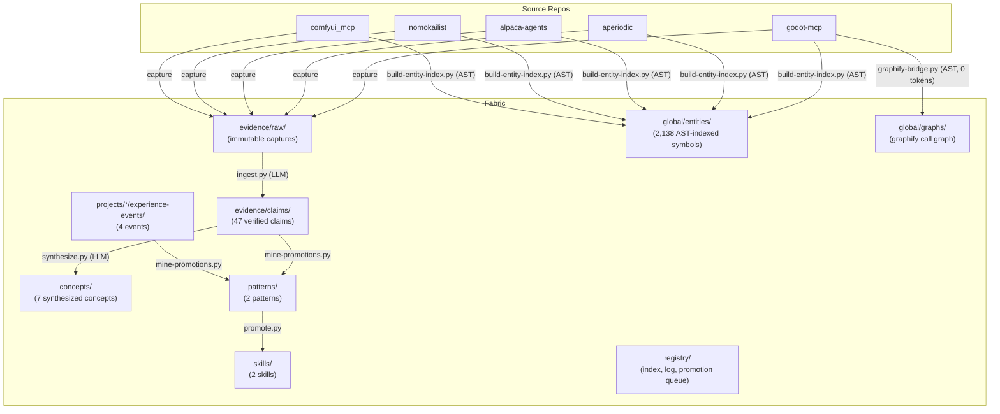
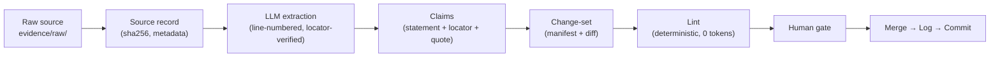
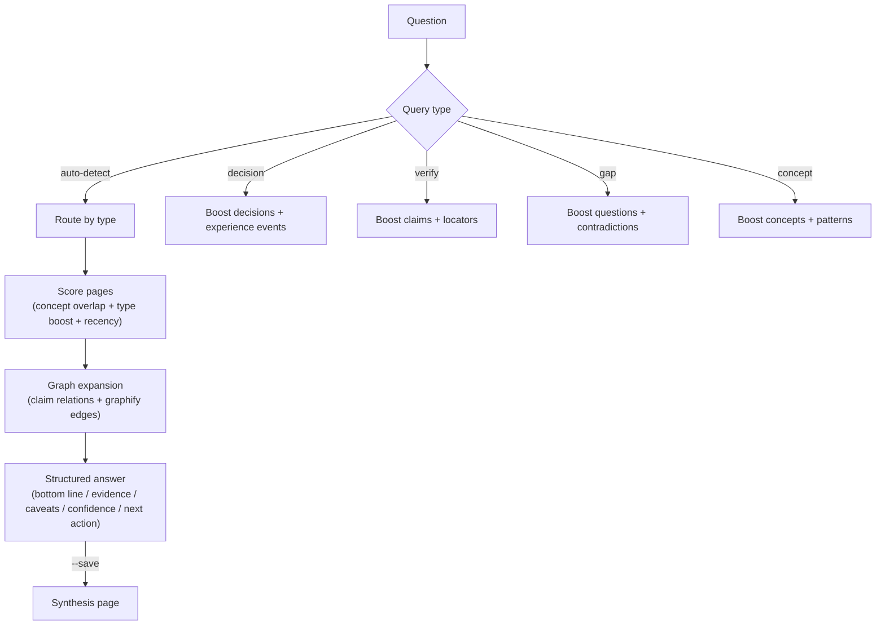
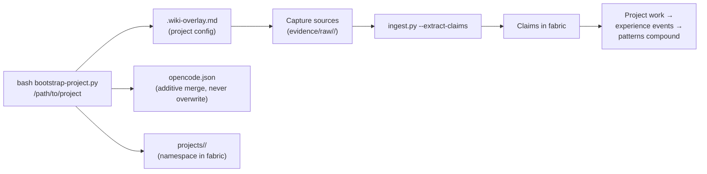
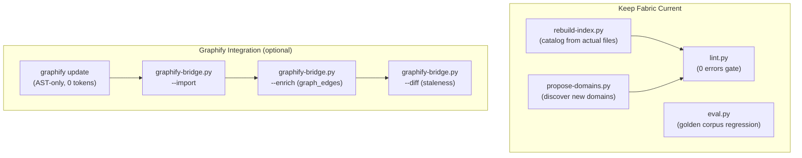
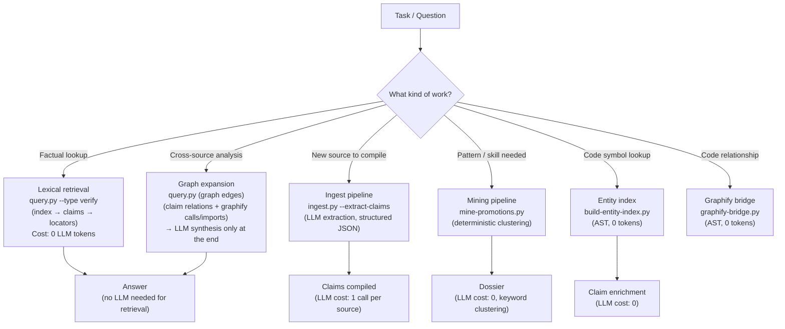
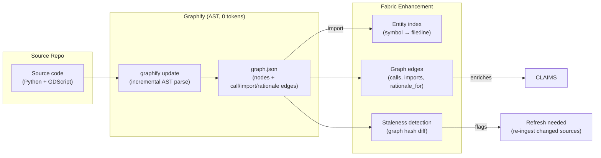

# Wiki Fabric

> **Evidence-first knowledge base that compounds across projects.** Every claim traces to a source locator. Patterns emerge from cross-project experience. The LLM maintains it; you review it.

---

## Quick Start

```bash
# One-liner install (installs the `wf` CLI at ~/.local/bin/)
curl -fsSL https://raw.githubusercontent.com/hybridindie/wiki-fabric/main/scripts/wiki-fabric.sh | bash

wf status                              # check fabric health
wf bootstrap /path/to/my-project       # connect a project
wf capture my-project                  # pull docs from upstream repos → evidence/raw/
wf ingest evidence/raw/my-project/docs/readme.md --extract-claims
wf query "Why does my code batch writes?"
wf log --project my-project --problem "..." --intervention "..." --outcomes "..."
```

All `wf` commands work without the install too — the underlying scripts live in `scripts/` and run with plain `python3`.

---

## What Is This?

Wiki Fabric is a self-maintaining knowledge system that:

1. **Compiles raw sources into verified claims** — LLM extracts atomic assertions with line-level locators and verbatim quotes from your project docs
2. **Promotes cross-project patterns** — experience events are mined into reusable patterns and skills that compound across all connected projects
3. **Validates itself** — deterministic linter + golden-corpus evaluation measures the compiler, not just the artifacts
4. **Stays current** — graphify AST integration detects code changes at zero token cost; entity index tracks symbol locations

---

## Architecture



---

## Core Workflows

### 1. Ingest: Source → Claims



```bash
# Ingest a source with LLM claim extraction
wf ingest evidence/raw/godot-mcp/docs/architecture.md --extract-claims

# Dry run (no files written)
wf ingest --extract-claims --dry-run evidence/raw/foo.md

# Use a different model
WIKI_LLM_MODEL="llama3.1:70b" wf ingest evidence/raw/foo.md --extract-claims
```

**LLM configuration** (env vars, Ollama default):

| Variable | Default | Purpose |
|----------|---------|---------|
| `WIKI_LLM_BASE_URL` | `http://localhost:11434/v1` | OpenAI-compatible endpoint |
| `WIKI_LLM_API_KEY` | `ollama` | API key (Ollama ignores) |
| `WIKI_LLM_MODEL` | `qwen2.5-coder:7b` | Model name |

Works with any OpenAI-compatible endpoint: Ollama, OpenAI, vLLM, LM Studio, Together, etc.

### 2. Query: Question → Evidence-Backed Answer



```bash
# Ask anything
wf query "Why does godot-mcp batch writes but pipeline reads?"

# Save reusable answers as synthesis pages
wf query "What patterns apply to single-writer systems?" --save

# Force query type
wf query "What did we decide about the bridge?" --type decision
```

### 3. Experience → Pattern → Skill (Compounding Loop)

```mermaid
flowchart LR
    W["Project work<br/>(real coding, debugging)"] --> LE["log-experience.py<br/>(capture observation)"]
    LE --> EE["Experience events<br/>(problem → intervention → outcome)"]
    EE --> M["mine-promotions.py<br/>(cluster by concept overlap)"]
    M --> PD["Promotion dossier<br/>(evidence + conditions + boundary)"]
    PD --> HR["Human review<br/>(7-point checklist)"]
    HR --> P["Pattern promoted<br/>(maturity 2, status: recommended)"]
    P --> S["Skill created<br/>(executable procedure)"]
    S --> NEXT["Next project<br/>inherits skills automatically"]
    NEXT -->|"more experience events"| LE
```



```bash
# Capture an experience event
wf log --project godot-mcp \
  --problem "Editor froze on batch mutation" \
  --intervention "Added batch queue with undo grouping" \
  --outcomes "frame_drops=12→0" --tags "godot-mcp,performance"

# List projects + event counts
wf log --list

# Mine for cross-project patterns
python3 scripts/mine-promotions.py --dry-run
python3 scripts/mine-promotions.py

# Review dossier, then promote
python3 scripts/promote.py --list
python3 scripts/promote.py --promote promotion-consolidate-validation.md
```

### 4. Bootstrapping: Connect a New Project



```bash
# One-time global install
wf install

# Per-project setup
wf bootstrap /path/to/my-project --name "My Project" \
  --domain agent-systems --domain web-systems \
  --skill serialize-and-verify-writes --init-git

# Then capture + ingest sources
wf capture my-project
wf ingest evidence/raw/my-project/docs/*.md --extract-claims
```

The bootstrap **additively merges** into existing `opencode.json` (never overwrites your MCP config, rules, or references).

### 5. Maintenance



```bash
# Rebuild index from actual files
python3 scripts/rebuild-index.py

# Verify health
wf lint

# Run formal evaluation (golden corpus)
WIKI_LLM_MODEL="qwen3.8:27b-mlx" python3 scripts/eval.py

# Discover new domains from evidence
python3 scripts/propose-domains.py

# Graphify integration (optional, 0 token cost)
python3 scripts/graphify-bridge.py --all          # full pipeline
python3 scripts/graphify-bridge.py --status       # dashboard
python3 scripts/graphify-bridge.py --diff         # staleness check
```

---

## Fabric Inventory

| Layer | Count | Purpose |
|-------|-------|---------|
| Claims | 47 | Atomic evidence with locators + quotes |
| Concepts | 7 | Synthesized explanations from claim clusters |
| Sources | 17 | Immutable captures from 6 repos |
| Source summaries | 16 | Faithful, locator-rich summaries |
| Patterns | 2 | Cross-project, maturity 2 |
| Anti-patterns | 2 | Detected failure modes |
| Skills | 2 | Reusable agent procedures |
| Experience events | 4 | From 4 connected projects |
| Entities (AST) | 2,138 | Code symbols across 4 repos |
| Graph edges (graphify) | 4,419 | Call/import/inherits relationships |
| Lint | **0 errors** | Deterministic, 12 checks |

---

## LLM Tool Routing (Preventing Unnecessary Loops)

The fabric distinguishes between three retrieval layers so the LLM picks the right tool:



**Key principle: LLM tokens are spent on extraction and synthesis, never on retrieval.**

| Task | Tool | LLM Cost |
|------|------|----------|
| Find claims about X | `query.py` | **0 tokens** (lexical + graph) |
| Look up a code symbol | `build-entity-index.py` | **0 tokens** (AST) |
| Check fabric health | `lint.py` | **0 tokens** |
| Detect code staleness | `graphify-bridge.py --diff` | **0 tokens** |
| Discover new domains | `propose-domains.py` | **0 tokens** |
| Extract claims from source | `ingest.py --extract-claims` | 1 LLM call per source |
| Synthesize concept from claims | `synthesize.py` | 1 LLM call per concept |
| Mine cross-project patterns | `mine-promotions.py` | 0 tokens (keyword clustering) |

**Anti-pattern to avoid:** don't call the LLM to answer questions that `query.py` can answer lexically. The retrieval policy routes by query type so the LLM is only invoked for synthesis, never for search.

### Graphify Integration (Optional, 0 Token Cost)



Graphify adds **structural intelligence the LLM can't provide deterministically**:

| Enhancement | How | Cost |
|-------------|-----|------|
| Call-graph expansion | When you query "batch writes", graphify follows `calls` edges to find every function in the batch path | 0 tokens |
| Concept boundaries | Graphify communities (Louvain) map to concept groupings | 0 tokens |
| Staleness detection | Graph diff tells you which symbols moved/changed → flag affected claims | 0 tokens |
| Doc → code provenance | `rationale_for` edges connect documentation claims to the implementing code | 0 tokens |

---

## Note Types

| Type | Location | Purpose |
|------|----------|---------|
| `source` | `evidence/sources/` | Immutable bibliographic record + sha256 |
| `source-summary` | `evidence/source-summaries/` | Faithful summary with locators, no inference |
| `claim` | `evidence/claims/` | Atomic assertion with `source_refs` (locator + quote) + `code_symbols` + `graph_edges` |
| `concept` | `concepts/` or `domains/<d>/concepts/` | Stable explanation built ONLY from linked claims |
| `experience-event` | `projects/<p>/experience-events/` | Structured observation: problem → intervention → outcome |
| `pattern` | `patterns/` | Reusable context→problem→forces→solution (maturity 0–3) |
| `anti-pattern` | `anti-patterns/` | Repeated failure mode; detect and warn |
| `skill` | `skills/` | Reusable procedure with inputs/outputs |
| `decision` | `projects/<p>/decisions/` | ADR-like technical choice record |
| `entity` | `global/entities/` | Code-symbol index from AST parsing |
| `change-set` | `evidence/traces/change-sets/` | Agent-proposed edit batch for human review |
| `synthesis` | `syntheses/` | Query answer filed for reuse |

**See `schemas/frontmatter.md` for full contracts.**

---

## CLI Reference (`wf`)

The `wf` command is the single entry point for controlling the fabric. It installs to `~/.local/bin/wf` (alias `wiki-fabric`).

| Command | Purpose |
|---------|---------|
| `wf install [--repo URL] [--dir DIR]` | Clone + set up the fabric |
| `wf update` | Pull latest, rebuild entity index + catalog, lint |
| `wf status` | Fabric health + inventory counts |
| `wf vault [PATH]` | Create Obsidian vault (symlinks) |
| `wf bootstrap <project-path>` | Connect a project to the fabric |
| `wf capture <project-slug> [--repo PATH]` | Capture upstream repo docs → `evidence/raw/` |
| `wf ingest <source> [--extract-claims]` | Ingest a source (LLM claim extraction) |
| `wf query "<question>"` | Ask the fabric a question |
| `wf log --project <slug> ...` | Log an experience event |
| `wf lint` | Run deterministic linter |

Environment: `WIKI_FABRIC_REPO` overrides the source repo URL.

---

## Scripts Reference

| Script | Purpose | LLM Cost |
|--------|---------|----------|
| `ingest.py` | Source → source record → claims (LLM extraction) | 1 call per source |
| `query.py` | Question → evidence-backed answer | 0 tokens (lexical + graph) |
| `lint.py` | 12 deterministic checks | 0 tokens |
| `eval.py` | Golden-corpus evaluation | 1 call per fixture |
| `synthesize.py` | Claims → concept pages | 1 call per concept |
| `log-experience.py` | Capture experience event | 0 tokens |
| `mine-promotions.py` | Cluster experience events → dossiers | 0 tokens |
| `promote.py` | Manage promotion dossiers | 0 tokens |
| `rebuild-index.py` | Rebuild registry index from files | 0 tokens |
| `propose-domains.py` | Discover new domains from evidence | 0 tokens |
| `build-entity-index.py` | AST entity index from source repos | 0 tokens |
| `graphify-bridge.py` | Optional graphify integration | 0 tokens |
| `bootstrap-project.py` | Connect new project to fabric | 0 tokens |
| `bootstrap-fabric.sh` | One-time global install | 0 tokens |
| `apply-changeset.sh` | Apply a change-set to canonical pages | 0 tokens |

---

## Key Files

| File | Purpose |
|------|---------|
| `AGENTS.md` | Master schema: layers, note types, workflows, protocols |
| `schemas/frontmatter.md` | Per-type frontmatter contracts |
| `schemas/ontology.md` | Living domain ontology (auto-discovered) |
| `registry/index.md` | Exhaustive catalog (auto-generated) |
| `registry/log.md` | Append-only operation timeline |
| `registry/promotion-queue.md` | Promotion pipeline with review checklist |
| `system/skills/*/SKILL.md` | Skill protocols |
| `fabric.yaml.example` | Config template (repos, owner, LLM) |
| `evaluations/rubric.md` | Evaluation metrics & run protocol |

---

## Connected Projects

| Project | Domain | Claims | Experience Events | Entity Pages |
|---------|--------|--------|-------------------|-------------|
| godot-mcp | agent-systems, godot-systems | 27 | 1 | 342 |
| aperiodic | godot-systems | 13 | 1 | 91 |
| alpaca-agents | agent-systems | 7 | 1 | 922 |
| nomokailist | agent-systems | 0 | 1 | 784 |
| instructions-and-rules | agent-systems | 7 | 0 | — |
| comfyui_mcp | mcp-systems | 0 | 0 | — |

---

## License

MIT — see [LICENSE](LICENSE). Use freely, contribute back improvements to the fabric.