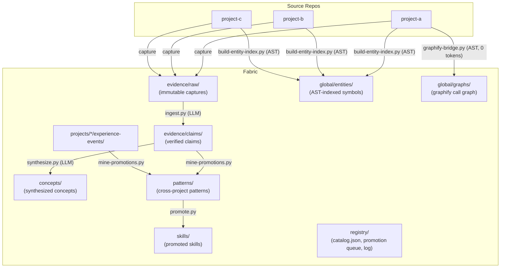
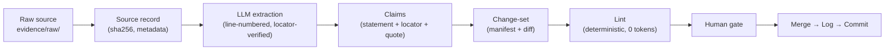
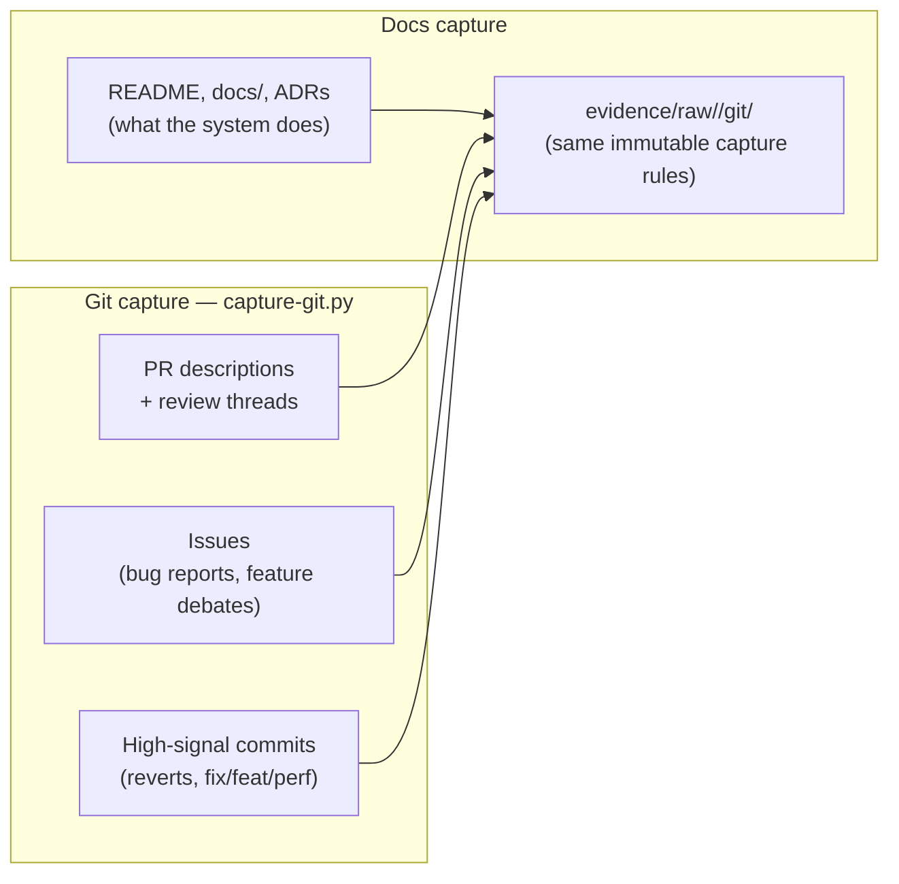
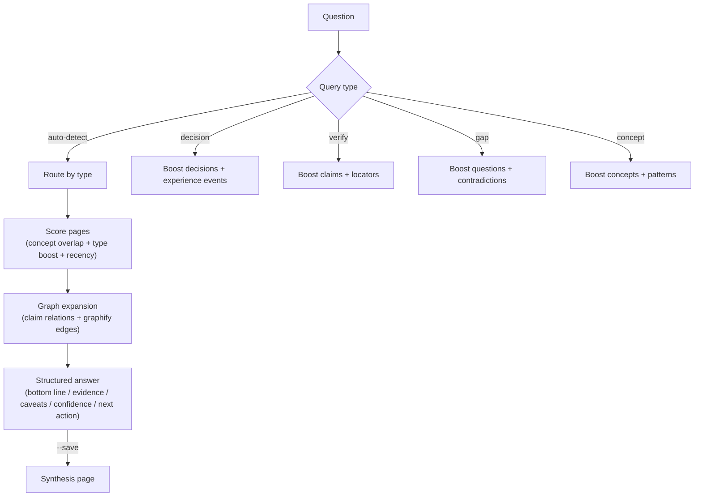
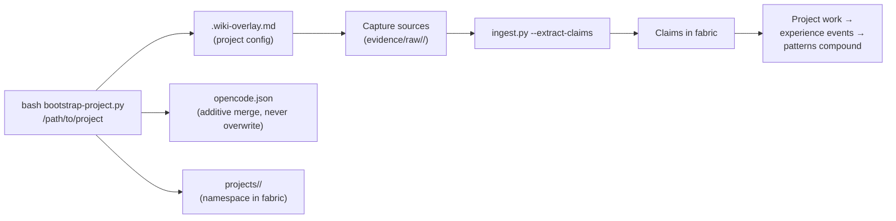
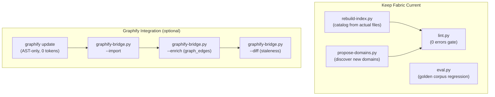
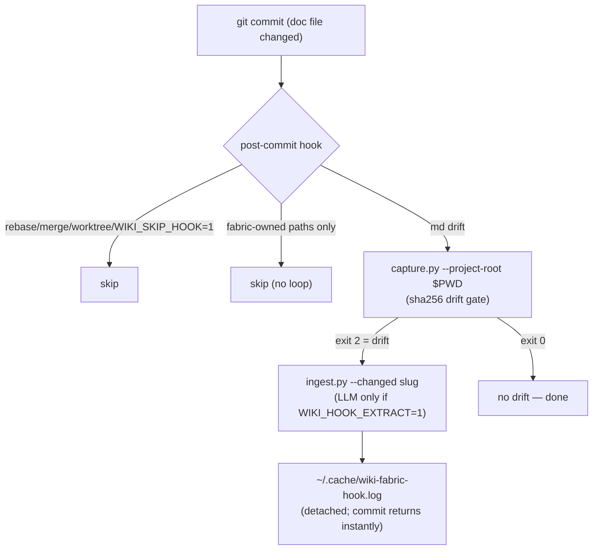
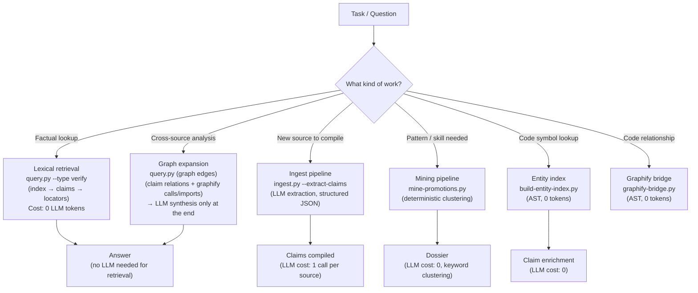
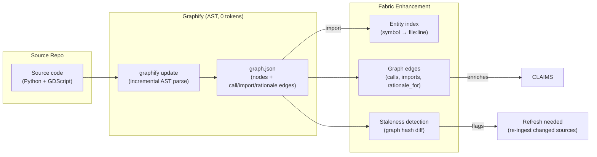

# Wiki Fabric

[](https://github.com/hybridindie/wiki-fabric/actions/workflows/ci.yml)

> **Git-native, testable knowledge governance for AI coding agents.**
> Project memory that is scoped by precedence, traceable to evidence, enforced by CI — and *provably delivered* before an agent writes code.

**Positioning in one line:** Wiki Fabric treats repository knowledge as operational infrastructure for agents — a governed context layer, not a note vault. Where generic "LLM wiki" projects stop at self-maintaining Markdown, Wiki Fabric adds the three things that make knowledge *trustworthy at task time*: scope with precedence, provenance with staleness gates, and behavior evaluations that measure whether the knowledge changed the agent's decision.

**The one-session proof** — a fabric containing one pattern, one anti-pattern, and one project decision changes what an agent is *told* before it writes code:

```bash
bash scripts/demo.sh
```

```text
▸ Agent asks for task context: "Add token refresh to the auth service"

## Selected
### Project (highest precedence)
- [[decision-rotation-over-sessions]] — project match: auth-service
### Global
- [[anti-pattern-shared-token-cache]] — global pattern match: token
- [[pattern-token-rotation]] — global pattern match: refresh, token

## Excluded
- `patterns/pattern-superseded.md` — superseded
- `patterns/pattern-stale.md` — stale: review_after overdue 255 days

✓ anti-pattern warning delivered: agent is told NOT to build a shared token cache
✓ project decision delivered: binding, highest precedence
✓ correct alternative delivered: per-session cache

PROOF: without the fabric, an LLM would plausibly implement the banned shared cache.
With the manifest, the banned approach is named in the prompt BEFORE code is written.
```

The agent's prompt now contains `[DO NOT] shared token cache → per-session + rotation` — knowledge mined from two projects' real failures, delivered deterministically, 0 tokens, with the reason for every inclusion and exclusion. Run `bash scripts/demo.sh --json` for the machine-checkable manifest.


> [!WARNING]
> **Very early alpha — expect breaking changes.** Wiki Fabric is under active
> development on a single-maintainer cadence. The core loop works end-to-end
> (capture → ingest → query → promote, verified on real projects), but:
>
> - **Breaking schema changes will happen** without migration scripts — the
>   frontmatter contracts and note types are still moving.
> - **Claim extraction quality varies by model.** Extraction is a spending
>   operation routed by tier (cloud default, local optional); quality/noise
>   tradeoffs are being tuned (e.g. code-symbol enrichment is currently noisy).
> - **Single-node only.** Team sync (`wf sync`) exists but conflict resolution
>   is a manual dossier review, not a polished flow.
> - **Not packaged.** No pip/npm distribution yet — clone-and-run with `uv`.
>   Windows is untested (git hooks are POSIX-verified only).
> - **No stable API.** Scripts, CLI flags, and registry formats change without
>   notice or deprecation windows.
>
> Useful today if you want to shape the direction (issues welcome). Not yet
> recommended as load-bearing infrastructure for a team's agent memory.

**What is core vs. optional:**

| Layer | Status |
|-------|--------|
| Knowledge format (claims with locators, patterns, decisions, scopes) | **core format** |
| `wf context` — task manifest compiler | **core** |
| Contract enforcement (`lint.py` + JSON, CI gate) | **core** |
| Behavior evaluations (`eval-behavior.py`) | **core** |
| `wf` CLI, uv install | reference implementation |
| **Graphify** (call-graph staleness, claim enrichment, graph expansion) | **optional integration** — off by default, enable via `integrations.graphify.enabled: true` or `wf update --with-graphify` |
| **Embeddings** (semantic re-ranking) | **optional integration** — off by default, planned |
| Git history capture, corpus team sync | integrations |
| MCP server, multi-harness skill packs | roadmap |

---

## Why Not Just a Wiki, Notes App, or RAG?

Most knowledge systems fail agents (and humans) in the same ways. Wiki Fabric is designed against those failure modes — and, critically, the governance claims are **executable**: lint enforces them (`SCOPE`, `REVIEW-AFTER`, `SYNC-CONFLICT`, `SOURCE-DRIFT`), CI proves them, and behavior evals measure delivery.

| Common system | Failure mode | Wiki Fabric's answer |
|---|---|---|
| **Wiki / notes app** (Obsidian, Notion, Confluence) | Pages drift from reality; nothing enforces freshness or provenance; orphaned pages rot silently | Every claim carries a `last_verified` date, a source locator, and a verbatim quote. A deterministic linter (14 checks) fails loudly on broken links, orphans, hash drift, and unsupported claims |
| **RAG / vector DB** | Retrieval is opaque; answers cite nothing auditable; stale chunks silently poison results; every question costs tokens | Retrieval is deterministic (lexical + graph expansion, 0 tokens). Answers are structured (`bottom line / evidence / caveats / confidence`) and every evidence item links to a line-level locator you can open and verify |
| **Memory tools** (session memory, auto-summaries) | Unstructured prose; contradicts itself over time; no way to tell "measured" from "guessed" | Claims are atomic and typed: `supported`, `contested`, `superseded`. Contradictions are represented, not collapsed. Confidence and evidence strength are explicit fields, not vibes |
| **ADR collections** | Decisions recorded but never revisited; no feedback loop from outcomes | Decisions connect to experience events (what actually happened), which cluster into patterns with measured maturity. A pattern read but never applied gets flagged |
| **Prompt/skill libraries** | Copied between projects by hand; drift apart; no evidence of what works | Skills and patterns live in one global fabric. Promotion requires replication in ≥2 independent projects. Projects inherit them automatically at session start |
| **Second-brain tools** | Capture is cheap, retrieval and trust are expensive; nothing compounds | Structure from day one: capture → claim → concept → pattern. Each layer is machine-checkable, so the fabric stays queryable as it grows to thousands of pages |

The core bet: **an LLM is a good compiler but a unreliable memory.** So the fabric stores structured, source-anchored claims (not prose summaries), does all retrieval deterministically, and spends LLM tokens only where judgment is needed — extraction and synthesis. You review at defined gates; the machine handles the bookkeeping.

---

## What Is This?

Wiki Fabric is a governance layer and reference implementation for coding-agent memory. Four properties, each machine-enforced:

1. **Compiles raw sources into verified claims** — LLM extracts atomic assertions with line-level locators and verbatim quotes. Provenance is mandatory (lint: claims without sources can't become canonical).
2. **Promotes cross-project patterns with measured maturity** — experience events are deterministically clustered into promotion dossiers; promotion requires ≥2 independent projects and human review.
3. **Enforces scope precedence at task time** — `wf context` compiles project decisions > domain patterns > global policies into a manifest where every inclusion/exclusion carries a reason, and stale/superseded knowledge is filtered before it can mislead.
4. **Measures behavior, not vibes** — behavior evals verify the knowledge actually changes agent decisions (avoids banned approaches, honors constraints, escalates gaps); the compiler has its own golden-corpus eval; CI fails on regression.

Everything else — the `wf` CLI, uv installer, Obsidian vault, git-history capture, corpus sync — is reference implementation and integrations around that core.

---

## The Loop (one page, start to finish)

The daily-use cycle — each step is a command, every step is checked:

| # | Step | Command | Enforced by |
|---|------|---------|-------------|
| 1 | **Connect** a project | `wf bootstrap /path/to/project` | namespace created, README written to corpus |
| 2 | **Capture** knowledge | `wf capture p --git owner/repo` + `--git` for PR history | immutable raw + sha256 |
| 3 | **Compile** sources → claims | `wf ingest <src> --extract-claims` | change-set + lint gate |
| 4 | **Validate** | `wf lint` (or `--format json`) | 0 errors before merge |
| 5 | **Compile task context** | `wf context --task "..."` | manifest with reasons + precedence |
| 6 | **Agent works, then learns** | `wf log --project p ...` | experience event captured |
| 7 | **Mine + review** | `mine-promotions` → human gate → `promote` | maturity gates, no auto-promotion |

Then loop: step 7's promoted pattern is step 5's context for the next project — that's the compounding. CI proves every arrow in this table.

---

## Quick Start

> Alpha reality check: the demo below is deterministic and works everywhere.
> Real-fabric setup (`wf bootstrap` + ingest + extraction) is the alpha part —
> expect rough edges, and file issues for anything that bites.

```bash
# See the value in 5 seconds (no install):
bash scripts/demo.sh

# One-liner install (installs uv if missing, then the `wf` CLI at ~/.local/bin/)
curl -fsSL https://raw.githubusercontent.com/hybridindie/wiki-fabric/main/scripts/wiki-fabric.sh | bash

# With team corpus sync wired in from the start:
curl -fsSL https://raw.githubusercontent.com/hybridindie/wiki-fabric/main/scripts/wiki-fabric.sh | bash -s -- --corpus git@github.com:your-org/wiki-fabric-corpus.git

wf status                              # check fabric health
wf bootstrap /path/to/my-project       # connect a project
wf capture my-project                  # pull docs from upstream repos → evidence/raw/
wf ingest evidence/raw/my-project/docs/readme.md --extract-claims
wf query "Why does my code batch writes?"
wf log --project my-project --problem "..." --intervention "..." --outcomes "..."

# Automate the refresh loop (opt-in, per project):
wf hook install --extract-claims       # doc-drift commits auto-capture + auto-ingest
wf claude install                      # always-on instructions in AGENTS.md/CLAUDE.md
```

The one-liner checks for **uv** (Astral's Python package manager) and installs it
if missing, then creates a `.venv` inside the fabric and installs Python deps
from `requirements.txt` (pyyaml, openai, anthropic) with `uv pip`. Everything
Python runs inside that venv — no system pip pollution, no version drift. If uv
can't be installed, `wf` falls back to plain `python3` (core CLI works; LLM
features need `pip install -r requirements.txt` manually). `wf update` re-syncs
deps if `requirements.txt` changed.

All `wf` commands work without the install too — the underlying scripts live in `scripts/` and run with plain `python3`.

### Tests

The harness tests itself:

```bash
python3 -m pytest tests/ -q    # unit tests: capture filters, ingest parsing, lint helpers
bash scripts/smoke-test.sh     # end-to-end: spins up a throwaway fabric, runs 13 CLI checks
python3 scripts/lint.py .      # fabric self-lint (0-error gate)
```

CI runs all three on every push and PR (`.github/workflows/ci.yml`) using
**uv** for environment setup. The smoke test runs in an isolated temp copy by
default (creating its own uv venv), so it can't dirty your fabric.

---

## Architecture



---

## Core Workflows

### 1. Ingest: Source → Claims



### 1a. Git History Capture: PRs, Issues, Commits → Raw Evidence

Code history is a second capture channel alongside docs. Two sources, one pipeline:



```bash
# GitHub: PR threads + issue reports (via gh CLI)
wf capture my-project --git owner/repo
wf capture my-project --git owner/repo --since 1y --limit 100

# Local repo: high-signal commits only + churn ranking
wf capture my-project --git /path/to/repo --churn

# See what would be captured without writing
wf capture my-project --git owner/repo --dry-run
```

**Why this is helpful — and why it's filtered:**

| Signal | What it gives the fabric | Cost control |
|---|---|---|
| PR bodies + review threads | The *why* behind changes — problem, debate, tradeoffs rejected and chosen. This is `experience-event` material pre-written by people who were there | 1 LLM call per PR, so `--limit` and `--since` bound the blast radius |
| Issues | Structured `observed_problem` reports, often with repro steps and environment details | Filtered by date window; closed/stale issues usually aren't worth extracting |
| Revert commits | Failed interventions — the seeds of anti-patterns. A revert says "we tried this and it was wrong", which docs never record | Deterministic prefix filter, 0 tokens |
| Conventional commits (`fix:`, `feat:`, `perf:`) | Hotspot trail: which subsystems keep breaking | `chore:`/`style:`/`test:`/`ci:` skipped — most commits are noise |
| `--churn` ranking | Tells you *where* to spend ingest budget: high-churn files are where the knowledge is | Pure git analysis, 0 tokens, 0 LLM calls |

The key discipline: **LLM extraction is the most expensive operation in the fabric**
(1 call per source), so git capture pre-filters deterministically and only the
high-signal subset goes through ingest. A repo with 2,000 commits might yield 40
capturable threads — and those 40 carry more decision history than all the docs
combined. Every captured thread keeps its PR number / commit SHA, which are valid
claim locators — auditable the same way line ranges are.

**Scenario — archaeology on a inherited codebase.** You inherit a repo with
thin docs and 8,000 commits. Instead of skimming `git log` by hand, run
`wf capture my-project --git owner/repo --since 1y` then ingest the captured
threads. The fabric compiles claims like "auth middleware was rewritten to
token-based auth because stateful sessions broke horizontally-scaled sessions
(PR #342, review thread)" — context no doc contains, each anchored to a PR you
can open. `--churn` shows the payment module changed 400 times in 6 months:
that's where the tribal knowledge lives, so ingest its PR threads first.

**Scenario — avoiding a repeat failure.** A revert commit says a caching layer
was tried and rolled back. Captured and ingested, it becomes an experience event
with a negative outcome — and months later, when a new session proposes "add a
cache here", `wf query "have we tried caching X?"` returns the revert's history
before anyone re-runs the same experiment.

```bash
# Ingest a source with LLM claim extraction
wf ingest evidence/raw/my-project/docs/readme.md --extract-claims

# Dry run (no files written)
wf ingest --extract-claims --dry-run evidence/raw/foo.md

# Use a different model
WIKI_LLM_MODEL="llama3.1:70b" wf ingest evidence/raw/foo.md --extract-claims
```

**LLM configuration** (env vars, Ollama default):

| Variable | Default | Purpose |
|----------|---------|---------|
| `WIKI_LLM_BASE_URL` | `http://localhost:11434/v1` | OpenAI-compatible endpoint |
| `WIKI_LLM_API_KEY` | `ollama` | API key (Ollama ignores) |
| `WIKI_LLM_MODEL` | `qwen2.5-coder:7b` | Model name |

Works with any OpenAI-compatible endpoint: Ollama, OpenAI, vLLM, LM Studio, Together, etc.

**Scenario — onboarding onto an unfamiliar codebase.** Your project's docs are
scattered across a README, `docs/`, and ADRs. Bootstrap the project, `wf capture`,
then ingest each doc. Within an hour you have a claim graph: "writes serialize on
the main thread (L42)", "batching collapses N round-trips to 1 (L55)". Ask
`wf query "Why is the write path slow?"` and get an answer citing exact lines you
can open — not a hallucinated summary. New docs re-captured later trigger
re-ingest only where the sha256 changed.

**Scenario — auditing an upstream dependency.** Before adopting a library,
capture its docs and changelog into the fabric. After each release,
`wf update` re-captures; hash drift flags exactly which claims are affected by the
new version — so "we rely on their single-writer guarantee" gets re-verified
against the new source text, not forgotten.

**Scenario — bootstrapping from PR history.** Docs tell you what a system does;
PR and issue history tells you why. See **Git History Capture** above: the
"problem → intervention" debates that never make it into docs, deterministically
pre-filtered so LLM extraction stays cheap, with `--churn` pointing ingest
budget at the highest-traffic areas.

### 2. Query: Question → Evidence-Backed Answer



```bash
# Ask anything
wf query "Why does my code batch writes but pipeline reads?"

# Save reusable answers as synthesis pages
wf query "What patterns apply to batch-write systems?" --save

# Force query type
wf query "What did we decide about the bridge?" --type decision
```

**Scenario — mid-session architectural question.** While refactoring, the agent
wonders "do we serialize writes here, or is that only in the other project?"
A lexical query costs 0 tokens and returns the relevant claims with locators —
the agent reads the underlying sources itself instead of asking you to repeat
project history you half-remember.

**Scenario — contradicting sources.** Two docs disagree about a throughput
figure. Ingesting both produces a `status: contested` claim with a `contradicts`
relation, not a silently merged average. Querying the topic surfaces the conflict
with both locators side by side, so a human settles it instead of a model
averaging it.

### 3. Experience → Pattern → Skill (Compounding Loop)

```mermaid
flowchart LR
    W["Project work<br/>(real coding, debugging)"] --> LE["log-experience.py<br/>(capture observation)"]
    LE --> EE["Experience events<br/>(problem → intervention → outcome)"]
    EE --> M["mine-promotions.py<br/>(cluster by concept overlap)"]
    M --> PD["Promotion dossier<br/>(evidence + conditions + boundary)"]
    PD --> HR["Human review<br/>(7-point checklist)"]
    HR --> P["Pattern promoted<br/>(maturity 2, status: recommended)"]
    P --> S["Skill created<br/>(executable procedure)"]
    S --> NEXT["Next project<br/>inherits skills automatically"]
    NEXT -->|"more experience events"| LE
```



```bash
# Capture an experience event
wf log --project my-project \
  --problem "API froze under concurrent writes" \
  --intervention "Added write queue with undo grouping" \
  --outcomes "errors=12→0" --tags "my-project,performance"

# List projects + event counts
wf log --list

# Mine for cross-project patterns
python3 scripts/mine-promotions.py --dry-run
python3 scripts/mine-promotions.py

# Review dossier, then promote
python3 scripts/promote.py --list
python3 scripts/promote.py --promote <dossier-file>.md
```

**Scenario — the same bug bites twice.** Project A hits a deadlock from
concurrent writes; you log the event with measured outcomes. Three weeks later,
project B (a completely different codebase) shows the same signature. After the
second `wf log`, mining clusters the two events into a promotion dossier: same
problem shape, same intervention, independent evidence. After your review, the
pattern is promoted — and project C, bootstrapped next month, inherits the skill
"serialize writes + verify parity" automatically instead of rediscovering the
bug a third time.

**Scenario — killing a bad habit.** Experience events aren't only wins: log
failed interventions too. Mined clusters can produce anti-patterns
("parallel validation writes caused 3 separate incidents") that future sessions
surface as warnings when they detect the setup.

### 4. Bootstrapping: Connect a New Project



```bash
# One-time global install
wf install

# Per-project setup
wf bootstrap /path/to/my-project --name "My Project" \
  --domain agent-systems --domain web-systems \
  --skill serialize-and-verify-writes --init-git

# Then capture + ingest sources
wf capture my-project
wf ingest evidence/raw/my-project/docs/*.md --extract-claims
```

The bootstrap **additively merges** into existing `opencode.json` (never overwrites your MCP config, rules, or references).

**Scenario — spinning up project five.** You've got four projects connected and
start a new one. Bootstrap takes a minute: it writes `.wiki-overlay.md`, creates
`projects/<slug>/`, and merges into `opencode.json` without touching your MCP
servers. At the next session start, the agent loads the global fabric plus this
project's overlay — and immediately knows about the three patterns promoted from
your other projects, the domain ontology, and which skills apply here. No copying
of wiki folders, no "let me catch you up" prompt engineering.

### 5. Maintenance



```bash
# Rebuild index from actual files (writes registry/catalog.json)
python3 scripts/rebuild-index.py
python3 scripts/rebuild-index.py --json   # print machine-readable registry to stdout

# Verify health (human-readable)
wf lint

# Verify health (machine-readable, for CI + agent harnesses)
wf lint --format json

# Run formal evaluation (golden corpus)
WIKI_LLM_MODEL="qwen3.8:27b-mlx" python3 scripts/eval.py

# Discover new domains from evidence
python3 scripts/propose-domains.py

# Graphify integration (optional, 0 token cost)
python3 scripts/graphify-bridge.py --all          # full pipeline
python3 scripts/graphify-bridge.py --status       # dashboard
python3 scripts/graphify-bridge.py --diff         # staleness check
```

**Scenario — docs went stale.** You refactor `gather_reads` into
`collect_reads`; the claim "gather_reads makes O(N) reads ~O(1)" now points at a
symbol that no longer exists. The graphify diff (AST-only, 0 tokens) detects the
rename and flags the affected claims as stale. Refresh re-ingests only the
changed source, and the claim either updates or is superseded — with the change
recorded in the change-set manifest, never silently rewritten.

### 6. Hooks: The Loop Runs Itself (opt-in)

Modeled on graphify's git-hook system — marker-delimited, append-safe, detached.



```bash
cd ~/Development/my-project
wf hook install                     # post-commit: capture+ingest drift (no LLM)
wf hook install --extract-claims    # + LLM claim extraction on every drift
wf hook status                      # per-repo hook state
wf hook uninstall
WIKI_SKIP_HOOK=1 git commit ...     # skip once, per command
```

Enhancements over the graphify design, adapted to a *content* pipeline:
- **Drift-gated ingest**: capture exits 2 only when sha256 drift exists, so unchanged docs cost zero LLM calls.
- **Self-skip**: commits touching only fabric-owned paths (`evidence/`, `registry/`, …) never re-trigger — no capture/ingest loop.
- **CWD-independent**: the hook passes `--project-root`; ingest writes are anchored to the fabric root, so running from inside the project repo can't scatter `evidence/` into the wrong repo.
- **Chainable**: the block is appended inside a subshell — `exit 0` inside it never kills the rest of an existing hook (keep other hooks' first lines non-`exec`).
- **Bootstrap wiring**: `wf bootstrap <path> --hook --hook-extract-claims` sets it up at project creation.

Always-on agent instructions (like `graphify claude install`):

```bash
wf claude install          # managed "## wiki-fabric" block in AGENTS.md/CLAUDE.md
wf claude install --user   # ~/.claude/CLAUDE.md
wf claude uninstall        # marker-based removal
```

Bootstrap also installs `.opencode/plugins/wiki-fabric.js` — a session-start
nudge (modeled on graphify's plugin) reminding the agent to prefer
`wf context` / `wf query` over grep.

---

## Fabric Inventory

Counts live in your fabric, not the repo. Check yours anytime:

```bash
wf status
```

The repo ships only the harness — examples, templates, schemas, and scripts. Your claims, captures, and patterns accumulate locally as you connect projects.

---

## OKF v0.2: The Fabric Speaks the Standard

Wiki Fabric is a **conformant OKF v0.2 bundle** — verified by our conformance
linter (`lint --okf`) and the external `okflint` validator. That means any OKF
consumer (Google's Knowledge Catalog, viz.html, Kiso static sites, OpenWiki, Roteiro)
can read your fabric without wiki-fabric tooling — and you can consume theirs.

### Trust & provenance (portable)

```yaml
---
type: claim
statement: "..."
generated: { by: "agent/you/deepseek-v4.1-flash:cloud", at: "2026-09-17T..." }
verified:
  - by: "process:locator-verification"
    at: "2026-09-17T..."
---
```

- **Actors** (§7): `agent/<owner>/<model>` · `human:<id>` · `process:<id>`
- **Trust tiers** (§5.3): every `wf context` manifest item carries
  `trust: human-reviewed > machine-confirmed > unverified` — advisory weighting at task time
- **Promotion gate** (§5.2 + §10): `maturity >= 2` requires a `human:` verifier — lint-enforced

### Attested computations (§10)

Deterministic fabric operations are declared as sanctioned computations with
executors and attesters, so a consumer can confirm a verdict ("recall 0.89 PASS")
was produced the declared way:

```text
global/computations/     # the contracts (runtime, parameters, executor, attester)
references/skills/       # how to run them
references/attesters/    # deterministic receipt checks (no LLM)
```

`promote` refuses to promote without a fresh attestation from the eval computation.

### Exchange

```bash
wf okf export --out ./bundle --scope global   # deterministic portable bundle
wf okf import  ./their-bundle --scope team-a  # external knowledge as immutable evidence
```

Export is byte-deterministic and okflint-conformant. Import records trust tiers
but never inherits them: external concepts land as captures with source records
(kind: okf-bundle), screened for prompt injection, quarantined on suspicion —
and promotion still requires the human-gated pipeline.

---

## LLM Tool Routing (Preventing Unnecessary Loops)

The fabric distinguishes between three retrieval layers so the LLM picks the right tool:



**Key principle: LLM tokens are spent on extraction and synthesis, never on retrieval.**

| Task | Tool | LLM Cost |
|------|------|----------|
| Find claims about X | `query.py` | **0 tokens** (lexical + graph) |
| Look up a code symbol | `build-entity-index.py` | **0 tokens** (AST) |
| Check fabric health | `lint.py` | **0 tokens** |
| Detect code staleness | `graphify-bridge.py --diff` | **0 tokens** |
| Discover new domains | `propose-domains.py` | **0 tokens** |
| Extract claims from source | `ingest.py --extract-claims` | 1 LLM call per source |
| Synthesize concept from claims | `synthesize.py` | 1 LLM call per concept |
| Mine cross-project patterns | `mine-promotions.py` | 0 tokens (keyword clustering) |

**Anti-pattern to avoid:** don't call the LLM to answer questions that `query.py` can answer lexically. The retrieval policy routes by query type so the LLM is only invoked for synthesis, never for search.

### Graphify Integration (Optional, 0 Token Cost)



Graphify adds **structural intelligence the LLM can't provide deterministically**:

| Enhancement | How | Cost |
|-------------|-----|------|
| Call-graph expansion | When you query "batch writes", graphify follows `calls` edges to find every function in the batch path | 0 tokens |
| Concept boundaries | Graphify communities (Louvain) map to concept groupings | 0 tokens |
| Staleness detection | Graph diff tells you which symbols moved/changed → flag affected claims | 0 tokens |
| Doc → code provenance | `rationale_for` edges connect documentation claims to the implementing code | 0 tokens |

---

## Note Types

| Type | Location | Purpose |
|------|----------|---------|
| `source` | `evidence/sources/` | Immutable bibliographic record + sha256 |
| `source-summary` | `evidence/source-summaries/` | Faithful summary with locators, no inference |
| `claim` | `evidence/claims/` | Atomic assertion with `source_refs` (locator + quote) + `code_symbols` + `graph_edges` |
| `concept` | `concepts/` or `domains/<d>/concepts/` | Stable explanation built ONLY from linked claims |
| `experience-event` | `projects/<p>/experience-events/` | Structured observation: problem → intervention → outcome |
| `pattern` | `patterns/` | Reusable context→problem→forces→solution (maturity 0–3) |
| `anti-pattern` | `anti-patterns/` | Repeated failure mode; detect and warn |
| `skill` | `skills/` | Reusable procedure with inputs/outputs |
| `decision` | `projects/<p>/decisions/` | ADR-like technical choice record |
| `entity` | `global/entities/` | Code-symbol index from AST parsing |
| `change-set` | `evidence/traces/change-sets/` | Agent-proposed edit batch for human review |
| `synthesis` | `syntheses/` | Query answer filed for reuse |

**See `schemas/frontmatter.md` for full contracts.**

---

## CLI Reference (`wf`)

The `wf` command is the single entry point for controlling the fabric. It installs to `~/.local/bin/wf` (alias `wiki-fabric`).

| Command | Purpose |
|---------|---------|
| `wf install [--repo URL] [--dir DIR]` | Clone + set up the fabric |
| `wf update` | Pull latest, rebuild entity index + catalog, lint, refresh installed CLI + project hooks |
| `wf status` | Fabric health + inventory counts |
| `wf vault [PATH]` | Create Obsidian vault (symlinks) |
| `wf bootstrap <project-path>` | Connect a project to the fabric |
| `wf capture <project-slug> [--repo PATH]` | Capture upstream repo docs → `evidence/raw/` |
| `wf capture <project-slug> --git <owner/name-or-path>` | Capture PR/issue threads + high-signal commits → `evidence/raw/<slug>/git/` (add `--since 6m`, `--limit 30`, `--churn`) |
| `wf ingest <source> [--extract-claims]` | Ingest a source (LLM claim extraction) |
| `wf query "<question>"` | Ask the fabric a question |
| `wf log --project <slug> ...` | Log an experience event |
| `wf hook {install\|uninstall\|status}` | Git post-commit auto-capture+ingest (`--extract-claims` for LLM on drift) |
| `wf claude {install\|uninstall\|status}` | Managed always-on block in `AGENTS.md`/`CLAUDE.md` (`--user` for `~/.claude/CLAUDE.md`) |
| `wf okf export --out DIR [--scope S]` | Export the fabric as a deterministic portable OKF v0.2 bundle |
| `wf okf import <bundle> [--scope S]` | Ingest an external OKF bundle as immutable evidence (trust recorded, not inherited) |
| `wf sync {init\|status\|push\|pull}` | Share the corpus with a team via a git remote |
| `wf lint [--okf] [--format json]` | Deterministic linter (full profile; `--okf` = OKF conformance floor; JSON for CI) |

Environment: `WIKI_FABRIC_REPO` overrides the source repo URL.

---

## Scripts Reference

| Script | Purpose | LLM Cost |
|--------|---------|----------|
| `ingest.py` | Source → source record → claims (LLM extraction) | 1 call per source |
| `query.py` | Question → evidence-backed answer | 0 tokens (lexical + graph) |
| `context.py` | Task → scoped context manifest with reasons | 0 tokens (deterministic) |
| `lint.py` | 12 deterministic checks | 0 tokens |
| `eval.py` | Golden-corpus evaluation | 1 call per fixture |
| `synthesize.py` | Claims → concept pages | 1 call per concept |
| `log-experience.py` | Capture experience event | 0 tokens |
| `mine-promotions.py` | Cluster experience events → dossiers | 0 tokens |
| `promote.py` | Manage promotion dossiers | 0 tokens |
| `rebuild-index.py` | Rebuild registry index from files | 0 tokens |
| `propose-domains.py` | Discover new domains from evidence | 0 tokens |
| `build-entity-index.py` | AST entity index from source repos | 0 tokens |
| `graphify-bridge.py` | Optional graphify integration | 0 tokens |
| `bootstrap-project.py` | Connect new project to fabric | 0 tokens |
| `bootstrap-fabric.sh` | One-time global install | 0 tokens |
| `apply-changeset.sh` | Apply a change-set to canonical pages | 0 tokens |

---

## Team Sync: Share the Corpus as Source of Truth

One fabric per machine, **one corpus shared via git**. `wf sync` pushes/pulls
your knowledge content (claims, sources, patterns, skills, concepts, experience
events, decisions, syntheses, registry) to a shared git remote — a private
GitHub repo works well. The harness (scripts, schemas) stays per-machine and
updates via `wf update` from the public repo; content and code have different
lifecycles and remotes.

```bash
# One-time: point your fabric at the shared corpus remote
# (or pass --corpus <git-url> to the installer and this is done for you)
wf sync init git@github.com:your-org/wiki-fabric-corpus.git

# Day-to-day, on any machine:
wf sync status        # ahead/behind + uncommitted corpus changes + conflicts
wf sync push -m "ingested upstream docs"   # commit + push corpus changes
wf sync pull          # fetch + merge; conflicts → review queue

# A teammate joins: clone your fabric, then
git remote add corpus git@github.com:your-org/wiki-fabric-corpus.git
wf sync pull
```

**How bootstrap meets the corpus:** when you `wf bootstrap` a project into a
fabric with a corpus remote, the bootstrap writes a small
`projects/<slug>/README.md` (title, owner, date, upstream sources) into the
namespace — that README syncs to the corpus, so teammates see *what* the new
project is the moment it lands. Bootstrap prints whether the project is
local-only or corpus-wired, and `wf sync status` lists new namespaces waiting
on the remote ("New projects on the corpus (pull to receive)"); `wf sync pull`
announces each namespace it delivers, with owner. Teammates discover
new projects by pulling — nothing to configure on their side.

**Conflict policy — review queue, never silent overwrite:** if two machines
changed the same file, `wf sync pull` aborts the merge and writes a conflict
dossier to `registry/conflicts/<date>/` containing *both* versions (ours vs
theirs) side by side. The fabric stays clean; you decide. Unresolved conflicts
make `wf lint` fail (SYNC-CONFLICT errors) and block `wf sync push`, so a
disagreement can't sneak into the shared truth. Resolve by picking the correct
version for the source page, delete the conflict file, then push.

**Why a separate remote from this public repo:** this repo is the public
harness; your corpus is your private knowledge. Keeping them on different
remotes means `wf update` (harness) never touches team content, and `wf sync`
never publishes your corpus to a public URL.

---

## Task Context: `wf context` (Deterministic Context Assembly)

Before an agent starts work, compile exactly the knowledge it needs — no
recursive filesystem scanning, no dumping the whole corpus, no LLM retrieval:

```bash
wf context --task "Add token rotation to the OAuth service" --paths services/auth
```

Output is a **context manifest** with three properties:

1. **Scoped by precedence** — project decisions (highest) → domain patterns →
   global policies. Conflicts resolve top-down; the agent cites the artifact it followed.
2. **Explainable by construction** — every selected item carries a reason
   (`project match: auth-service`, `domain match: oauth, rotation`, `global pattern match: token`).
   Every *excluded* item carries a reason too (`superseded`, `stale: review_after overdue 255 days`,
   `beyond --max`).
3. **Deterministic, 0 tokens** — pure string ops over the corpus. Same task,
   same manifest. Honors `--project` pinning, `--paths` code-path hints,
   `--max`, and `--format json` for harnesses.

```markdown
## Selected

### Project (highest precedence)
- [[decision-rotation]] — *project match: auth-service*

### Domain
- [[concept-rotation]] — *domain match: oauth, rotation*

### Global
- [[pattern-token-rotation]] — *global pattern match: oauth, token*

## Excluded
- `patterns/pattern-old-writer.md` — superseded
- `patterns/pattern-stale.md` — stale: review_after overdue 255 days
```

This is the payoff of the scope model: `global/` + `domains/` + `projects/`
are not filing categories — they are the priority layers of task-time context
assembly, enforced by the P1 contract (SCOPE, REVIEW-AFTER, status filters).

---

## Behavior Evals: Does the Fabric Change Agent Behavior? (P4)

The compiler evals (`eval.py`, golden corpus) measure extraction quality.
**Behavior evals** measure the thing that actually matters: when an agent
receives the context manifest, does it make a better decision?

```bash
python3 scripts/eval-behavior.py          # zero-LLM: manifest-level compliance (CI)
python3 scripts/eval-behavior.py --llm    # probe a real model + score its answer
python3 scripts/eval-behavior.py --record # append metrics to registry/log.md
```

Fixtures in `evaluations/behavior/` encode scenarios with two layers:

1. **Zero-LLM layer (deterministic):** does the compiled manifest deliver the
   required knowledge? — banned anti-pattern present in the prompt, binding
   decision present, stale pattern excluded with a reason, gap acknowledged
   (nothing selected where no knowledge exists).
2. **LLM layer (`--llm`):** the same fixture's probe question is sent to a real
   model *with* the manifest; the answer must contain the compliant behavior
   (`must_contain`) and must not contain the banned approach
   (`must_not_contain`).

Current fixtures:

| Fixture | Behavior tested |
|---------|-----------------|
| `be1-avoid-anti-pattern` | agent is told NOT to build the banned shared token cache; implements rotation + per-session |
| `be2-project-over-global` | project constraint (rotating tokens) beats the general preference (session store) |
| `be3-stale-demoted` | stale pattern excluded from the manifest, fresh pattern delivered |
| `be4-escalate-gap` | no billing knowledge exists → agent escalates rather than inventing policy |

```text
Knowledge Utility: 100% (4/4)
```

**Knowledge Utility** = fixtures whose required knowledge was delivered ÷ total.
Regression guard: CI fails if any fixture stops passing — the same discipline
as the compiler evals, applied to behavior. This is the differentiator: repos
that only promise "compounding memory" can't measure whether the memory
changed anything.

### Real-repo evaluation

For a heavyweight end-to-end check, run the whole pipeline against a real,
popular repo (default: FastAPI — large, active, well-documented Python):

```bash
python3 scripts/eval-real-repo.py                      # clone + full pipeline + LLM ingest
python3 scripts/eval-real-repo.py --skip-llm           # corpus + context metrics, no LLM
python3 scripts/eval-real-repo.py --repo /path/to/clone
python3 scripts/eval-real-repo.py --json
```

It seeds a throwaway fabric with both integrations enabled, captures a scoped
slice of the repo's docs, ingests with LLM claim extraction (or seeds
doc-backed patterns in `--skip-llm` mode), compiles probe-task manifests, and
measures each tier:

| Tier | Metric |
|------|--------|
| Corpus | sources captured, claims extracted, locator rate, lint errors |
| Context | manifest hit-rate per probe task (selected > 0 with reasons) |
| Graphify | AST symbols indexed from the real repo (e.g. 4,992 for FastAPI), entity pages written |
| Embeddings | re-rank delta when `sentence-transformers` is installed; reported as config-only when absent |

The graphify/embeddings tiers are measured *as integrations*: their
contribution is reported separately, so you can see exactly what enabling them
buys.

### PR replay evaluation

Replay **real PRs** from an active repo and measure whether the fabric would
have helped when the PR was written — a knowledge-recall eval on real-world
vocabulary:

```bash
python3 scripts/eval-pr-replay.py --repo tiangolo/fastapi --prs 16192 --llm
python3 scripts/eval-pr-replay.py --repo tiangolo/fastapi --auto 3            # pick recent merged PRs (deps-bumps skipped)
python3 scripts/eval-pr-replay.py ... --json
```

Per replayed PR (fetched live via `gh` — title, body, review comments, touched files):

- **Graphify tier:** the repo's code is AST-indexed; the report shows entity
  pages written and how many of the PR's touched files have code-symbol
  coverage (e.g. 4,992 symbols / 913 pages from FastAPI; 1/2 touched files covered).
- **Zero-LLM tier:** manifest hit-rate over docs-only corpus (honest baseline).
- **`--llm` tier:** the PR's own discussion is ingested with LLM claim
  extraction; the manifest re-compiles and the report shows
  `after LLM ingest (12 claims): coverage 0.414 (Δ +0.414)` — how much the
  PR's own knowledge improves later recall of its task.

**Term coverage** = share of the PR's own vocabulary (title + body + comments,
stemmed) present in the selected artifacts — a recall proxy on real work. The
coverage delta isolates the value of the ingest step itself.

### Stability & sensitivity evaluation

Closes the rubric's reproducibility rows with hard gates:

```bash
python3 scripts/eval-stability.py --skip-llm          # deterministic gates (CI)
python3 scripts/eval-stability.py --models qwen2.5-coder:7b,qwen3.8:27b-mlx
python3 scripts/eval-stability.py --record            # append metrics to registry/log.md
```

| Gate | What it proves | Threshold |
|------|----------------|-----------|
| G1 context determinism | 20 manifest runs byte-identical | exact (0-token code must not vary) |
| G2 rebuild determinism | `rebuild-index` output identical across runs | exact |
| G3 ingest stability | same model, same source, 2 runs | fuzzy word-coverage ≥ 0.7 (exact Jaccard reported; paraphrase ≠ instability) |
| G6 locator presence | every claim carries an L-locator | 1.0 |
| G4 model sensitivity | two models on the same source | fuzzy ≥ 0.5 (target 0.8); a fail means model swap requires re-running compiler evals |

**Live findings** (recorded in `registry/log.md`): context/rebuild are exactly
deterministic (~40ms); same-model extraction is semantically stable (fuzzy 0.76–0.86)
but drifts in wording (exact 0.31–0.73). A **5-model matrix** — local
(qwen2.5-coder:7b, qwen3.8:27b-mlx) vs Ollama cloud (deepseek-v4.1-flash:cloud,
kimi-k2.7-code:cloud, glm-5.3-flash:cloud) — first showed capability-correlated
disagreement (fuzzy 0.28–0.59). Fixing it took a contract change, not a model change:
the CLAIM_PROMPT now carries an explicit **granularity spec** (exactly one verifiable
fact per claim, target 5–12). After that: **all 10 pairwise G4 checks PASS
(fuzzy 0.75–0.85)** and claim counts converge to 11–12 across every model. The
compiler change was re-baselined against the golden corpus first (recall 0.89, locator
1.00 — PASS). Infra note: cloud reasoning models can silently return 0 claims when
reasoning consumes the token budget — the extractor now budgets 16K tokens and retries
on `finish_reason=length`.

### Model policy: ops vs compiler models

Claim extraction is *compiler work* — it compiles sources into the fabric's
canonical evidence — so it runs on a policy-designated **compiler model**, not
whatever model is configured for cheap queries:

| Setting | Default | Used for |
|---------|---------|----------|
| `llm.model` | `qwen2.5-coder:7b` | ops: capture, status, cheap query synthesis |
| `llm.compiler_model` | `deepseek-v4.1-flash:cloud` | claim extraction (`ingest --extract-claims`), synthesis, promotion mining |

```bash
# Override per-run (e.g. test a different compiler model):
WIKI_LLM_COMPILER_MODEL=kimi-k2.7-code:cloud wf ingest evidence/raw/<doc>.md --extract-claims
```

**The gate:** `promote.py` and `mine-promotions.py` **refuse to run** unless
`registry/log.md` contains a recorded compiler eval for the current compiler
model. This enforces the G4 lesson — model swaps are compiler changes, and
compiler changes require re-evaluation — as a hard gate instead of a docs
sentence. `wf status` shows both models.

---

## Governance: The Answers, Enforced

The hard questions for agent-maintained knowledge — with where the fabric answers them:

| Question | The fabric's answer | Where it lives |
|----------|--------------------|----------------|
| Does every claim have a source or evidence type? | Claims without `source_refs` can't be `supported`; locators + verbatim quotes mandatory | lint `CLAIM` checks; provenance rules in AGENTS.md |
| What changes when source documents change? | sha256 per capture; hash drift flags exactly which claims are affected; re-ingest produces a change-set, never silent overwrite | lint `SOURCE-DRIFT`; refresh workflow |
| Canonical policy vs. tentative research? | Status taxonomy: `proposed` → `supported` → `contested` → `superseded` → `retracted`; patterns carry maturity 0–3 | frontmatter contracts; lint gates |
| What wins when global and project rules conflict? | Precedence: project > domain > global, enforced at manifest compile time and validated against path scope | `wf context`; lint `SCOPE` |
| How does an agent propose a knowledge mutation? | Change-sets (manifest + diff), staging→canonical flow, human gate before canonical writes | ingest workflow; `apply-changeset.sh` |
| Which artifacts require human review? | Pattern promotion (7-point checklist), canonical merges, corpus conflicts (`SYNC-CONFLICT` blocks push) | promotion-queue; sync protocol |
| How do we find stale pages after a dependency upgrade? | `review_after` dates lint-checked, sha256 staleness from capture drift, graphify AST diff flags code changes | lint `REVIEW-AFTER`; `graphify-bridge --diff` |

None of these are promises in a README — each is a lint check or workflow gate in CI right now.

---

## Optional Integrations

Integrations are **off by default** and declared in `fabric.yaml`:

```yaml
integrations:
  graphify:
    enabled: true          # call-graph intelligence
    graph_dir: graphify-out
  embeddings:
    enabled: false         # semantic re-ranking (planned)
```

```bash
wf integrations                    # show what's active and what it changes
wf install --with-graphify         # enable at install time
wf update --with-graphify          # enable on an existing fabric
```

**When graphify is active**, skills change behavior — each affected skill documents the delta:

| Skill | Inactive (default) | Active (`graphify.enabled: true`) |
|-------|--------------------|-----------------------------------|
| `refresh` | sha256 drift is the only staleness signal | `graphify-bridge --diff` runs first; graph hash diff prioritizes which claims to re-ingest |
| `ingest` | claims carry `source_refs` only | `graphify-bridge --enrich` attaches `code_symbols` + `graph_edges` (doc→code provenance) |
| `query` | expansion via claim `relations` (frontmatter) | expansion also follows call/import edges; code-reachable claims surface |
| `lint` | contract checks only | run `graphify-bridge --diff` after lint for code-staleness signal |
| `promote` | dossiers rest on experience outcomes | code-adjacent dossiers cite graph evidence |

When graphify is inactive, every script runs exactly as before — the flag gates *additional* steps, never core ones. The design rule: **integrations add capabilities; they are never load-bearing.**

---

## Machine-Readable Contract

Everything the fabric validates and catalogs is available in JSON, so CI and
agent harnesses can consume it without parsing prose:

```bash
wf lint --format json            # errors/warnings with code + page + message, ok flag
python3 scripts/rebuild-index.py # writes registry/catalog.json (catalog with ids, types, scopes, statuses)
```

The lint report codes are stable: `FRONTMATTER`, `BROKEN-LINK`, `SCOPE`,
`REVIEW-AFTER`, `CLAIM`, `CONCEPT`, `PATTERN`, `DUP-ID`, `SOURCE`,
`SOURCE-DRIFT`, `SYNC-CONFLICT`, `ORPHAN`. `registry/catalog.json` carries every
cataloged page with its `id`, `type`, `scope`, `status`, `maturity`,
`review_after`, and `last_verified` — a deterministic, auditable answer to
"what knowledge exists and how fresh is it."

**Checks the contract enforces:**

| Check | Meaning |
|-------|---------|
| `SCOPE` | frontmatter `scope:` must match the path-implied scope (`global/` `domains/` `projects/`) — precedence comes from scope, so scope lies are errors |
| `REVIEW-AFTER` | pages with a past `review_after` date are flagged stale (warning; message shows days overdue) — staleness is detected, not forgotten |
| `SYNC-CONFLICT` | unresolved team-sync conflicts block commit/push |
| `SOURCE-DRIFT` | a captured source's sha256 changed without re-ingest |

---

## Key Files

| File | Purpose |
|------|---------|
| `AGENTS.md` | Master schema: layers, note types, workflows, protocols |
| `schemas/frontmatter.md` | Per-type frontmatter contracts |
| `schemas/ontology.md` | Living domain ontology (auto-discovered) |
| `registry/catalog.json` | Machine registry (auto-generated, JSON for agents/CI) |
| `registry/promotion-queue.md` | Promotion pipeline with review checklist |
| `system/skills/*/SKILL.md` | Skill protocols |
| `fabric.yaml.example` | Config template (repos, owner, LLM) |
| `evaluations/rubric.md` | Evaluation metrics & run protocol |

---

## License

MIT — see [LICENSE](LICENSE). Use freely, contribute back improvements to the fabric.