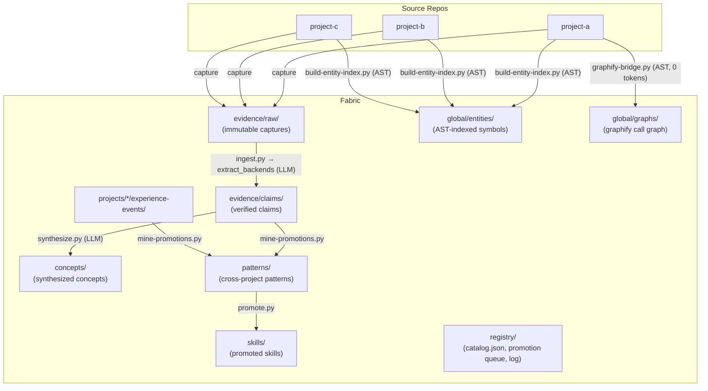

# Architecture

```mermaid
graph TB
    subgraph "Source Repos"
        R1["project-a"]
        R2["project-b"]
        R3["project-c"]
    end

    subgraph "Fabric"
        RAW["evidence/raw/<br/>(immutable captures)"]
        CLAIMS["evidence/claims/<br/>(verified claims)"]
        CONCEPTS["concepts/<br/>(synthesized concepts)"]
        PATTERNS["patterns/<br/>(cross-project patterns)"]
        SKILLS["skills/<br/>(promoted skills)"]
        EVENTS["projects/*/experience-events/"]
        ENTITIES["global/entities/<br/>(AST-indexed symbols)"]
        GRAPHS["global/graphs/<br/>(graphify call graph)"]
        REGISTRY["registry/<br/>(catalog.json, promotion queue, log)"]
    end

    R1 & R2 & R3 -->|capture| RAW
    RAW -->|"ingest.py → extract_backends (LLM)"| CLAIMS
    CLAIMS -->|"synthesize.py (LLM)"| CONCEPTS
    CLAIMS -->|"mine-promotions.py"| PATTERNS
    PATTERNS -->|"promote.py"| SKILLS
    R1 & R2 & R3 -->|"build-entity-index.py (AST)"| ENTITIES
    R1 -->|"graphify-bridge.py (AST, 0 tokens)"| GRAPHS
    EVENTS -->|"mine-promotions.py"| PATTERNS
```

---
