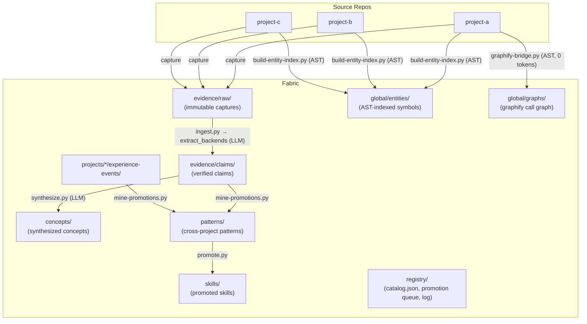

# Architecture

Wiki Fabric is a **fabric** (one knowledge corpus per machine or team) plus a
**harness** (the deterministic tooling that compiles and governs it). Source
repos connect as namespaces; knowledge flows through a one-way pipeline.

## The pipeline



## Reading order

1. [Why not just a wiki or RAG?](./why) — the failure modes this design answers, and the core bet.
2. [Core Workflows](./core-workflows) — the loop in practice: ingest → query → learn.
3. [Task Context](./context) — the payoff: what the agent receives at task time.
4. [Configuration](./configuration) — providers, model tiers, routing.
5. **How It Works** — narrative deep-dives into each component:
   [the compiler](./how-compiler) · [retrieval & delivery](./how-retrieval) ·
   [the compounding loop](./how-compounding) · [trust & governance](./how-trust) ·
   [the corpus & connected projects](./how-corpus) ·
   [staying in sync (hooks & CI)](./how-sync)
6. The Reference section (CLI, OKF, governance) — for operating and extending the fabric.

## Module map

Pipeline scripts and shared modules — full tables in the
[CLI & Scripts Reference](./cli#scripts-reference):

```
scripts/
├── fabric_config.py      config (memoized) · stage routing · actors · local models
├── extract_backends.py   prompt · 4 LLM backends · JSON repair · locator verify
├── local_llm.py          on-device generation (GGUF / MLX dispatch)
├── wf_common.py          frontmatter · norm · slugify · hashing
├── eval_core.py          scoring primitives (concept_match, jaccard, coverage)
├── ingest.py             source → record → claims (the compiler entry point)
├── synthesize.py         claims → concept pages
├── mine-promotions.py    experience events → dossiers (deterministic clustering)
├── promote.py            dossier review/promotion (compiler-eval gated)
├── query.py              0-token retrieval (lexical + graph expansion)
├── context.py            0-token task-manifest compiler
├── lint.py               deterministic contract enforcement (+ --okf floor)
├── review.py              staleness scan + re-verify (the governance loop)
├── export-wiki.py         human-layer wiki renderer (topics, projects, staleness)
├── mine-chats.py          chat transcript distillation (durable takeaways)
├── harnesses.py           multi-harness registry + installer (11 agent tools)
├── capture-chat.py        agent chat session capture (opencode/claude)
├── skill.py               universal skill loader (all harnesses)
├── repos-migrate.py       config-per-project migration
└── ...                    capture, hooks, sync, okf export/import, evals
```

**Design rule:** every script runs standalone (`python3 scripts/x.py --help`);
shared logic lives in the five modules above — import, don't copy
(anti-loop rule 7 in [AGENTS.md](https://github.com/hybridindie/wiki-fabric/blob/main/AGENTS.md)).


## Core vs. optional

| Layer | Status |
|-------|--------|
| Knowledge format (claims with locators, patterns, decisions, commitments) | **core format** |
| `wf context` — task manifest compiler + persisted receipts | **core** |
| Contract enforcement (`lint.py` + JSON, CI gate) | **core** |
| Behavior evaluations (`eval-behavior.py`) | **core** |
| Self-building domain vocabulary | **core** |
| `wf` CLI, uv install | reference implementation |
| Graphify (call-graph staleness, enrichment, code navigation) | optional integration — off by default |
| Judgment tier (decision-model eval gates) | optional integration — off by default |
| Embeddings (semantic re-ranking) | optional — planned |
| Git history capture, corpus team sync | integrations |
| MCP server, multi-harness skill packs | roadmap |

## On-disk layout

Two trees: the **harness** (tooling, this repo) and the **fabric** (your
knowledge — gitignored; lives in the corpus/vault, teammates pull it at
install).

| Harness path (this repo) | What it is |
|------|-----------|
| `README.md` `AGENTS.md` `CONTRIBUTING.md` `index.md` | entry points (index.md is the OKF root index) |
| `pyproject.toml` `requirements.txt` `okf-base.yaml` | packaging, deps, okflint profile |
| `scripts/` | the pipeline — `cmd/`, `lib/`, `eval/`, `harness/` |
| `tests/` | unit tests (`-m "not live"` for the fast suite) |
| `system/` | agent-facing assets: skills, always-on block, plugins, policy profiles |
| `schemas/` | frontmatter contracts + ontology docs |
| `templates/` | page scaffolds + examples |
| `references/` | attesters (deterministic receipt checks) + executor skills |
| `evaluations/` | golden corpus, behavior fixtures |
| `global/computations/` | attested-computation contracts (OKF §10) |

**The harness never holds your knowledge.** In dev mode the content dirs
exist gitignored inside the clone; in installed mode they live in the
**fabric dir** (`~/.local/share/wiki-fabric/` default, `WIKI_FABRIC_DIR` or
`--vault`/`vault:` to relocate), created at install:

| Fabric-dir path | What it is |
|------|-----------|
| `fabric.yaml` | config (see [Configuration](./configuration)) |
| `corpus/evidence/` | captured sources, summaries, claims |
| `corpus/projects/` | per-project namespaces, receipts, commitments |
| `corpus/patterns/` `concepts/` `skills/` `anti-patterns/` `domains/` | canonical knowledge |
| `corpus/registry/` | `log.md`, `catalog.json`, promotion queue, pending gate |
| `wiki/` | generated human-layer wiki (Obsidian) |

Your knowledge accumulates in the fabric dir and syncs via
[Team Sync](./sync).

---

Next: [Walk the core workflows](./core-workflows)
