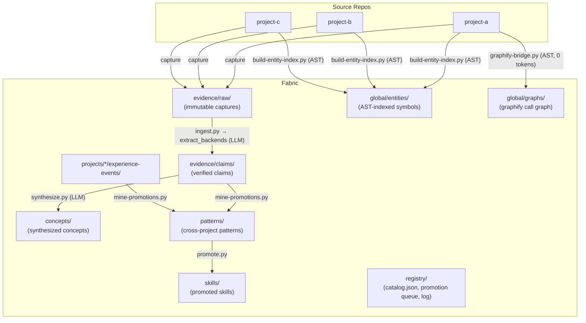

# Architecture

Wiki Fabric is a **fabric** (one knowledge corpus per machine or team) plus a
**harness** (the deterministic tooling that compiles and governs it). Source
repos connect as namespaces; knowledge flows through a one-way pipeline.

## The pipeline



## Reading order

1. [Why not just a wiki or RAG?](./why) — the failure modes this design answers, and the core bet.
2. [Core Workflows](./core-workflows) — the loop in practice: ingest → query → learn.
3. [Task Context](./context) — the payoff: what the agent receives at task time.
4. [Configuration](./configuration) — providers, model tiers, routing.
5. The Reference section (CLI, OKF, governance) — for operating and extending the fabric.

## Module map

Pipeline scripts and shared modules — full tables in the
[CLI & Scripts Reference](./cli#scripts-reference):

```
scripts/
├── fabric_config.py      config (memoized) · stage routing · actors · local models
├── extract_backends.py   prompt · 4 LLM backends · JSON repair · locator verify
├── local_llm.py          on-device generation (GGUF / MLX dispatch)
├── wf_common.py          frontmatter · norm · slugify · hashing
├── eval_core.py          scoring primitives (concept_match, jaccard, coverage)
├── ingest.py             source → record → claims (the compiler entry point)
├── synthesize.py         claims → concept pages
├── mine-promotions.py    experience events → dossiers (deterministic clustering)
├── promote.py            dossier review/promotion (compiler-eval gated)
├── query.py              0-token retrieval (lexical + graph expansion)
├── context.py            0-token task-manifest compiler
├── lint.py               deterministic contract enforcement (+ --okf floor)
└── ...                   capture, hooks, sync, okf export/import, evals
```

**Design rule:** every script runs standalone (`python3 scripts/x.py --help`);
shared logic lives in the five modules above — import, don't copy
(anti-loop rule 7 in [AGENTS.md](https://github.com/hybridindie/wiki-fabric/blob/main/AGENTS.md)).