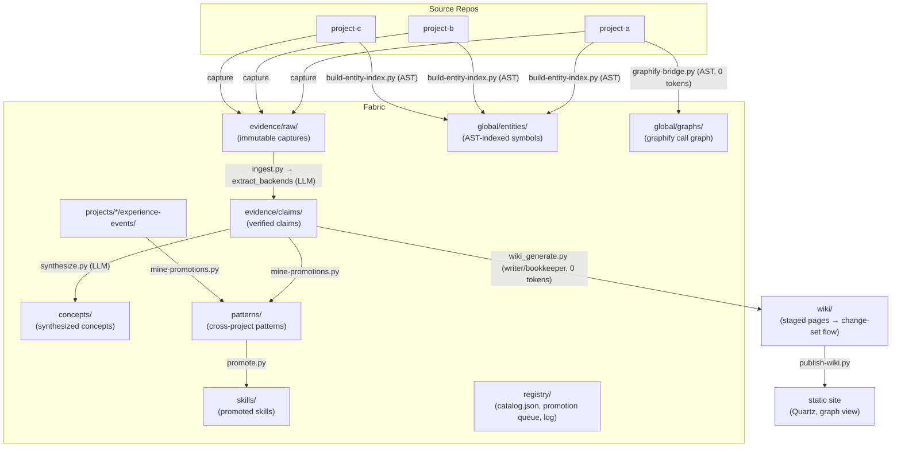

# Architecture

Wiki Fabric is a **fabric** (one knowledge corpus per machine or team) plus a
**harness** (the deterministic tooling that compiles and governs it). Source
repos connect as namespaces; knowledge flows through a one-way pipeline.

## Glossary

Terms used throughout the docs, defined once:

| Term | Meaning |
|------|---------|
| **harness** | wiki-fabric's own tooling — the code in this repo (scripts, schemas, tests). Distinct from an *agent harness* (Claude Code, opencode, Codex — the coding tools the fabric installs into). |
| **fabric** | your local knowledge base: content dirs (`evidence/`, `patterns/`, `projects/`, …) + `fabric.yaml`. Lives in the fabric dir (gitignored in the harness clone; separate location when installed). |
| **corpus** | the shared subset of the fabric that syncs to a team remote — the *source of truth* for a team. |
| **vault** | a generated *output*: the Obsidian-shaped view of the fabric (and of the generated wiki). Never a mirror, never the storage of record — see `cli.md`'s `wf vault` entry. |
| **atom** | a knowledge unit with a promotion gate: claims, patterns, decisions, projects. Sync PRs touching atoms always wait for human review; evidence-plane files can auto-merge. |
| **P1 / P2 / P3** | precedence layers at task time: P1 = project (decisions, commitments) > P2 = domain patterns > P3 = global. Contract codes in `schemas/frontmatter.md`. |
| **receipt** | a persisted, content-addressed context manifest (`receipt-v1`) proving what knowledge was delivered to an agent before a task. |

> **Where things live on disk:** the [Corpus & Connected Projects](./how-corpus)
> page carries the three-tree layout (harness, fabric, connected code repos).
> Full module tables are in the [CLI & Scripts Reference](./cli#scripts-reference).
> This page keeps only the pipeline and the layering.

## The pipeline

```mermaid
graph TB
    subgraph "Source Repos"
        R1["project-a"]
        R2["project-b"]
        R3["project-c"]
    end

    subgraph "Fabric"
        RAW["evidence/raw/<br/>(immutable captures)"]
        CLAIMS["evidence/claims/<br/>(verified claims)"]
        CONCEPTS["concepts/<br/>(synthesized concepts)"]
        PATTERNS["patterns/<br/>(cross-project patterns)"]
        SKILLS["skills/<br/>(promoted skills)"]
        EVENTS["projects/*/experience-events/"]
        ENTITIES["global/entities/<br/>(AST-indexed symbols)"]
        GRAPHS["global/graphs/<br/>(graphify call graph)"]
        REGISTRY["registry/<br/>(catalog.json, promotion queue, log)"]
    end

    R1 & R2 & R3 -->|capture| RAW
    RAW -->|"ingest.py → extract_backends (LLM)"| CLAIMS
    CLAIMS -->|"synthesize.py (LLM)"| CONCEPTS
    CLAIMS -->|"mine-promotions.py"| PATTERNS
    PATTERNS -->|"promote.py"| SKILLS
    R1 & R2 & R3 -->|"build-entity-index.py (AST)"| ENTITIES
    R1 -->|"graphify-bridge.py (AST, 0 tokens)"| GRAPHS
    EVENTS -->|"mine-promotions.py"| PATTERNS
    CLAIMS -->|"wiki_generate.py (writer/bookkeeper, 0 tokens)"| WIKI["wiki/<br/>(staged pages → change-set flow)"]
    WIKI -->|"publish-wiki.py"| SITE["static site<br/>(Quartz, graph view)"]
```

**Design rule:** every script runs standalone (`python3 scripts/x.py --help`);
shared logic lives in the `scripts/lib/` modules (`fabric_config`,
`extract_backends`, `local_llm`, `wf_common`, `eval_core`, `judgment`,
`embed_index`, `tombstones`) — import, don't copy (anti-loop rule 7
in [AGENTS.md](https://github.com/hybridindie/wiki-fabric/blob/main/AGENTS.md)).

## Core vs. optional

| Layer | Status |
|-------|--------|
| Knowledge format (claims with locators, patterns, decisions, commitments) | **core format** |
| `wf context` — task manifest compiler + persisted receipts | **core** |
| Contract enforcement (`lint.py` + JSON, CI gate) | **core** |
| Behavior evaluations (`eval-behavior.py`) | **core** |
| Self-building domain vocabulary | **core** |
| `wf` CLI, uv install | reference implementation |
| Graphify (call-graph staleness, enrichment, code navigation) | optional integration — off by default |
| Judgment tier (mining refinement, eval gates, ingest effect verification, opt-in context re-rank — Jev cloud / Laya local) | optional integration — off by default |
| Embeddings (semantic re-rank boost, `wf query`) | optional integration — off by default |
| Git history capture, corpus team sync | integrations |
| MCP server (`wf-mcp`, incl. wiki-generation tools), multi-harness skill packs | reference implementation |
