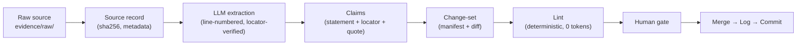
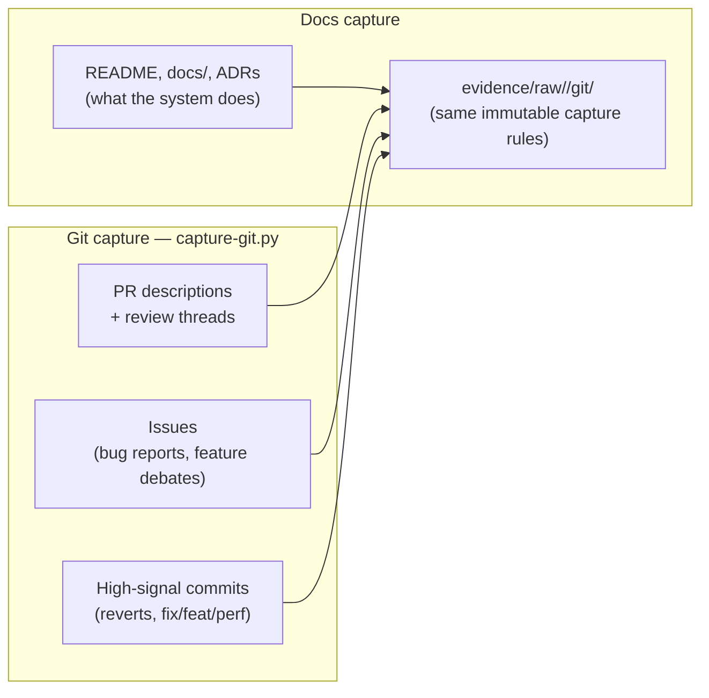
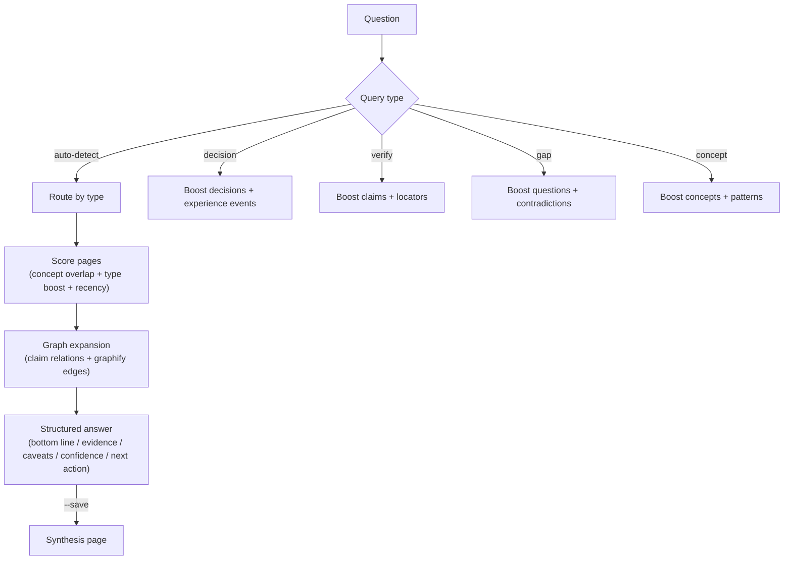
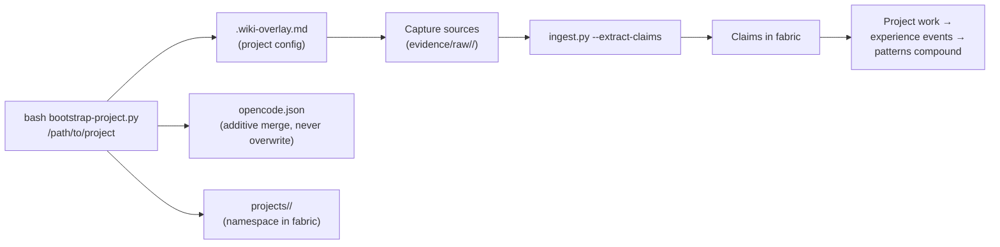
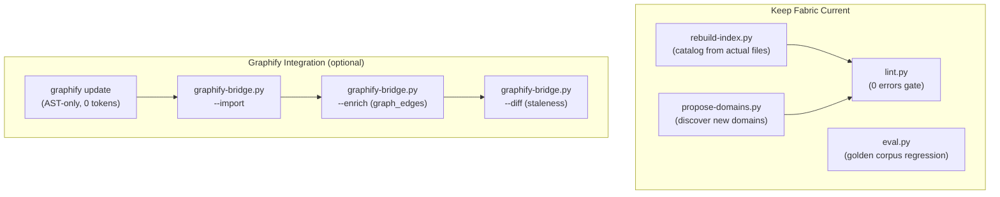
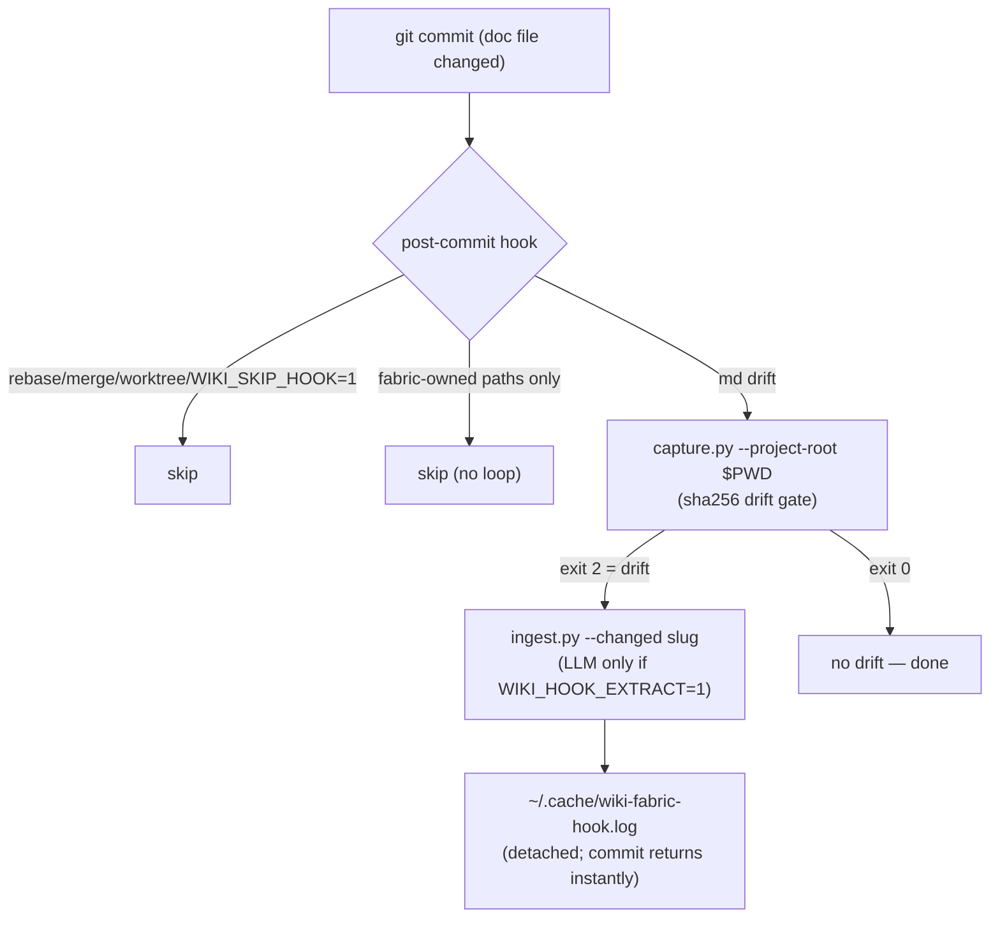

# Core Workflows

## 1. Ingest: Source → Claims

Ingesting a document is not fire-and-forget: everything the LLM extracts is
**staged for human review** before it can become canonical knowledge. Two terms
recur below — a **change-set** is the proposed edit (a manifest of what changed
plus a diff) that a human approves or rejects, and a **locator** is the exact
file-and-line pointer every claim carries, so each statement can be checked
against its source.



## 1a. Git History Capture: PRs, Issues, Commits → Raw Evidence

Code history is a second capture channel alongside docs. Two sources, one pipeline:



```bash
# GitHub: PR threads + issue reports (via gh CLI)
wf capture my-project --git owner/repo
wf capture my-project --git owner/repo --since 1y --limit 100

# Local repo: high-signal commits only + churn ranking
wf capture my-project --git /path/to/repo --churn

# See what would be captured without writing
wf capture my-project --git owner/repo --dry-run
```

**Why this is helpful — and why it's filtered:**

| Signal | What it gives the fabric | Cost control |
|---|---|---|
| PR bodies + review threads | The *why* behind changes — problem, debate, tradeoffs rejected and chosen. This is pre-written `experience-event` material (structured records of problem → what we tried → what happened — see §3 below), written by people who were there | 1 LLM call per PR, so `--limit` and `--since` bound the blast radius |
| Issues | Structured `observed_problem` reports, often with repro steps and environment details | Filtered by date window; closed/stale issues usually aren't worth extracting |
| Revert commits | Failed interventions — the seeds of anti-patterns. A revert says "we tried this and it was wrong", which docs never record | Deterministic prefix filter, 0 tokens |
| Conventional commits (`fix:`, `feat:`, `perf:`) | Hotspot trail: which subsystems keep breaking | `chore:`/`style:`/`test:`/`ci:` skipped — most commits are noise |
| `--churn` ranking | Tells you *where* to spend ingest budget: high-churn files are where the knowledge is | Pure git analysis, 0 tokens, 0 LLM calls |

The key discipline: **LLM extraction is the most expensive operation in the fabric**
(1 call per source), so git capture pre-filters deterministically and only the
high-signal subset goes through ingest. A repo with 2,000 commits might yield 40
capturable threads — and those 40 carry more decision history than all the docs
combined. Every captured thread keeps its PR number / commit SHA, which are valid
claim locators — auditable the same way line ranges are.

**Scenario — archaeology on an inherited codebase.** You inherit a repo with
thin docs and 8,000 commits. Instead of skimming `git log` by hand, run
`wf capture my-project --git owner/repo --since 1y` then ingest the captured
threads. The fabric compiles claims like "auth middleware was rewritten to
token-based auth because stateful sessions broke horizontally-scaled sessions
(PR #342, review thread)" — context no doc contains, each anchored to a PR you
can open. `--churn` shows the payment module changed 400 times in 6 months:
that's where the tribal knowledge lives, so ingest its PR threads first.

**Scenario — avoiding a repeat failure.** A revert commit says a caching layer
was tried and rolled back. Captured and ingested, it becomes an experience event
with a negative outcome — and months later, when a new session proposes "add a
cache here", `wf query "have we tried caching X?"` returns the revert's history
before anyone re-runs the same experiment.

```bash
# Ingest a source with LLM claim extraction
wf ingest evidence/raw/my-project/docs/readme.md --extract-claims

# Dry run (no files written)
wf ingest --extract-claims --dry-run evidence/raw/foo.md

# Use a different model
WIKI_LLM_MODEL="llama3.1:70b" wf ingest evidence/raw/foo.md --extract-claims
```

**LLM configuration:** any OpenAI-compatible endpoint works — full provider
table, model tiers, and env-var overrides in [Configuration](./configuration).

**Scenario — onboarding onto an unfamiliar codebase.** Your project's docs are
scattered across a README, `docs/`, and ADRs. Bootstrap the project, `wf capture`,
then ingest each doc. Within an hour you have a claim graph: "writes serialize on
the main thread (L42)", "batching collapses N round-trips to 1 (L55)". Ask
`wf query "Why is the write path slow?"` and get an answer citing exact lines you
can open — not a hallucinated summary. New docs re-captured later trigger
re-ingest only where the sha256 changed.

**Scenario — auditing an upstream dependency.** Before adopting a library,
capture its docs and changelog into the fabric. After each release,
`wf update` re-captures; hash drift flags exactly which claims are affected by the
new version — so "we rely on their single-writer guarantee" gets re-verified
against the new source text, not forgotten.

**Scenario — bootstrapping from PR history.** Docs tell you what a system does;
PR and issue history tells you why. See **Git History Capture** above: the
"problem → intervention" debates that never make it into docs, deterministically
pre-filtered so LLM extraction stays cheap, with `--churn` pointing ingest
budget at the highest-traffic areas.

## 2. Query: Question → Evidence-Backed Answer

When the agent asks a question mid-task, it can't afford hallucinated summaries
or token-billed retrieval. `wf query` routes the question by type, scores pages
deterministically, and returns a structured answer with citations you can open:



```bash
# Ask anything
wf query "Why does my code batch writes but pipeline reads?"

# Save reusable answers as synthesis pages
wf query "What patterns apply to batch-write systems?" --save   # file as a synthesis page (a reusable, citable query result)

# Force query type
wf query "What did we decide about the bridge?" --type decision
```

**Scenario — mid-session architectural question.** While refactoring, the agent
wonders "do we serialize writes here, or is that only in the other project?"
A lexical query costs 0 tokens and returns the relevant claims with locators —
the agent reads the underlying sources itself instead of asking you to repeat
project history you half-remember.

**Scenario — contradicting sources.** Two docs disagree about a throughput
figure. Ingesting both produces a `status: contested` claim with a `contradicts`
relation, not a silently merged average. Querying the topic surfaces the conflict
with both locators side by side, so a human settles it instead of a model
averaging it.

## 3. Experience → Pattern → Skill (Compounding Loop)

```mermaid
flowchart LR
    W["Project work<br/>(real coding, debugging)"] --> LE["log-experience.py<br/>(capture observation)"]
    LE --> EE["Experience events<br/>(problem → intervention → outcome)"]
    EE --> M["mine-promotions.py<br/>(cluster by concept overlap)"]
    M --> PD["Promotion dossier<br/>(evidence + conditions + boundary)"]
    PD --> HR["Human review<br/>(7-point checklist)"]
    HR --> P["Pattern promoted<br/>(maturity 2, status: recommended)"]
    P --> S["Skill created<br/>(executable procedure)"]
    S --> NEXT["Next project<br/>inherits skills automatically"]
    NEXT -->|"more experience events"| LE
```



```bash
# Capture an experience event
wf log --project my-project \
  --problem "API froze under concurrent writes" \
  --intervention "Added write queue with undo grouping" \
  --outcomes "errors=12→0" --tags "my-project,performance"

# List projects + event counts
wf log --list

# Mine for cross-project patterns
python3 scripts/mine-promotions.py --dry-run
python3 scripts/mine-promotions.py

# Review dossier, then promote
python3 scripts/promote.py --list
python3 scripts/promote.py --promote <dossier-file>.md
```

**Scenario — the same bug bites twice.** Project A hits a deadlock from
concurrent writes; you log the event with measured outcomes. Three weeks later,
project B (a completely different codebase) shows the same signature. After the
second `wf log`, mining clusters the two events into a promotion dossier: same
problem shape, same intervention, independent evidence. After your review, the
pattern is promoted — and project C, bootstrapped next month, inherits the skill
"serialize writes + verify parity" automatically instead of rediscovering the
bug a third time.

**Scenario — killing a bad habit.** Experience events aren't only wins: log
failed interventions too. Mined clusters can produce anti-patterns
("parallel validation writes caused 3 separate incidents") that future sessions
surface as warnings when they detect the setup.

## 4. Bootstrapping: Connect a New Project



```bash
# One-time global install
wf install

# Per-project setup
wf bootstrap /path/to/my-project --name "My Project" \
  --domain agent-systems --domain web-systems \
  --skill serialize-and-verify-writes --init-git

# Then capture + ingest sources
wf capture my-project
wf ingest evidence/raw/my-project/docs/*.md --extract-claims
```

The bootstrap **additively merges** into existing `opencode.json` (never overwrites your MCP config, rules, or references).

**Scenario — spinning up project five.** You've got four projects connected and
start a new one. Bootstrap takes a minute: it writes `.wiki-overlay.md`, creates
`projects/<slug>/`, and merges into `opencode.json` without touching your MCP
servers. At the next session start, the agent loads the global fabric plus this
project's overlay — and immediately knows about the three patterns promoted from
your other projects, the domain ontology, and which skills apply here. No copying
of wiki folders, no "let me catch you up" prompt engineering.

## 5. Maintenance

Keeping the fabric current is mostly deterministic. (Graphify — an optional integration, see [Integrations](./integrations) — builds a code call-graph so the fabric can detect when code changes invalidate stored claims.)



```bash
# Rebuild index from actual files (writes registry/catalog.json)
python3 scripts/rebuild-index.py
python3 scripts/rebuild-index.py --json   # print machine-readable registry to stdout

# Verify health (human-readable)
wf lint

# Verify health (machine-readable, for CI + agent harnesses)
wf lint --format json

# Run formal evaluation (golden corpus)
WIKI_LLM_MODEL="qwen3.8:27b-mlx" python3 scripts/eval.py

# Discover new domains from evidence
python3 scripts/propose-domains.py

# Graphify integration (optional, 0 token cost)
graphify update                              # refresh each connected repo's graph (AST-only)
python3 scripts/graphify-bridge.py --all     # update → import → enrich → diff
python3 scripts/graphify-bridge.py --status  # dashboard
python3 scripts/graphify-bridge.py --diff    # staleness check
```

Run the graphify refresh **after code refactors** (it's AST-only — a few
seconds, no LLM): `graphify update` in each connected repo, then
`graphify-bridge --import` to sync hashes and `--diff` to see which claims
reference symbols that moved. The fabric's own repo appears in the bridge once
it has a `repos:` entry pointing at `.` — its self-graph lives in
`graphify-out/` (see [Integrations](./integrations)).

**Scenario — docs went stale.** You refactor `gather_reads` into
`collect_reads`; the claim "gather_reads makes O(N) reads ~O(1)" now points at a
symbol that no longer exists. The graphify diff (AST-only — Abstract Syntax Tree parsing, no LLM) detects the
rename and flags the affected claims as stale. Refresh re-ingests only the
changed source, and the claim either updates or is superseded — with the change
recorded in the change-set manifest, never silently rewritten.

## 6. Hooks: The Loop Runs Itself (opt-in)

Modeled on graphify's git-hook system (marker-delimited, append-safe, detached): a post-commit hook captures doc drift and ingests it automatically.



```bash
cd ~/Development/my-project
wf hook install                     # post-commit: capture+ingest drift (no LLM)
wf hook install --extract-claims    # + LLM claim extraction on every drift
wf hook status                      # per-repo hook state
wf hook uninstall
WIKI_SKIP_HOOK=1 git commit ...     # skip once, per command
```

Enhancements over the graphify design, adapted to a *content* pipeline:
- **Drift-gated ingest**: capture exits 2 only when sha256 drift exists, so unchanged docs cost zero LLM calls.
- **Self-skip**: commits touching only fabric-owned paths (`evidence/`, `registry/`, …) never re-trigger — no capture/ingest loop.
- **CWD-independent**: the hook passes `--project-root`; ingest writes are anchored to the fabric root, so running from inside the project repo can't scatter `evidence/` into the wrong repo.
- **Chainable**: the block is appended inside a subshell — `exit 0` inside it never kills the rest of an existing hook (keep other hooks' first lines non-`exec`).
- **Bootstrap wiring**: `wf bootstrap <path> --hook --hook-extract-claims` sets it up at project creation.

Always-on agent instructions (like `graphify claude install`):

```bash
wf harness install         # always-on block + procedures in every detected harness
                           # (Claude Code, Codex, Copilot, Gemini CLI, Cursor, Pi, ...)
wf harness status          # per-harness state: detected / installed / —
```

Bootstrap runs this automatically; `wf harness install --all` covers every
harness even if not yet detected.

Bootstrap also installs `.opencode/plugins/wiki-fabric.js` — a session-start
nudge (modeled on graphify's plugin) reminding the agent to prefer
`wf context` / `wf query` over grep.

---

---

Next: [Go deep on the payoff: task context](./context)
