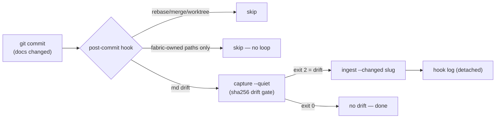

# How It Works: Staying in Sync

Knowledge that requires manual maintenance rots. This page covers the two
machines that keep the fabric current without anyone remembering to:
**hooks** (per-project, event-driven) and **CI** (per-push, assertion-driven).

## The hook loop: drift → capture → compile

(Also new: `wf capture chat <slug>` captures agent-harness chat sessions —
opencode's SQLite, Claude Code's JSONL transcripts — as `kind: chat-transcript`
evidence. PRs/issues capture the why for shipped work; chats capture the why
for everything else: debugging dead ends, rejected approaches, environment
quirks. sha256 anti-loop means re-running is free.)

A project's docs change through normal development — a commit renames a
feature, updates a README, deletes a doc that had claims pointing at it. The
opt-in post-commit hook turns that drift into fabric updates without a
session:

Four design choices make this safe to leave on:

1. **Drift-gated**: capture recomputes sha256 for every tracked source file;
   unchanged files cost zero tokens. Only exit code 2 ("drift") proceeds.
2. **Self-skipping**: commits touching only fabric-owned paths (`evidence/`,
   `registry/`) never re-trigger — the hook can't create a capture/ingest
   loop feeding itself.
3. **Detached**: the hook's work runs in a background process; `git commit`
   returns immediately. Output lands in `~/.cache/wiki-fabric-hook.log`.
4. **LLM-optional**: with plain `wf hook install`, drift is captured and
   *recorded* without claims (0 tokens) — the agent ingests interactively on
   its next session, when you're watching. With
   `wf hook install --extract-claims`, drift also compiles immediately
   (1 call per changed file).

`WIKI_SKIP_HOOK=1 git commit ...` skips once; `wf hook status` shows state.

## CI: the fabric checks its own homework

The harness repo's CI runs five deterministic gates on every push — each one
a claim about the system, each one verified:

| Gate | What it proves |
|------|----------------|
| **Unit tests** (220+) | script logic: parsing, routing, discovery, merge |
| **Smoke test** | the CLI works end-to-end in a throwaway fabric |
| **Behavior eval** | the context manifest actually delivers the right knowledge (banned approaches named, correct alternatives present) — the P4 proof, zero-LLM |
| **Stability eval** | deterministic operations are byte-deterministic (20 context runs identical; catalog identical across rebuilds) |
| **Fabric lint + OKF floor + okflint** | the bundle conforms to its own contracts *and* the external validator agrees |

Two properties make this meaningful: every gate is **0-token**
(deterministic code, no model in the loop), and the behavior eval is the
homepage's proof in CI form — "the manifest changed the agent's instructions"
is an assertion, not a sentence.

## The freshness contract, end to end

Putting the layers together — what guarantees a teammate's fabric reflects
reality:

1. **A commit changes docs** → the hook captures and compiles the drift
   (minutes, automatically). `wf bootstrap` installs this hook
   automatically (that's what makes it a **requirement**, not a chore) — layer 1 of the guarantee depends on it;
   without it, drift waits for a manual capture.
2. **A dependency updates its docs** → `wf capture` recomputes hashes;
   `SOURCE-DRIFT` lint errors name exactly which claims are affected
3. **A refactor renames code** → graphify's AST diff flags code-referencing
   claims as stale
4. **Knowledge ages** → `review_after` / `stale_after` gates drop it from
   manifests before it misleads
5. **Structure drifts** (new project, moved dir) → `wf vault --check` fails
   loudly; `wf vault` self-heals

None of these require remembering to run something. The hooks run on commits;
the lint runs in CI and on every command that could be affected; `wf status`
surfaces whatever needs attention.

Next: [Model Policy & Evals](./evals)
