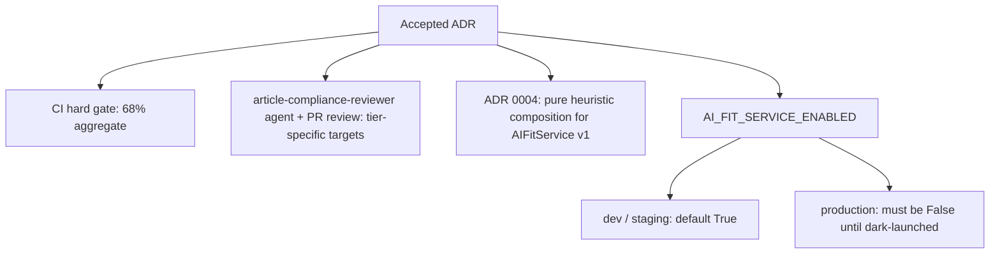

Accepted ADRs are architecture decision records that have moved past proposal and are now binding on the codebase. This article covers the accepted decisions currently in force, how each one is enforced, and where its boundaries sit. It matters because an accepted ADR is not documentation — it is a constraint that CI, review agents, and deployment configuration are expected to uphold. When an accepted record and the code disagree, the record wins until a superseding record is accepted.

## Enforcement model: one hard gate, tier targets by review

The 68% CI aggregate remains the hard gate [1][4]. Tier-specific targets are not implemented as separate CI jobs; they are enforced by the article-compliance-reviewer agent and by PR reviews [1][4].

That split has a concrete consequence. The automated pipeline enforces a single aggregate threshold that must pass before merge, while finer-grained, per-tier expectations are handled by review rather than by additional pipeline stages [1][4]. A change can therefore pass CI and still be rejected in review if it misses a tier-specific target [1][4]. Anyone reasoning about "will this merge" needs to check both surfaces, not just the green check on the PR.

## ADR 0004: heuristic composition for AIFitService v1

ADR 0004 adopts option 2, pure heuristic composition, for v1 of AIFitService [2][5]. The accepted scope for the first version of the service is therefore heuristic composition [2][5]. This is a v1 decision, and it is recorded as such — the record names the version it governs, so the constraint applies to v1 of AIFitService specifically [2][5].

## Rollout control: AI_FIT_SERVICE_ENABLED

The flag `AI_FIT_SERVICE_ENABLED` defaults to True for dev and staging [3][6]. Production deploys must set it to False until the surface is dark-launched [3][6].

The accepted configuration is not "off everywhere." It is on by default outside production, and explicitly off in production until the dark launch happens [3][6]. Because the production value must be set at deploy time rather than inherited from the default, a production deploy that does not override the flag is misconfigured against this record [3][6].

## How the accepted decisions relate

The diagram shows the three enforcement surfaces an accepted decision can land on: the aggregate CI gate, the review path, and deploy-time configuration. The first two are the two halves of the quality enforcement model [1][4]; the third is where the feature-flag decision is actually applied [3][6].

## Working with accepted records

Two habits follow from the above. First, when a change touches tier-specific targets, expect the review path — the article-compliance-reviewer agent and PR review — to be the place where it is judged, because no separate CI job covers it [1][4]. Second, when a change touches AIFitService v1 composition, the accepted answer is pure heuristic composition, and any alternative needs a new or superseding record rather than an in-code exception [2][5]. Third, when a change touches production deployment of the AI fit surface, verify the flag override explicitly, since the default will not do it for you [3][6].

## See also

- Architecture Decision Records
- CI quality gates and aggregate thresholds
- article-compliance-reviewer agent
- PR review as an enforcement surface
- AIFitService
- Feature flags and dark launches
- Deployment-time configuration overrides

---

_Citations link to claims in evidence/claims/. Generated on 2026-09-21._
