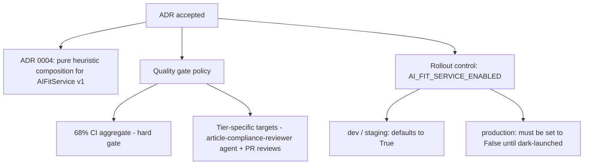

# Accepted ADRs

This page tracks the architecture decision records (ADRs) that have been accepted for this repository and are therefore binding on implementation work. An accepted ADR is not a proposal: it fixes a choice, and the surrounding tooling — CI gates, review agents, feature flags — is expected to reflect that choice. The decisions recorded here matter because they determine what the build enforces automatically, what reviewers must enforce by hand, and how new surfaces are exposed to production traffic. The entries below cover the accepted decision on AIFitService composition, the quality-gate policy that accompanies it, and the rollout control that governs its exposure.

## ADR 0004: pure heuristic composition for AIFitService v1

ADR 0004 adopts option 2, pure heuristic composition, for v1 of AIFitService [2][5]. This is the core accepted decision on this page. The choice is scoped explicitly to v1, which means the heuristic path is the intended implementation for the first release rather than a stopgap that reviewers should treat as provisional. Any work that assumes a different composition strategy for v1 is out of step with the accepted record and should be raised as a new ADR rather than resolved ad hoc in a pull request.

## Quality gates: the 68% CI aggregate

The 68% CI aggregate remains the hard gate [1][4]. That aggregate is the only threshold enforced as a blocking CI job. Tier-specific targets are not implemented as separate CI jobs; they are enforced by the article-compliance-reviewer agent and by PR reviews [1][4]. The practical consequence is a split of responsibility: CI will fail on the aggregate number, while finer-grained, tier-specific expectations depend on the reviewer agent and on human review. Contributors should not assume that a green CI run means every tier-specific target has been satisfied — the aggregate can pass while tier-level gaps remain, and those gaps are caught downstream.

## Rollout control: AI_FIT_SERVICE_ENABLED

Exposure of the AIFitService surface is controlled by the `AI_FIT_SERVICE_ENABLED` flag. It defaults to `True` for dev and staging, while production deploys must set it to `False` until the surface is dark-launched [3][6]. The asymmetry is deliberate: non-production environments exercise the surface by default so that the heuristic composition path is exercised during normal development, whereas production stays off until the dark-launch step is carried out. Production configuration that leaves the flag at its default is therefore incorrect, and the flag must be set explicitly to `False` in production deploys.

## How the decisions connect

The accepted decisions form a chain from the ADR itself through enforcement and finally to runtime exposure.

Read top to bottom, the diagram shows that a single accepted decision fans out into three enforcement surfaces: the implementation choice for v1, the gate that blocks merges, and the flag that decides whether the surface is reachable in production. Changing any one of these without revisiting the ADR would leave the record inconsistent with the code.

## Working with accepted ADRs

Because these decisions are accepted rather than proposed, the correct way to change them is to supersede them with a new ADR, not to work around them. When reviewing a change that touches AIFitService composition, the quality gate, or the enablement flag, check it against the accepted record first. Where a tier-specific target is at stake, remember that the reviewer agent and PR review carry that enforcement [1][4], so the review conversation is the place to resolve it.

## See also

- ADR 0004 — pure heuristic composition for AIFitService v1
- AIFitService
- article-compliance-reviewer agent
- CI quality gates and the 68% aggregate
- Feature flags and dark launches
- `AI_FIT_SERVICE_ENABLED`

---

_Citations link to claims in evidence/claims/. Generated on 2026-09-21._
