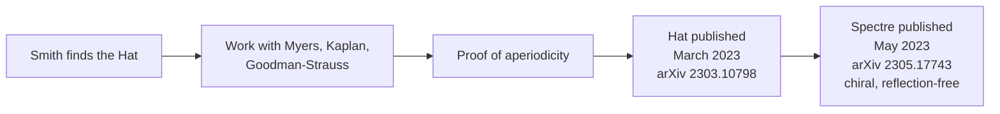

Aperiodic monotiles are single tile shapes that tile the plane without ever repeating a periodic pattern. The question of whether such a shape exists — the "einstein problem," after the German *ein Stein*, "one stone" — was open for decades, and its resolution is recent enough that the primary sources are still preprints. The topic matters because it closes a long-standing existence question in tiling theory and because the construction techniques used to prove it are reusable for other combinatorial and geometric problems.

## Discovery of the Hat

The Hat monotile was found by David Smith, who then worked with Joseph Samuel Myers, Craig Kaplan, and Chaim Goodman-Strauss to prove the result [1][4]. The collaboration pattern is worth noting: the initial find was a single individual's, while the proof that the shape forces aperiodicity required the combined effort of the four authors [1][4]. This is the step that converts a candidate shape into a proven aperiodic monotile.

## Publication record

The Hat was published by Smith–Myers–Kaplan–Goodman-Strauss in March 2023 as arXiv 2303.10798 [3][6]. A second, related result followed in May 2023: the Spectre, published as arXiv 2305.17743 [3][6]. The Spectre is described as chiral and reflection-free [3][6] — that is, it does not rely on reflected copies of itself to tile, which distinguishes it from the Hat in a way that matters for anyone trying to build physical or computational instances of the tiling.

The publication sequence can be read as a short pipeline:

## The three-dimensional case

The two-dimensional result does not carry over to three dimensions. No true 3D aperiodic monotile is known [2][5]. The closest candidate is the Schmitt–Conway–Danzer biprism, which is the only near-example and whose status is contested [2][5]. Anyone citing a "3D monotile" should treat that claim as unresolved rather than settled; the biprism is a near-example, not a confirmed one [2][5].

## What is and is not established

Two things are firmly established by the cited sources: the 2D Hat and Spectre results, with their publication identifiers and dates [3][6], and the authorship chain from Smith's find through the four-author proof [1][4]. One thing is explicitly not established: a true 3D aperiodic monotile, with the Schmitt–Conway–Danzer biprism remaining contested [2][5]. Keeping these separated is important, because the 2D and 3D cases are frequently conflated in secondary discussion.

## See also

- Aperiodic tiling
- Einstein problem
- Hat monotile
- Spectre monotile
- Schmitt–Conway–Danzer biprism
- Chiral aperiodic tilings
- Tiling theory

---

_Citations link to claims in evidence/claims/. Generated on 2026-09-21._
