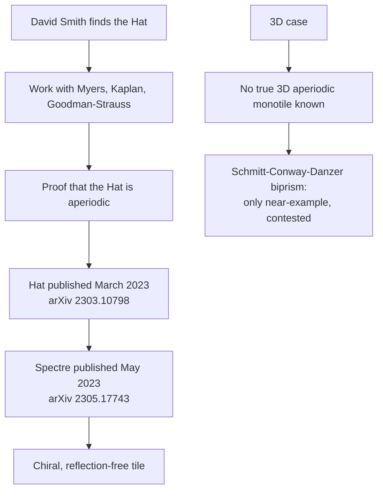

# Aperiodic Monotiles

An aperiodic monotile is a single tile shape that tiles the plane but admits no periodic tiling — every tiling it produces is non-repeating. The question of whether such a shape exists was open for decades, and its resolution is recent enough that the answer is still being consolidated. This article covers the discovery and proof of the Hat and Spectre monotiles, the publication record behind them, and the current state of the three-dimensional case.

## The Hat: discovery and proof

The Hat was found by David Smith, who then worked with Joseph Samuel Myers, Craig Kaplan, and Chaim Goodman-Strauss to prove the result [1][4]. The collaboration matters here: the find was an individual observation, while the proof that the shape is genuinely aperiodic — that it tiles, and that no tiling of it is periodic — was a joint effort [1][4].

## Publication record

The Hat aperiodic monotile was published by Smith–Myers–Kaplan–Goodman-Strauss in March 2023 (arXiv 2303.10798) [3][6]. A second result followed quickly: the chiral, reflection-free Spectre, published in May 2023 (arXiv 2305.17743) [3][6].

The distinction between the two tiles is worth stating plainly. The Spectre is chiral and reflection-free, meaning it does not depend on its mirror image to tile [3][6]. That property removes a caveat that applied to earlier constructions, where reflected copies of the tile were required.

## The three-dimensional case

The 3D problem is not solved. No true 3D aperiodic monotile is known [2][5]. The Schmitt–Conway–Danzer biprism is the only near-example, and it is contested [2][5]. "Near-example" and "contested" are the operative terms: the biprism is the closest candidate on record, but it does not settle the question, so the existence of a genuine 3D aperiodic monotile remains open [2][5].

## Flow of the result

The diagram separates the two tracks. The 2D track runs from discovery through proof to two published tiles, with the Spectre as a refinement of the Hat result [1][3][4][6]. The 3D track has no equivalent endpoint: it terminates at a contested candidate rather than a proven monotile [2][5].

## What the evidence supports

Two claims are well established by the record: the Hat exists and was proven aperiodic by Smith–Myers–Kaplan–Goodman-Strauss [1][4], and both the Hat and the Spectre have dated arXiv publications [3][6]. One claim is a negative: no true 3D aperiodic monotile is known, and the leading candidate is disputed [2][5]. Anything stronger than that — for example, a claim that 3D aperiodic monotiles are impossible — is not supported by the evidence summarized here.

## See also

- Aperiodic tiling
- Hat monotile
- Spectre monotile
- Chiral aperiodic monotile
- Schmitt–Conway–Danzer biprism
- Periodic versus aperiodic tilings

---

_Citations link to claims in evidence/claims/. Generated on 2026-09-21._
