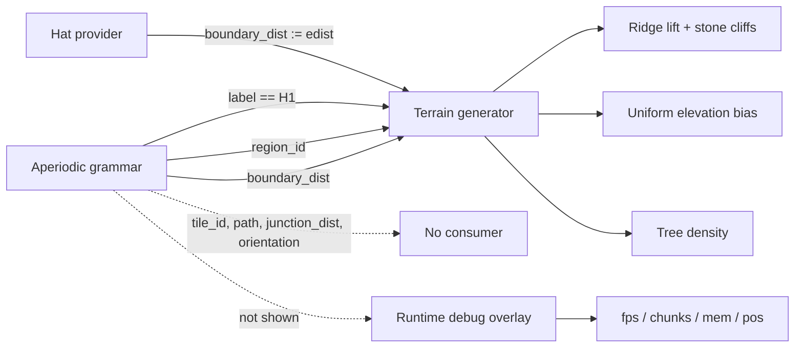

# Aperiodic Terrain Generator

The aperiodic terrain generator is the component that turns the output of the aperiodic grammar into visible world geometry: elevation, cliffs, and vegetation. It matters because it defines the actual contract between the tiling system and the rendered world — and that contract is much narrower than the grammar's full output. Understanding which signals are consumed, how they are transformed by providers, and what is observable at runtime is necessary for anyone debugging terrain that does not match the underlying tiling.

## Grammar signal consumption

The generator consumes exactly 3.5 of the grammar signals [1][5]. The three usages are:

- **`boundary_dist`** — drives ridge lift and stone cliffs [1][5].
- **`region_id`** — applies a uniform elevation bias across a region [1][5].
- **`label == "H1"`** — controls tree density [1][5].

Everything else the grammar produces — `tile_id`, `path`, `junction_dist`, `orientation`, and the rest — has no consumer in the terrain pipeline. The fractional count reflects that the third usage is a boolean test on a label rather than a full use of the signal.

## Signal collapse in the Hat provider

The provider layer can destroy information before the terrain generator ever sees it. In the Hat provider, `boundary_dist` is literally assigned `edist`, which collapses the leaf-vs-metatile distinction [2][6]. Any downstream logic that would have treated leaf edges and metatile edges differently receives a single undifferentiated distance value instead. Because the terrain generator's ridge lift and stone cliffs are driven by `boundary_dist` [1][5], this collapse propagates directly into the geometry.

## Edge classification loss

A related loss occurs in the outline handling. The Hat outline has 13 edges belonging to different legal classes, but the code takes an undifferentiated minimum over all edges [4][8]. The class structure of the outline is therefore not respected when the minimum is computed, in the same way that the leaf/metatile structure is not respected in the `boundary_dist` assignment [2][6]. Both are cases where a richer grammar output is reduced to a scalar before consumption.

## Observability gap

The runtime debug overlay shows fps, chunks, mem, and pos, but nothing about the grammar [3][7]. There is no display of `tile_id`, `label`, `path`, `region_id`, `boundary_dist`, `junction_dist`, or `orientation` [3][7]. Combined with the signal collapse [2][6] and the undifferentiated edge minimum [4][8], this means a developer observing a terrain anomaly has no runtime view of the grammar state that produced it. The only grammar-derived quantities that reach the screen are the ones the terrain generator already consumed [1][5].

## Flow

The diagram shows the three consumed signals feeding the generator, the remaining signals terminating with no consumer, the Hat provider overwriting `boundary_dist` before it arrives, and the debug overlay sitting outside the grammar path entirely.

## Summary of gaps

Three distinct issues compound: only 3.5 grammar signals reach the terrain generator [1][5]; the Hat provider flattens `boundary_dist` to `edist`, losing the leaf-vs-metatile distinction [2][6]; and the outline minimum ignores the 13 legal edge classes [4][8]. None of these are visible in the runtime overlay, which reports only fps, chunks, mem, and pos [3][7].

## See also

- Aperiodic Grammar
- Hat Provider
- Boundary Distance
- Region ID
- Runtime Debug Overlay
- Edge Classification

---

_Citations link to claims in evidence/claims/. Generated on 2026-09-21._
