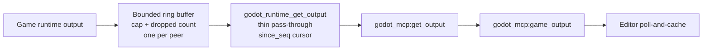

A bounded buffer with honest truncation is a buffering pattern in which a fixed-capacity store discards excess or old entries instead of growing without limit, while always reporting how many entries were dropped. The pattern matters because a buffer that silently discards data leads downstream consumers to believe they have seen a complete stream when they have not. In the Godot MCP integration, this pattern governs how game output is captured and delivered to the editor.

## Honest truncation as a rule

Truncation must be honest: a bounded buffer carries explicit truncated/dropped counts and performs no silent drops, following the error-handling honesty rules [1][4]. The requirement is not that data is never lost — a bounded buffer exists precisely because unbounded growth is unacceptable — but that loss is observable. A consumer reading the buffer can distinguish "the stream ended here" from "the stream was cut here," and can quantify the gap.

## Ring buffer with per-peer accounting

`mcp_debugger.gd` implements this as a bounded ring with a cap and honest dropped counts, maintained one per peer [2][5]. Per-peer accounting means each connected peer has its own ring and its own drop counter, so capacity and loss statistics are tracked separately for each peer rather than pooled. The cap bounds memory; the dropped count preserves the information that the cap was reached.

## Retrieval: thin pass-through and sequence cursor

Retrieval is deliberately thin. `godot_runtime_get_output` is a pass-through that exposes the buffer using a `since_seq` cursor [2][5]. The cursor names a sequence position, so a caller can request what follows a known point rather than re-reading the whole buffer. This keeps repeated reads incremental and makes the boundary between already-delivered and newly-available output explicit.

## Pull, not push

The editor pulls game output on demand via `godot_mcp:get_output` → `godot_mcp:game_output`, using a poll-and-cache pattern with no unsolicited pushes over the debugger channel [3][6]. Nothing is pushed at the editor; the editor asks, receives what the cursor indicates is new, and caches it. Combined with the honest drop counts, the editor's cache reflects what it has actually seen, and any gap is attributable to a reported drop rather than to a lost message.

## Flow

## Why the combination works

Three properties reinforce each other. Bounded capacity keeps memory predictable. Explicit drop counts keep loss visible. Pull-based retrieval with a cursor keeps delivery incremental and keeps the debugger channel free of unsolicited traffic. Removing any one weakens the others: a bounded buffer without drop counts hides loss, and a push model without a cursor makes it hard to tell what has already been delivered.

The design also keeps responsibilities separated. The ring buffer owns capacity and accounting; `godot_runtime_get_output` owns cursor-based access and stays a thin pass-through rather than accumulating state of its own [2][5]; the editor owns polling and caching [3][6]. Because the pass-through adds no buffering of its own, the drop counts reported by the ring remain the single source of truth about truncation, and the editor never has to reconcile two different notions of what was lost.

## See also

- Error-handling honesty rules
- Ring buffer
- Sequence cursor (`since_seq`)
- Poll-and-cache pattern
- `mcp_debugger.gd`
- `godot_runtime_get_output`
- `godot_mcp:get_output` / `godot_mcp:game_output`

---

_Citations link to claims in evidence/claims/. Generated on 2026-09-21._
