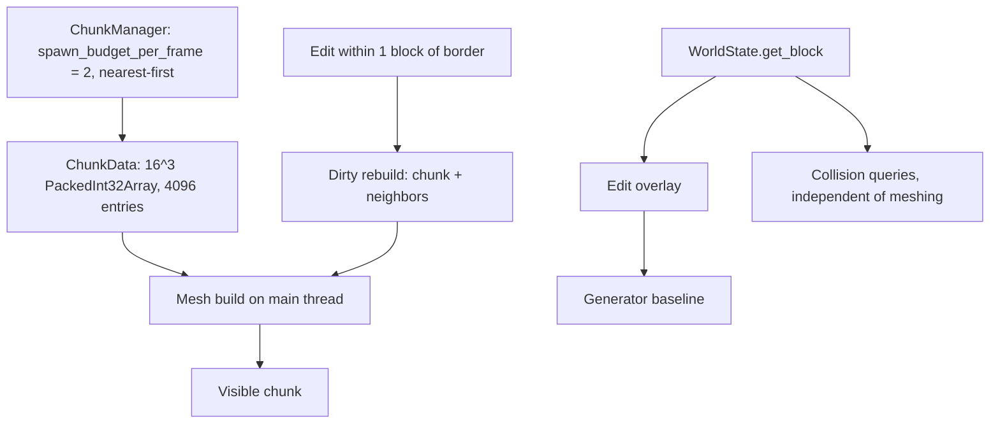

Chunk management covers how the voxel world is divided into fixed-size chunks, how those chunks are stored in memory, how they are streamed in and out around the player, how they are meshed, and how they are rebuilt after edits. It matters because this subsystem sits directly on the frame budget: streaming and mesh work run on the main thread, and the current cost exceeds the 60 fps target [9]. This article describes the data layout, the streaming policy, the rebuild rules, the collision path, and the known bottlenecks.

## Chunk data layout

The chunk size constant `CHUNK_SIZE` is 16 blocks [1]. `ChunkData.blocks` is a `PackedInt32Array` that is always resized to 4096 entries and filled with `AIR`, indexed as `x + y*16 + z*256` [3]. There is no sparse storage and no palette or RLE compression, so every chunk pays the full 4096-entry cost regardless of how much of it is actually solid [3]. This keeps indexing simple and predictable, at the price of memory and copy cost per chunk.

## Streaming and residency

`ChunkManager.spawn_budget_per_frame` is 2 [2]. With `view_radius_chunks = 8`, the wanted set is roughly 632 chunks, so filling it takes about 316 frames — roughly 5 seconds — with chunks spawned nearest-first [2]. A live walk probe at the demo configuration (`vs=3`, radius 8) showed residency growing from 36 to 459 chunks while walking, with zero stall frames [7].

One detail worth noting: `WorldForgeWorld3D._process` only refreshes the HUD label; only headless tests call `update_around` [5]. The streaming path is therefore exercised by tests and probes rather than by the node's own per-frame processing.

## Chunk lifecycle at a glance

## Meshing and dirty rebuilds

Dirty rebuilds always rebuild the containing chunk plus its neighbors when the edit is within 1 block of a border [4]. They are budgeted at `maxi(1, roundi(2/vs²))` per frame, and they are all synchronous on the main thread [4]. The border rule exists because a block change at a chunk edge alters the geometry of the adjacent chunk's mesh; the budget exists to spread that cost across frames.

## Collision is independent of meshing

Collision reads the pure world function — `WorldState.get_block`, then the edit overlay, then the generator baseline — so solidity exists even where chunks are not meshed [6]. This decouples physics correctness from mesh build progress: a player can stand on terrain that has not yet been rendered.

## Performance budget

The engine currently spends 20–33 ms per frame on streaming frames on an M4 Max, against a 60+ fps (16.6 ms) target [9]. The remaining costs are per-chunk mesh builds (3–5 ms in GDScript), frontier fallback builds, and the single-threaded main-thread budget model [9]. Issue #62 (move mesh builds to workers) is the keystone, because #61's tier-2 dispatches through it and #64 depends on the worker-build issue [8]. Until mesh builds leave the main thread, the streaming budget model remains the binding constraint.

## See also

- Voxel world generation and the generator baseline
- Mesh building and worker threads (issue #62)
- Collision and world queries (`WorldState.get_block`)
- Frame budget and streaming performance targets
- Chunk residency and view radius configuration

---

_Citations link to claims in evidence/claims/. Generated on 2026-09-21._
