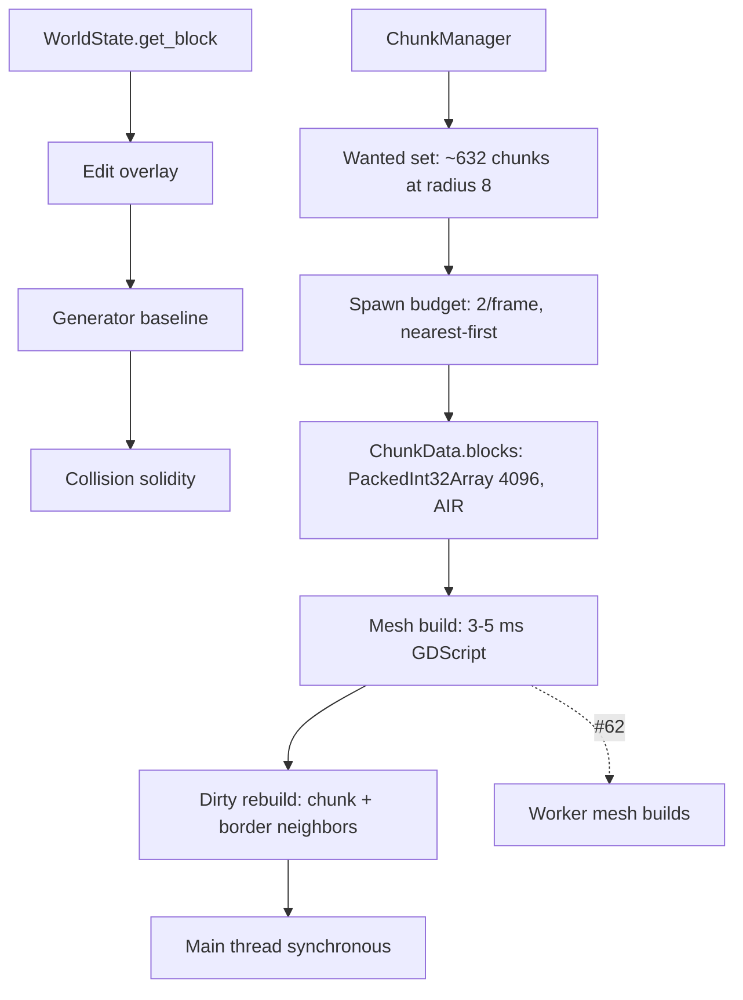

# Chunk Management in Godot Project

Chunk management in this Godot project covers how voxel chunks are sized, stored, streamed, rebuilt, and meshed. It matters because streaming frames currently cost 20–33 ms/frame on an M4 Max against a 60+ fps (16.6 ms) target, with remaining costs being per-chunk mesh builds (3–5 ms in GDScript), frontier fallback builds, and the single-threaded main-thread budget model [9][18]. The system is functional but budget-bound.

## Chunk Representation and World Function

The chunk size constant `CHUNK_SIZE` is 16 blocks [1][10]. `ChunkData.blocks` is a `PackedInt32Array` always resized to 4096 and filled with `AIR`, indexed as `x + y*16 + z*256`, with no sparse storage or palette/RLE compression [3][12]. This means every chunk carries a full dense block array regardless of content.

Collision does not depend on meshed chunks. It reads the pure world function (`WorldState.get_block` → edit overlay → generator baseline), so solidity exists even where chunks aren't meshed [6][15]. That separation lets physics remain correct while rendering catches up.

## Streaming and Residency

`ChunkManager.spawn_budget_per_frame` is 2, so with `view_radius_chunks=8` the ~632-chunk wanted set takes ~316 frames (~5 s) to fill, nearest-first [2][11]. `WorldForgeWorld3D._process` only refreshes the HUD label; only headless tests call `update_around` [5][14]. A live walk probe at demo config (`vs=3`, radius 8) showed residency growing from 36 to 459 chunks while walking, with zero stall frames [7][16]. The streaming budget therefore avoids stalls but fills the view slowly.

## Dirty Rebuilds and Meshing

Dirty rebuilds always rebuild the containing chunk plus neighbors when the edit is within 1 block of a border, are budgeted at `maxi(1, roundi(2/vs²))` per frame, and are all synchronous on the main thread [4][13]. Combined with per-chunk mesh builds at 3–5 ms in GDScript, this is the main remaining cost against the 16.6 ms frame target [9][18].

## Worker Migration Path

Issue #62 (move mesh builds to workers) is the keystone because #61's tier-2 dispatches through it and #64 depends on the worker-build issue [8][17]. Until mesh builds leave the main thread, the synchronous dirty-rebuild budget and per-chunk GDScript mesh cost will keep streaming frames above the 16.6 ms target [4][13][9][18].

## See also

- [[WorldState.get_block]]
- [[ChunkData.blocks]]
- [[ChunkManager.spawn_budget_per_frame]]
- [[Dirty Rebuilds]]
- [[Worker Mesh Builds]]
- [[Streaming Budget]]

---

_Citations link to claims in evidence/claims/. Generated on 2026-09-21._
