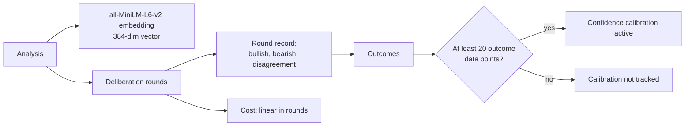

This article covers two coupled design decisions in the analysis pipeline: the embedding model used to vectorize each analysis, and the data models that record deliberation output and confidence calibration state. The two are linked because the embedding fixes the vector representation stored alongside the structured records, while the structured records determine what the system can later calibrate or test. Both are expensive to change after data has accumulated, so the constraints are worth stating explicitly.

## Embedding generation

Each analysis is embedded with the all-MiniLM-L6-v2 model, which produces a 384-dimensional vector per analysis [1][6]. The vector width is therefore fixed at 384 for every downstream consumer — any index, similarity search, or storage schema built on these embeddings has to assume that dimensionality. Embedding is generated per analysis, so the number of vectors tracks the number of analyses rather than the number of deliberation rounds.

## Deliberation data model

Each deliberation round records three fields: the bullish argument, the bearish argument, and the disagreement level between the two positions [3][8]. Storing the disagreement level as a first-class field, rather than deriving it later from the two arguments, makes each round record self-contained and queryable without re-running a model. The round is the unit of record, so a multi-round deliberation produces one record per round.

## Cost model

Computational cost scales linearly with the number of rounds: three rounds equate to three times the API call cost of a single round [4][9]. Round count is therefore the primary cost lever, and it interacts directly with the deliberation data model above — every additional round adds both a cost multiple and another round record.

## Confidence calibration

Confidence calibration requires a minimum of 20 outcome data points before the system can begin tracking and calibrating agent confidence [2][7]. Below that threshold, no calibration is tracked. This is a data-model constraint as much as a statistical one: outcomes must be persisted in a form that can be joined back to the agent's original confidence, and at least 20 of them must accumulate before the calibration path activates.

## Test coverage gap

The seeded-sidecar path is not covered by a test; the contract test only exercises the case where the sidecar already exists [5][10]. The path that creates and seeds a sidecar from scratch is therefore unverified, while the pre-existing-sidecar case is verified. Any change to seeding logic has no test to catch a regression.

## Flow

## See also

- Vector storage and index sizing
- Deliberation round aggregation
- Confidence calibration thresholds
- Contract test coverage
- Sidecar lifecycle and seeding

---

_Citations link to claims in evidence/claims/. Generated on 2026-09-21._
