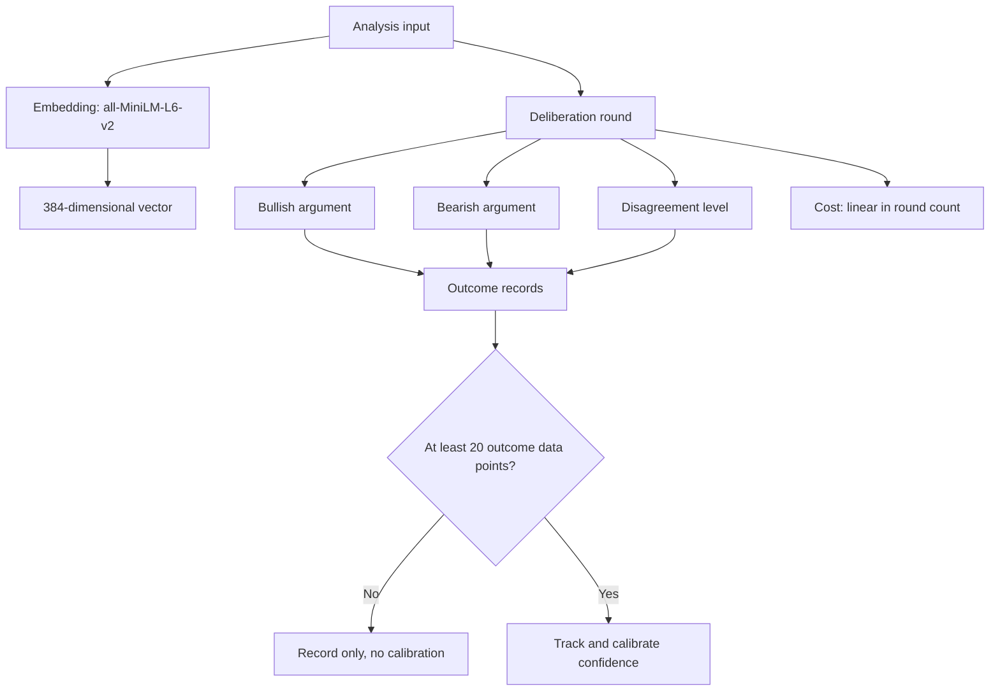

Embedding models and data models are the two structural layers that determine what an analysis system can store, compare, and later reason about. The embedding model fixes the vector representation used for each analysis, while the data model fixes the shape of the records produced during deliberation, calibration, and cost accounting. Getting either wrong is expensive to reverse: embeddings are baked into stored vectors, and record schemas propagate into every downstream consumer. This article covers the concrete choices in this system — the embedding model and its dimensionality, the per-round deliberation record, the calibration threshold, the cost model, and a known gap in test coverage.

## Embedding model

Embedding generation uses the `all-MiniLM-L6-v2` model, which produces a 384-dimensional vector for each analysis [1][6]. The dimensionality is the load-bearing detail: it defines the width of every stored vector, the size of any similarity index, and the memory footprint per analysis. Because the model name and the vector width are fixed together, swapping models is a migration, not a configuration change — existing vectors would need regeneration to remain comparable with new ones.

## Deliberation record model

Each deliberation round records three fields: the bullish argument, the bearish argument, and the disagreement level between the two positions [3][8]. Storing the disagreement level alongside the two arguments means the record is self-describing — a consumer can read the tension between positions without re-deriving it from the argument text. It also means the round is the unit of storage, so a multi-round deliberation produces a sequence of these records rather than a single merged verdict.

## Confidence calibration

Confidence calibration requires a minimum of 20 outcome data points before the system can begin tracking and calibrating agent confidence [2][7]. Until that threshold is reached, confidence values are recorded but not calibrated. This is a data-model constraint as much as a statistical one: the system needs a place to accumulate outcomes and a gate that prevents calibration from running on a sample too small to be meaningful.

## Cost model

Computational cost scales linearly with the number of rounds — three rounds equate to three times the API call cost [4][9]. There is no batching discount or shared-prefix saving assumed in this model. The practical consequence is that round count is the primary cost lever, and any change to the deliberation record model that adds rounds has a directly proportional cost impact.

## Flow

## Test coverage gap

The seeded-sidecar path is not covered by a test; the contract test only exercises the case where the sidecar already exists [5][10]. This matters for the data model because the seeded path is where initial state is written. A contract test that only runs against a pre-existing sidecar verifies the read/update contract but leaves the creation contract unverified — the branch most likely to drift when the record schema changes.

## Summary of constraints

The embedding layer is fixed at 384 dimensions by the chosen model [1][6]. The deliberation layer stores three fields per round [3][8]. Calibration is gated on 20 outcome data points [2][7]. Cost is linear in rounds [4][9]. And the seeded-sidecar creation path lacks test coverage [5][10]. Each of these is a constraint on what the data model can safely change without a migration or a new test.

## See also

- Vector embeddings and similarity search
- Deliberation and multi-agent argumentation
- Confidence calibration and outcome tracking
- API cost modeling for multi-round pipelines
- Contract testing and fixture seeding

---

_Citations link to claims in evidence/claims/. Generated on 2026-09-21._
