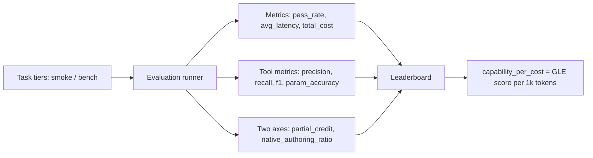

# Evaluation Metrics and Leaderboard

The evaluation system tracks specific metrics including `pass_rate`, `avg_latency`, and `total_cost` during evaluation runs [1]. Every GLE result is evaluated along two axes: Correctness (`partial_credit`) and Approach (`native_authoring_ratio`) [4]. These measurements feed a leaderboard that ranks models using `gle_score`, `pass_rate`, `native_authoring_ratio`, and a derived `capability_per_cost` score [3]. This article covers the metric definitions, task tiers, leaderboard ranking, and saturation calibration used to keep the benchmark meaningful.

## Evaluation Axes and Task Tiers

GLE results are not reduced to a single pass/fail signal. Correctness is captured by `partial_credit`, while approach is captured by `native_authoring_ratio` [4]. The Native Authoring Ratio is a continuous signal that distinguishes between code-first and tool-first agent behavior [10].

Tasks are categorized into two tiers: `smoke` and `bench` [9]. The `smoke` tier provides a fast, deterministic mock gate used during Continuous Integration (CI) runs [5]. The `bench` tier uses the live Godot's Last Exam set [9]. This split allows CI to run a quick deterministic check while reserving the full benchmark for deeper evaluation.

## Core Metrics

During evaluation runs, the system tracks `pass_rate`, `avg_latency`, and `total_cost` [1]. Running the evaluation with `--repeat N` allows the runner to aggregate metrics including mean ± std pass-rate and `tool_f1` [7].

Tool-use quality is reported through `tool_precision`, `tool_recall`, `tool_f1`, and `tool_param_accuracy` [8]. Tool Precision, Recall, and F1 score measure the agreement between the recorded MCP call history and the expected tools at the tool-name level [12]. Cost is estimated by Prompt and Model Cost, which is an estimation of token pricing based on prompt and response tokens and their respective rates [11].

A scatter plot allows comparing `partial_credit` (correctness) against `native_authoring_ratio` (approach) [2]. This makes it possible to see whether a model solves tasks correctly through native authoring or through tool calls.

## Leaderboard and Capability-per-Cost

The leaderboard ranks models using metrics including `gle_score`, `pass_rate`, `native_authoring_ratio`, and a derived `capability_per_cost` score [3]. The leaderboard ranks models based on a capability-per-cost metric, defined as the GLE score per 1k tokens [6]. This makes cost part of the ranking rather than an afterthought.

## Saturation Calibration

The calibration run demonstrates that the Godot's Last Exam set is not saturated by a strong model, meaning the model either fails or only partially solves some tasks [13]. The GLE set is considered NOT saturated if the strong model's overall GLE score is less than 100% and the pass rate is less than 100% [14]. For the GLE set to be considered NOT saturated, no task should show a `⚠️ retire?` flag when calibrated across two or more models [15]. If a strong model aces all tasks, this signals the need to author harder tasks or retire easy ones into the next version of the GLE [16].

## See also

- Godot's Last Exam
- Native Authoring Ratio
- Partial Credit
- Tool F1
- Capability per Cost
- Saturation Calibration
- Smoke Tier
- Bench Tier

---

_Citations link to claims in evidence/claims/. Generated on 2026-09-21._
