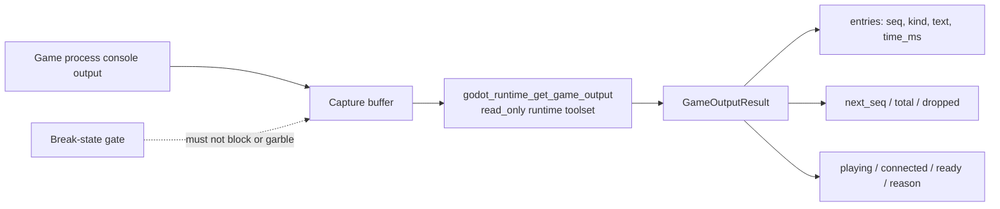

Game Output Capture is the runtime facility that collects console output produced by a running game and makes it available to clients through a read-only server tool. It matters because a running game's console is often the only place where runtime errors, print statements, and engine diagnostics surface; without a structured way to retrieve that output, debugging a live session depends on out-of-band access to the process. This article covers what the capture tool returns, how it behaves when execution is paused at a break state, and when the capability landed.

## The capture tool

The server exposes `godot_runtime_get_game_output` as a `read_only` runtime toolset tool [3][6]. Being read-only means the tool observes the running game rather than mutating it, so it can be polled without altering execution state.

The tool returns a `GameOutputResult` with the following fields [3][6]:

- `playing` and `connected` — session state, indicating whether a game is running and whether the server is attached to it.
- `entries` — the captured output records, each carrying `seq`, `kind`, `text`, and `time_ms`.
- `next_seq` — the cursor to use for subsequent retrieval.
- `total` and `dropped` — accounting for how much output was produced and how much was discarded.
- `ready` and `reason` — availability diagnostics, so a caller can distinguish "no output yet" from "capture unavailable."

The `entries` shape is the core of the design: each record is sequenced (`seq`), typed (`kind`), timestamped (`time_ms`), and carries the raw `text`. The `next_seq` field supports incremental polling, so a client can fetch only what it has not already seen instead of re-reading the whole buffer. The `dropped` counter is the honest signal that capture is lossy under pressure — a client that sees a non-zero value knows its view of the console is incomplete.

## Interaction with the break-state gate

An explicit acceptance criterion for this feature is that output capture works alongside the break-state gate, keeping output readable while broken [1][4]. This is the constraint that shapes the design: pausing execution at a break state must not suppress, reorder, or corrupt the captured output that a client retrieves. In practice, that means the capture path and the break-state gate are independent concerns — the gate controls whether the game is executing, while capture continues to serve whatever has already been recorded, in a form that remains readable.

## Delivery

The capability was delivered in PR #547, titled `feat(runtime): game console output capture`, which was merged on 2026-09-21 [2][5].

## Flow

The diagram shows the two independent paths: output flows from the game process into a capture buffer and out through the read-only tool, while the break-state gate sits alongside that path rather than in front of it. That separation is what satisfies the acceptance criterion — a paused game still yields readable output.

## Practical notes

Two fields deserve attention when consuming this tool. First, `next_seq` should be treated as the polling cursor; advancing it is how a client avoids duplicate entries. Second, `dropped` should be checked on every call, because a non-zero value means the returned `entries` are a partial view and any conclusion drawn from the console is correspondingly partial. The `ready` and `reason` pair covers the remaining case where no entries are returned at all, letting a caller tell an idle game apart from a capture failure.

## See also

- Runtime toolset
- Read-only tools
- Break-state gate
- `GameOutputResult`
- `godot_runtime_get_game_output`

---

_Citations link to claims in evidence/claims/. Generated on 2026-09-21._
