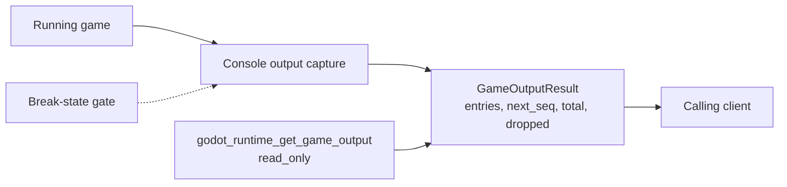

Game output capture is the runtime feature that lets a client read the console output produced by a running game. It matters because inspecting what a game printed is a routine part of debugging, and that need does not disappear when execution is paused. The feature shipped as PR #547 (`feat(runtime): game console output capture`), merged on 2026-09-21 [2][5].

## The read tool

The server exposes `godot_runtime_get_game_output` as a `read_only` tool in the runtime toolset [3][6]. Because it is read-only, calling it observes runtime state rather than changing it — it does not start, stop, or step the game.

The tool returns a `GameOutputResult` [3][6]. Its fields fall into three groups:

- **Status:** `playing`, `connected`, `ready`, and `reason`.
- **Entries:** an array of `entries`, each carrying `seq`, `kind`, `text`, and `time_ms`.
- **Counters:** `next_seq`, `total`, and `dropped`.

The `entries` array is the payload: each element pairs a sequence number (`seq`) with a `kind`, the `text` itself, and a timestamp in milliseconds (`time_ms`). The surrounding counters — `next_seq`, `total`, and `dropped` — describe the position and completeness of the returned set rather than the content of any single line. The status fields describe the state of the game and the connection at the time of the call, with `reason` available to explain that state [3][6].

## Interaction with the break-state gate

Output capture is explicitly required to work alongside the break-state gate. The acceptance criterion is that output capture works alongside the break-state gate, keeping output readable while broken [1][4]. In other words, a game stopped at a break must still produce output that a client can read; the gate that halts execution must not make the captured output unreadable or unavailable.

This is the constraint that shapes the feature. Capture is not a side effect of a running game that happens to be observed — it is expected to remain usable in the paused state, which is precisely when a developer is most likely to want to look at what the game printed [1][4].

## Flow

The path from a running game to a calling client is short: the game produces console output, capture collects it, and the read-only tool returns it as a `GameOutputResult`. The break-state gate sits alongside capture rather than in front of it, so a paused game still yields readable output.

## What the feature covers

Taken together, the merged change [2][5] and the tool contract [3][6] define a narrow, well-bounded capability: a read-only way to fetch game console output, with a structured result that separates status, entries, and counters. The acceptance criterion [1][4] adds the one behavioural requirement that distinguishes it from a naive log tail — it has to keep working while the game is broken.

## See also

- Break-state gate
- Runtime toolset
- `read_only` tools
- `godot_runtime_get_game_output`
- `GameOutputResult`
- PR #547 — `feat(runtime): game console output capture`

---

_Citations link to claims in evidence/claims/. Generated on 2026-09-21._
