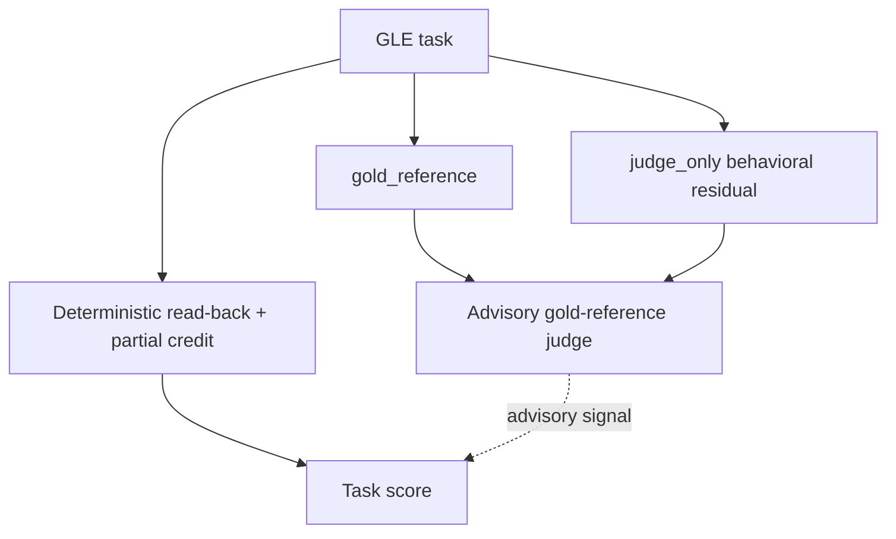

## GLE Task Set

The GLE task set is the collection of evaluation tasks that defines what a GLE submission is measured against. Its composition and grading structure matter because they determine both what the benchmark can observe and how much of a submission's behavior is scored mechanically versus judged. This article covers two things: what the set contains, and the two-track grading model applied to it.

## Composition

The set is composed of five tasks spanning four genres [1][4]. In the GLE-v1 content specifically, these are five composite tasks across four genres [2][5]. Two properties follow directly from that description. First, the tasks are *composite* — each is a bundle of work rather than a single narrow prompt. Second, the genre spread means the five tasks are not five variations of the same thing; four distinct genres are represented across five tasks.

Each task carries two distinct artifacts:

- a **gold_reference** — reference material associated with the task [2][5]
- a **judge_only behavioral residual** — a portion of the task's expected behavior reserved for the judge rather than exposed as a deterministic check [2][5]

The pairing is the key structural fact. Every task in the set has both a reference and a residual. The reference supports comparison against expected output; the residual captures behavior that cannot be reduced to a read-back check. Because the residual is marked *judge_only*, it is not part of the deterministic surface of the task.

## Grading model

Grading runs on two tracks [3][6].

The first track is **deterministic read-back plus partial credit** [3][6]. Read-back means the grader checks the submission against expected values directly, without interpretation. Partial credit means a submission is not scored as a single pass/fail outcome — it earns credit for the portions it gets right. This track is reproducible: the same submission yields the same result.

The second track handles the **behavioral residual**, and it is graded by an **advisory gold-reference judge** [3][6]. Two properties of that judge matter. It is *gold-reference* based, meaning it works against the task's gold_reference rather than an open-ended rubric. And it is *advisory*, meaning its output informs the evaluation rather than replacing the deterministic track.

The division of labor is therefore explicit: mechanical checks carry the reproducible score, and the judge covers the residual behavior that read-back cannot reach.

## What the structure implies

Three consequences follow from the evidence above.

Coverage is broad relative to task count: five tasks across four genres [1][4] means the set is not concentrated in a single genre, so a submission cannot pass by being strong in one mode of work alone.

Every task has a judged component. Because each of the five composite tasks possesses a judge_only behavioral residual [2][5], no task in the set is fully scored by deterministic means.

The deterministic track remains the backbone. Since the judge is advisory [3][6], the read-back plus partial-credit result is the reproducible part of the score, and the judge's contribution sits alongside it rather than overriding it.

## See also

- Gold Reference
- Behavioral Residual
- Deterministic Read-Back
- Partial Credit Scoring
- Advisory Judge
- GLE-v1

---

_Citations link to claims in evidence/claims/. Generated on 2026-09-21._
