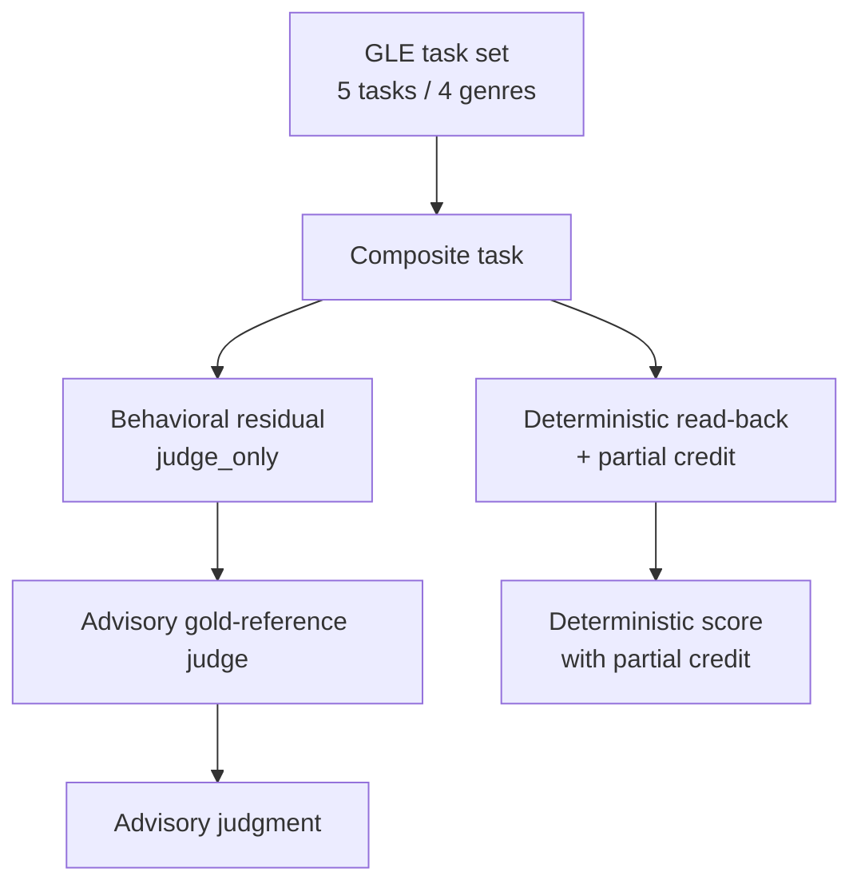

# GLE Task Set

The GLE task set is the evaluation unit used to score GLE submissions. It is composed of five tasks spanning four genres [1][4]. The GLE-v1 content packages these as five composite tasks across the same four genres, and each task carries two distinct artifacts: a `gold_reference` and a `judge_only` behavioral residual [2][5]. Understanding the task set matters because it fixes both the scope of the evaluation and the way results are produced — the set defines what is measured, and the grading model defines which parts of a result are deterministic and which are advisory.

## Composition

The set is small and deliberately bounded: five tasks, four genres [1][4]. The genre count is lower than the task count, so at least one genre is represented by more than one task. The tasks are composite rather than atomic, meaning a single task is not a single check but a bundle of required behavior [2][5].

Because the same five-task, four-genre structure appears in both the general description of the task set and the description of the GLE-v1 content [1][2][4][5], the composition is stable across those two descriptions rather than varying between them.

## Per-task artifacts

Each composite task in GLE-v1 has two associated artifacts [2][5]:

- **`gold_reference`** — the reference material used to judge the behavioral residual.
- **`judge_only` behavioral residual** — a residual that is marked judge-only, i.e. it is not part of the deterministic read-back path and is instead handled by the judge.

The `judge_only` designation is the key structural detail. It separates the residual from the mechanically checkable portion of the task and routes it to a different grading mechanism.

## Grading model

Grading is split into two paths [3][6]:

1. **Deterministic read-back plus partial credit.** The main body of a GLE task is graded by reading back the submission deterministically and awarding partial credit. This path is mechanical and reproducible.
2. **Advisory gold-reference judge.** The behavioral residual is graded by a judge that uses the gold reference. This path is explicitly advisory — it produces a judgment rather than a deterministic score.

The split means a GLE result is not a single uniform number produced by one mechanism. Part of the score comes from deterministic read-back with partial credit, and part comes from an advisory judge operating against the gold reference [3][6].

## Implications for interpreting results

Two consequences follow directly from the structure above.

First, the deterministic portion of a GLE score is reproducible by construction, since it relies on read-back and partial credit rather than judgment [3][6]. Second, the behavioral residual portion is not reproducible in the same way, because it is produced by an advisory judge rather than a deterministic procedure [3][6]. Any comparison of GLE results should therefore keep the two paths distinct: the deterministic component and the advisory component are not interchangeable, and the `judge_only` residual is not part of the read-back path [2][5].

The task set itself remains fixed at five tasks across four genres, with each task carrying a gold reference and a judge-only behavioral residual [1][2][4][5].

## See also

- GLE-v1
- Gold Reference
- Behavioral Residual
- Judge-Only Artifact
- Deterministic Read-Back
- Partial Credit
- Advisory Gold-Reference Judge

---

_Citations link to claims in evidence/claims/. Generated on 2026-09-21._
