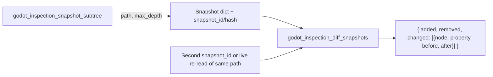

Godot inspection tools, as proposed, are a pair of read-only operations for observing the state of a scene subtree and for comparing that state across two points in time. They matter because inspection is the prerequisite for any automated reasoning about a running or edited scene: without a stable, serializable representation of the tree and a way to compute what changed between two representations, downstream tooling has no reliable input to work from. The two tools are `godot_inspection_snapshot_subtree` and `godot_inspection_diff_snapshots` [1][4][2][5].

## Snapshotting a subtree

`godot_inspection_snapshot_subtree` is a proposed read-only tool that returns a stable dict snapshot of a subtree [1][4]. The snapshot captures node paths, node types, script paths, selected (or all) properties, groups, and transforms [1][4]. Two parameters shape the result: an optional `max_depth` that bounds how far down the subtree the walk goes, and a returned `snapshot_id`/hash that identifies the snapshot for later reference [1][4].

The design choices here are worth noting. The output is a dict rather than a live object reference, which makes it stable — it does not mutate as the scene changes underneath it. The `max_depth` parameter allows callers to trade completeness for size when only the upper levels of a tree are relevant. The `snapshot_id`/hash is what makes the second tool possible: it gives a diff operation a handle to compare against rather than requiring the caller to hold and re-supply the full snapshot payload [1][4].

## Diffing snapshots

`godot_inspection_diff_snapshots` is the companion read-only tool. It diffs two snapshot ids, or alternatively a snapshot plus a live re-read of the same path [2][5]. The live re-read variant is useful when the caller wants to know what changed since a snapshot was taken without first taking a second snapshot explicitly.

The return shape is fixed: `{ added, removed, changed: [{node, property, before, after}] }` [2][5]. Added and removed entries cover nodes present in one side but not the other. The `changed` list is property-level, carrying the node, the property name, and the before and after values [2][5]. This granularity is deliberate — a node-level "changed" flag would not tell a caller which property moved, and property-level detail is what makes the diff actionable.

## Acceptance criteria

An acceptance criterion for this work requires that diff output distinguish added, removed, and changed nodes, with property-level before/after values expressed as JSON-coerced shapes [3][6]. The JSON-coercion requirement is the binding constraint: Godot property values are not all natively JSON-representable, so the diff must normalize them into shapes that survive serialization. The criterion ties the three categories — added, removed, changed — to the same output contract, meaning a diff that reports changes without separating additions and removals, or that reports changes without before/after values, does not satisfy it [3][6].

## Flow

The flow is linear: a snapshot produces a stable dict and an id; the diff consumes either two ids or one id plus a live re-read; the diff emits the categorized, property-level result [1][4][2][5]. Both tools are read-only, so neither mutates the scene they inspect [1][4][2][5].

## See also

- Godot scene tree and node paths
- Node types and script paths
- Godot property serialization and JSON coercion
- Snapshot hashing and stable identifiers
- Read-only tool design for editor and runtime inspection

---

_Citations link to claims in evidence/claims/. Generated on 2026-09-21._
