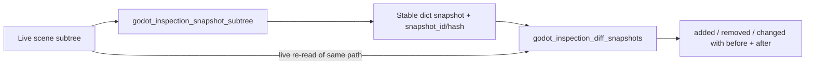

# Godot Inspection Tools

This article covers two proposed read-only inspection tools for Godot: `godot_inspection_snapshot_subtree` and `godot_inspection_diff_snapshots`. Together they define a workflow for capturing the state of a scene subtree and then comparing two captures to determine what changed. The topic matters because both tools are read-only — they observe the scene tree without mutating it — and because the diff output is expected to be property-level rather than a coarse "something changed" signal.

## Capturing a subtree: godot_inspection_snapshot_subtree

The first tool, `godot_inspection_snapshot_subtree`, is proposed as a read-only tool that returns a stable dict snapshot of a subtree [1][4]. The snapshot contains node paths, node types, script paths, selected (or all) properties, groups, and transforms [1][4]. It accepts an optional `max_depth` parameter, which bounds how deep into the subtree the capture goes [1][4]. Each call also returns a `snapshot_id` / hash, which identifies the captured state and can be referenced later [1][4].

The stable dict and the returned identifier are the two properties that make the tool usable as a baseline: the snapshot is a plain data structure, and the id gives a handle to it without requiring a re-read of the live tree [1][4].

## Comparing captures: godot_inspection_diff_snapshots

The second tool, `godot_inspection_diff_snapshots`, is proposed as a read-only tool that diffs two snapshot ids [2][5]. It can also diff a snapshot against a live re-read of the same path, so a stored baseline can be compared with the current state of that subtree [2][5]. The return shape is `{ added, removed, changed: [{node, property, before, after}] }` [2][5].

That shape separates three cases: nodes that appeared, nodes that disappeared, and nodes whose properties changed [2][5]. For the changed case, each entry names the node and the property, and carries both the before and after values [2][5].

## Acceptance criteria

An acceptance criterion for the diff tool requires the output to distinguish added, removed, and changed nodes, with property-level before/after values expressed as JSON-coerced shapes [3][6]. In other words, the diff must not merely report that a subtree differs; it must attribute the difference to specific nodes and specific properties, and the values must be serializable as JSON [3][6].

## Flow

The diagram shows the two entry points into the diff: a previously captured `snapshot_id` and a live re-read of the same path [2][5]. Both feed the same diff tool, which produces the added/removed/changed result [2][5].

## See also

- Scene subtree snapshots
- Snapshot diffing and baselines
- Read-only tool design
- JSON-coerced value shapes

---

_Citations link to claims in evidence/claims/. Generated on 2026-09-21._
