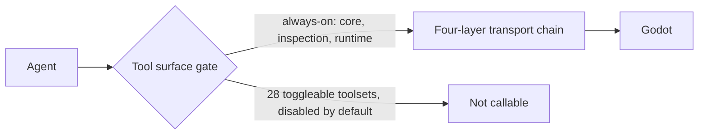

# Godot MCP Tool Surface

godot-mcp is a generic, game-agnostic Model Context Protocol server for AI-driven Godot development [6][12]. Its *tool surface* — the set of tools an agent can actually invoke at a given moment — is not a flat list. It is partitioned into an always-on core and a large body of toggleable toolsets, and any call that clears that surface then crosses a four-layer transport chain [4][10]. This matters because the surface, not the agent's intent, decides what work is possible: a tool that exists in the catalogue but sits in a disabled toolset is simply not callable.

## What the server is

godot-mcp is a generic, game-agnostic Model Context Protocol server for AI-driven Godot development [6][12]. "Generic" and "game-agnostic" are the load-bearing words: the server is not bound to a particular project layout or genre, so the tool surface is the same regardless of what is being built. The surface is therefore the stable contract between an agent and a Godot project.

## Inventory: 180 tools across 29 categories

The ecosystem ships 180 tools across 29 categories — an always-on core plus 28 toggleable toolsets [3][9]. The arithmetic is worth stating plainly: 29 categories decompose into one always-on core and 28 toolsets that can be switched on or off. The 180 tools are distributed across that structure, so the number of tools an agent sees is a function of which toolsets are enabled, not a fixed constant.

## What is enabled by default

The default configuration is deliberately narrow. Only the `core` and `inspection` toolsets are enabled by default [5][11]. Separately, only core, inspection, and runtime tools — the always-on set — are callable [1][7]. Read together, these two statements describe the same gate from different angles: `core` and `inspection` are the toolsets that ship enabled, and `runtime` belongs to the always-on set that remains callable regardless of toolset toggling.

One discrepancy should be flagged rather than smoothed over. A third statement of the default says the ecosystem ships 180 tools across 29 categories "with only inspection enabled by default" [3][9], which conflicts with the claim that both `core` and `inspection` are enabled [5][11]. All sources agree that `inspection` is on by default and that the remaining toggleable toolsets are off until explicitly enabled; they disagree on whether `core` is on by default or always-on by a different mechanism. Anyone relying on the default surface should verify against the current build rather than assume either reading.

## The four-layer transport chain

Every agent action crosses a four-layer transport chain [4][10]. A tool call is therefore not a direct function invocation against the Godot process; it passes through four distinct stages between the agent and the target. Combined with the toolset gate, this gives the surface two independent filters — one at discovery time (is the tool enabled?) and one at call time (does the request survive the transport chain?).

The diagram is intentionally coarse: the evidence establishes that the chain has four layers [4][10] but does not enumerate them here, so the layers are shown as a single stage rather than named individually.

## Changelog

The changelog page mirrors GitHub Releases [2][8]. Release history is published in two places with the same content, so either can be used to track changes to the tool surface — relevant when a toolset is added, renamed, or moved between the always-on set and the toggleable 28.

## See also

- Model Context Protocol
- Godot
- Toolset gating and capability gating
- MCP transport layers
- godot-mcp changelog and release history

---

_Citations link to claims in evidence/claims/. Generated on 2026-09-21._
