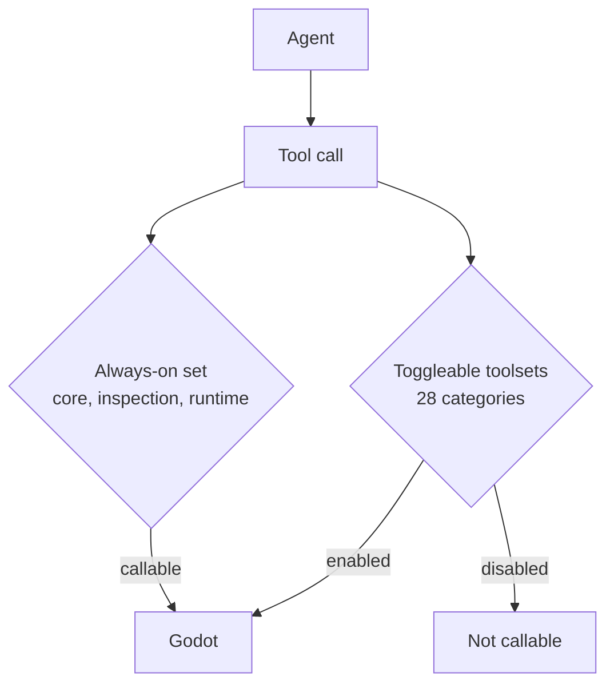

# Godot MCP Tool Surface

godot-mcp is a generic, game-agnostic Model Context Protocol server for AI-driven Godot development [6][12]. This article covers the surface that server exposes to an agent: how many tools exist, how they are grouped, which groups are callable without configuration, and how a call travels from the agent to the engine. The surface matters because it defines what an agent can do out of the box versus what requires an explicit opt-in, and because a large advertised inventory is not the same thing as a large reachable inventory.

## What the server is

godot-mcp is not tied to a particular game or project layout. It is described as a generic, game-agnostic MCP server whose purpose is AI-driven Godot development [6][12]. That framing is what makes the tool surface the interesting part of the system: since the server carries no project-specific knowledge, the set of exposed tools is the entire contract between the agent and the engine.

## Tool inventory and categories

The ecosystem ships 180 tools across 29 categories [3][9]. Those categories are not uniform in kind. The inventory is structured as an always-on core plus 28 toggleable toolsets [3][9]. In other words, one category is permanently present and the remaining 28 can be switched on or off, which means the effective surface an agent sees is a function of configuration rather than a fixed number.

## Default-enabled toolsets

Only the `core` and `inspection` toolsets are enabled by default [5][11]. A second description of the same surface states that only inspection is enabled by default [3][9]. The two statements disagree on whether `core` counts as default-on, and that disagreement should be resolved against the live configuration before it is relied on for anything operational.

Separately, the always-on set is described as core, inspection, and runtime tools, and only that set is callable [1][7]. Taken together, the evidence supports a simple reading: there is a small permanently callable set, and everything else is gated behind toolset toggles that are off unless turned on.

## Transport chain

Tool availability is only half the picture. Every agent action crosses a four-layer transport chain [4][10]. No call reaches the engine directly; each one passes through all four layers. This is relevant when debugging, because a failure observed at the agent end may originate at any layer in the chain rather than in the tool itself.

## Release tracking

The changelog page mirrors GitHub Releases [2][8]. Release history for the tool surface is therefore tracked in one place and reflected in the other, rather than being maintained as two independent records.

## Practical implications

Three things follow from the above. First, the headline number — 180 tools across 29 categories [3][9] — overstates what a default agent can call, since only the always-on set is callable [1][7] and the default-enabled toolsets are limited to `core` and `inspection` [5][11]. Second, enabling a toolset is a configuration decision with a direct effect on the agent's reachable surface. Third, any diagnosis of a failed call has to account for the four-layer transport chain [4][10], not just the tool's own behavior.

## See also

- Model Context Protocol
- Godot Engine
- Toolset configuration and gating
- MCP transport chain
- godot-mcp changelog and release history

---

_Citations link to claims in evidence/claims/. Generated on 2026-09-21._
