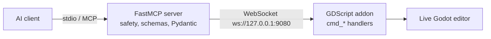

# Godot Multi-Platform Communication Protocol (MCP)

The Godot MCP is a standalone Model Context Protocol server that gives any AI agent harness generic control over a live Godot editor, rather than editing project files on disk [824][891]. It is deliberately game-agnostic: the server knows Godot, not the user's game [892]. It matters because it defines a concrete, versioned contract between an agent and a running editor — envelopes, safety classes, undo semantics, and a sessionless transport — that other Godot tooling can build on.

## Two halves joined by a bridge

The system is two halves joined by a WebSocket bridge: an AI client speaks MCP over stdio to a Python FastMCP server, which then speaks WebSocket to a GDScript Godot addon that reaches the live project [834]. The MCP server owns all safety and permission logic, Pydantic models, and tool schemas, and never touches Godot directly [835]. The addon is the only layer that touches the Godot Editor API and routes commands to `cmd_*` handlers [836].

The connection direction is inverted: the server listens and the editor connects out [849]. The addon dials `ws://127.0.0.1:9080` (configurable via `GODOT_MCP_BRIDGE_URL`) and reconnects automatically, with no auth in v1 [830][845]. The server boots, binds port 9080, and waits [846]; it also listens on `http://localhost:9090` for MCP HTTP [895]. The server initiates every command and the addon responds — the addon never pushes unsolicited commands [850].

Because the editor is single-threaded, the addon drains queued command packets once per `_process` frame and executes them serially on the main thread at roughly 50–100 ms per command [856]. `godot_composite_run_commands` collapses N round-trips into one by executing a whole command list in a single frame and returning one envelope per command [858]; it cannot be nested [860], and each sub-mutation wraps its own UndoRedo action with command order preserved [859].

## Envelopes, coercion, and safety

JSON envelopes are versioned from day one: commands are `{id, command, params}` and responses `{id,

---

_Citations link to claims in evidence/claims/. Generated on 2026-09-21._
