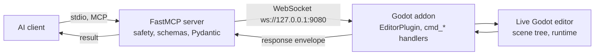

# Godot Multi-Platform Communication Protocol (MCP)

`godot-mcp` is a standalone MCP server that provides generic Godot editor control over the Model Context Protocol, usable by any AI agent harness and game-agnostic [1948]. It bridges an AI agent and a live Godot editor, letting the agent drive the editor directly instead of editing files on disk [2015]. The distinction matters because file-on-disk edits are invisible to a running editor until the user manually closes and reopens scenes or restarts the editor entirely [1552][1553]. This article covers the bridge architecture, the envelope contract, toolset gating, the sessionless protocol revision, and the versioning and verification rules that keep the two halves in sync.

## Two halves joined by a WebSocket bridge

The system is two halves joined by a WebSocket bridge: an AI client over stdio to a Python FastMCP server, then WebSocket to a GDScript Godot addon that reaches the live project [1958]. The MCP server owns all safety and permission logic, Pydantic models, and tool schemas, and never touches Godot directly [1959]. The Godot addon is the only layer that touches the Godot Editor API and routes commands to `cmd_*` handlers [1960]. The bridge connection direction is inverted: the server listens and the editor connects out [1973]. The server initiates every command and the addon responds; the addon never pushes unsolicited commands [1974]. The addon dials out to `ws://127.0.0.1:9080` [1969], while the server listens on `http://localhost:9090` for MCP HTTP and `ws://localhost:9080` for the bridge [2019].

## Envelopes and the command contract

JSON envelopes are versioned from day one, with command `{id, command, params}` and response `{id, ok, result, error}` correlated by id [1951]. All create, rename, delete, and set operations in the addon must register with `EditorUndoRedoManager` [1952]. Error codes must be stable and drawn from the enumerated set, never ad-hoc strings [1975]. Godot types cross the bridge as JSON-safe forms coerced on the addon side in the dedicated `type_coerce.gd` helper (`MCPTypeCoerce`), never inline [1976].

## Toolsets, safety classes, and gating

Every tool is tagged with exactly one safety class [1996]. Tools tagged destructive may be irreversible and require both `dry_run` and `confirm: bool = True` [1961], and `dry_run=True` returns what would happen while performing nothing [1997]. All safety logic lives in `mcp_server/safety.py`, never in the addon [1998]. Every `@mcp.tool` takes typed parameters and returns a typed Pydantic model, never a raw dict [1994], and validates inputs and checks preconditions before any side effect [1995]. Every JSON-result tool declares a standard `outputSchema` and returns `structuredContent` alongside text content, with FastMCP 4.0 deriving both from the tool's Pydantic return annotation automatically [1999]; `godot_editor_capture_screenshot` returns `ImageContent` (non-JSON), so it declares no schema and no `structuredContent` [2000]. Only the inspection toolset is enabled by default among the 28 toggleable toolsets [2011], and only after enabling a toolset can you call the tools in that category [2005].

## Sessionless protocol and state handling

The MCP spec's 2026-07-28 revision removes sessions and the initialize handshake entirely [1985]; per-request `_meta` carries version and capabilities instead of handshake negotiation [1986], and cross-call state moves to explicit handles — server-minted tokens passed as ordinary tool arguments [1987]. A source-shape guard AST-scans `mcp_server/**` so no module may read `.session_id`/`.session`, name a `session_id` binding, or define `on_initialize`/`on_new_session`/`on_session_end` [1992]. Unlike a spec-default server that scopes a grant to the caller, godot-mcp's grants are visible to every client of the process [1993]. Because the WebSocket bridge is synchronous, the round-trip to the running game is poll-and-cache [1977]. The Godot editor is single-threaded: the addon drains queued command packets once per `_process` frame and executes them serially on the main thread at roughly 50–100 ms per command [1980]. `godot_composite_run_commands` executes a whole command list in a single frame and returns one envelope per command, collapsing N round-trips into one [1982], and cannot be nested [1984].

## Versioning, handshake, and drift

Versioning uses CalVer `YYYY.MM.DD[-N]`, and the version must stay in lockstep across `pyproject.toml`, `mcp_server/__init__.py`, `godot/addons/godot_mcp/plugin.cfg`, and `skills/godot-getting-started/SKILL.md`, enforced by drift tests [1963]. PR #543 implements the server↔addon handshake from issue #530, closing #521 as a side effect [1910]. `cmd_get_addon_info` self-describes with `addon_version` (live from `plugin.cfg`), `godot_version`, and the live registered-command list from `_handlers.keys()` [1911]. `cmd_server_hello {version}` stores the server's pushed package version, which the plugin entry reflects on the next 2s dock poll [1912]. A server↔addon version mismatch surfaces in `godot_get_server_info` as an `addon_drift_warning` naming the count of unregistered commands [1915].

## Why honesty fields exist

Silent failures were the dominant defect class in practice: deleting a `.tscn` file left a stale tab that resurrects a mangled scene [1456], `set_node_property` with a `res://` path no-ops while still reporting `set:true` [1457], `navigation_bake_mesh` returns `baked:true` on an empty navmesh [1458], and the debugger traps the game invisibly [1459]. These four priority:high bugs formed the recommended next fix batch [1462]. Zero skipped tests are a blocking gate: no `@pytest.mark.skip`, no `xfail`, and no bare `pytest.skip()` are allowed [1962].

## See also

- Model Context Protocol
- Godot editor automation
- Toolset gating and safety classes
- Sessionless MCP protocol
- Godot addon bridge and `cmd_*` handlers

---

_Citations link to claims in evidence/claims/. Generated on 2026-09-21._
