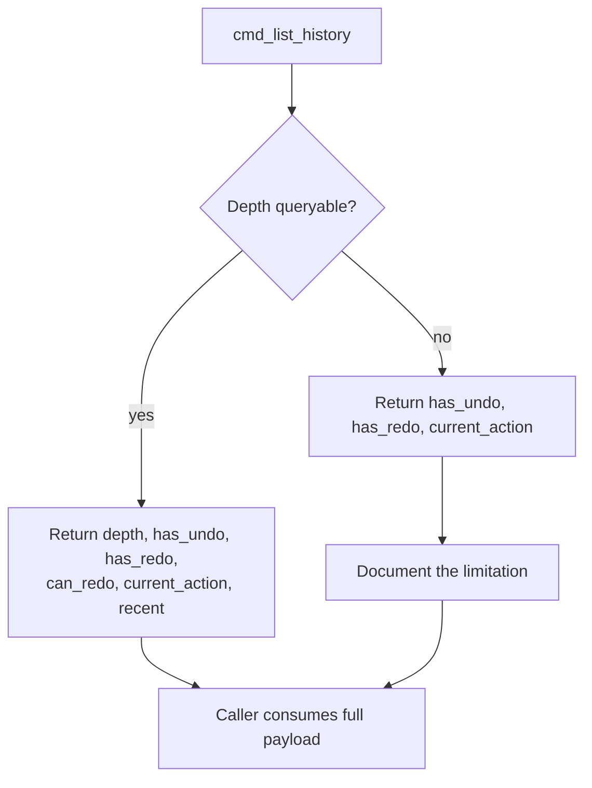

# Godot Undo/Redo History API

This article covers the proposed command surface for inspecting and driving Godot's undo/redo history from an external tool or agent interface — specifically `cmd_list_history` and `cmd_redo` — and the constraint that Godot 4.7's `UndoRedo` class places on it. The topic matters because tooling that edits a scene needs to know what can be undone or redone *before* issuing a command, and needs to report honestly when the engine cannot answer the question.

## Proposed command surface

`cmd_list_history` is specified as a read-only core command. It returns a structured payload containing `depth`, `has_undo`, `has_redo`, `can_redo`, `current_action`, and a `recent` list of entries, capped at roughly 20 items [2][6]. The cap keeps the response bounded no matter how long the editing session has run.

`cmd_redo` is specified to mirror `cmd_undo`. It accepts `count` and `dry_run`; in dry-run mode it reports `has_redo` together with the name of the next action that would be redone. Its result carries `redone`, `requested`, and `last_action` [1][5]. Mirroring the undo command means callers can treat the two directions symmetrically — the same request shape, the same dry-run semantics, the same result envelope.

## The gap in Godot 4.7

The engine's `UndoRedo` class exposes `has_undo()`, `has_redo()`, and `get_current_action_name()`. It does not expose a public stack-depth or entries API in 4.7 [3][7]. Consequently, the `depth` and `recent` fields as specified in `cmd_list_history` have no direct backing in the engine's public surface.

This is the central design tension of the proposal: the intended response shape is richer than what the engine can currently supply. Any implementation has to decide what to do about the difference rather than assume the data is there.

## Returning an honest subset

The guidance is explicit. If depth is not queryable, the implementation should return the honest subset — `has_undo`, `has_redo`, `current_action` — and document the limitation rather than fabricating a depth value [4][8]. A synthesized or estimated depth would be worse than an absent field, because callers would act on it: a tool that believes it knows the stack depth may issue a `count`-based redo that overshoots or undershoots.

The practical consequence for consumers is that `depth` and `recent` must be treated as optional fields. The three values that are always trustworthy are the ones backed by public engine methods: `has_undo`, `has_redo`, and `current_action`. Everything else is best-effort and should be validated before use.

The same honesty rule applies to `cmd_redo`'s dry-run path. Because `has_redo()` and the next action name are both available from the public API, the dry-run report can be answered without guessing [1][5]. That makes dry-run the safe way to probe redo state before committing to a `count`-based redo.

## Summary of guarantees

| Field | Backed by public API in 4.7 |
|---|---|
| `has_undo` | Yes — `has_undo()` [3][7] |
| `has_redo` | Yes — `has_redo()` [3][7] |
| `current_action` | Yes — `get_current_action_name()` [3][7] |
| `depth` | No — not queryable [3][7] |
| `recent` | No — not queryable [3][7] |

The design principle that falls out of this is straightforward: expose what the engine can prove, mark the rest as unavailable, and let the caller decide whether the reduced payload is sufficient for its task.

## See also

- Godot `UndoRedo` class
- `cmd_undo` — the command `cmd_redo` mirrors
- Dry-run command semantics
- Command result envelopes (`redone` / `requested` / `last_action`)
- Capability negotiation for engine-backed tools

---

_Citations link to claims in evidence/claims/. Generated on 2026-09-21._
