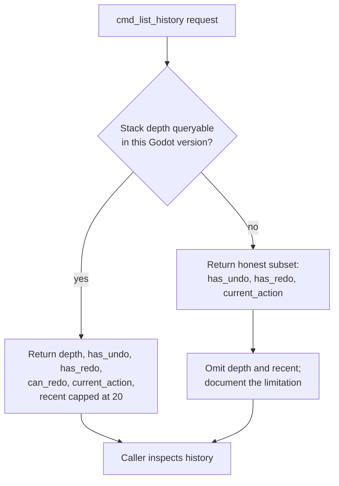

Godot's `UndoRedo` class is the mechanism behind reversible editor operations, and any tooling that drives the editor programmatically — plugins, test harnesses, automation agents — eventually needs to inspect or advance that history without going through the editor UI. This article covers the proposed command surface for doing so: `cmd_undo`, `cmd_redo`, and `cmd_list_history`. It also covers the gap between what that surface is specified to return and what Godot 4.7 actually exposes, and the rule the implementation follows when those two disagree.

## Proposed command surface

`cmd_redo` mirrors `cmd_undo` [1][5]. It takes a `count` parameter, supports a `dry_run` mode that reports `has_redo` together with the name of the next action that would be redone, and returns a result carrying `redone`, `requested`, and `last_action` [1][5]. The symmetry with undo is the point: a caller can probe what a redo would do before committing to it, and can batch multiple steps in one call rather than issuing them one at a time.

`cmd_list_history` is specified as a read-only core command [2][6]. It returns a structured payload containing `depth`, `has_undo`, `has_redo`, `can_redo`, `current_action`, and a `recent` list capped at roughly 20 entries [2][6]. The cap keeps the response bounded no matter how long an editing session has been running, which matters when the caller is an agent paying for every token of the reply.

## What Godot 4.7 actually exposes

Godot's `UndoRedo` exposes `has_undo()`, `has_redo()`, and `get_current_action_name()`, but no public stack-depth or entries API in 4.7 [3][7]. That is the constraint the whole design has to work around. Three parts of the proposed `cmd_list_history` payload — `depth`, the `recent` array, and anything else derived from enumerating the stack — have no direct backing in the engine's public surface [3][7]. The engine can answer "is there something to undo?" and "what is the current action called?", but it cannot answer "how many entries are on the stack?" or "what were the last twenty actions?"

## Honest degradation

If depth is not queryable, the implementation should return the honest subset — `has_undo`, `has_redo`, `current_action` — and document the limitation rather than faking a depth [4][8]. This is a deliberate rule rather than a fallback path. A fabricated depth, or a `recent` list reconstructed from guesswork, would be worse than an absent field, because callers would build logic on values that do not correspond to engine state [4][8]. A missing field produces a clear error at the call site; a plausible-looking wrong number produces silent misbehaviour.

In practice this means `can_redo` is derived from `has_redo()`, `current_action` from `get_current_action_name()`, and `depth` and `recent` are omitted or explicitly null with a documented note explaining why [3][4][7][8]. The command's contract is "return what the engine can actually tell you," and the documentation carries the rest.

The same reasoning applies to `cmd_redo`: its `dry_run` result depends only on `has_redo()` and the next action name, both of which the engine does provide, so no degradation is needed there [1][5]. The asymmetry between the two commands is a direct consequence of which primitives Godot 4.7 chose to make public [3][7].

## See also

- Godot `UndoRedo` class reference
- Editor plugin command surface
- Dry-run command semantics
- Capability probing and graceful degradation
- Read-only core commands

---

_Citations link to claims in evidence/claims/. Generated on 2026-09-21._
