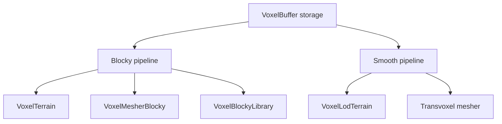

Voxel terrain in Godot is not a single pipeline. The `godot_voxel` module maintained by Zylann runs two parallel pipelines over the same `VoxelBuffer` storage: a blocky pipeline (`VoxelTerrain` + `VoxelMesherBlocky` + `VoxelBlockyLibrary`) and a smooth pipeline (`VoxelLodTerrain` + Transvoxel mesher) [2][5]. Understanding this split matters because the choice of pipeline determines mesh topology, level-of-detail behaviour, and which collision path is available — and because the two pipelines are not as different as they first appear.

## Shared storage, two pipelines

Both pipelines read from the same `VoxelBuffer` storage [2][5]. The voxel data is therefore not duplicated per pipeline; what differs is how that data is turned into geometry and how the resulting terrain node is managed.

## The blocky pipeline

The blocky pipeline is composed of `VoxelTerrain`, `VoxelMesherBlocky`, and `VoxelBlockyLibrary` [2][5]. `VoxelTerrain` is the terrain node, `VoxelMesherBlocky` produces the mesh, and `VoxelBlockyLibrary` supplies the model definitions the mesher works from. The output is the familiar cube-per-voxel surface.

## The smooth pipeline

The smooth pipeline pairs `VoxelLodTerrain` with a Transvoxel mesher [2][5]. The terrain node here is LOD-aware, which is the structural difference from the blocky side: the smooth path is the one built around level-of-detail terrain, and Transvoxel is the mesher used to stitch the resulting surfaces.

## Topology: blocky and surface nets

A useful property when reasoning about these pipelines is that surface nets on a cubic grid has the same topology as the blocky mesh, differing only in vertex placement [1][4]. In other words, the connectivity of the surface — which cells connect to which — is identical between the two; the smooth variant simply positions vertices differently rather than producing a fundamentally different surface structure. This means switching between a blocky representation and a surface-nets representation on a cubic grid is a change of vertex placement, not a change of topology.

## Collision data

Collision is handled differently depending on the pipeline. `VoxelBlockyModel` carries a `collision_aabbs: AABB[]` list of bounding boxes [3][6]. These boxes are used for box-based collision with `VoxelBoxMover` [3][6]. They are not used with mesh-based collision [3][6]. So a project using `VoxelBoxMover` depends on the per-model AABB list, while a project relying on mesh-based collision does not consume that data at all.

## Practical implications

Two consequences follow from the evidence above. First, because both pipelines share `VoxelBuffer` storage [2][5], the voxel data layer is common and the pipeline choice is a meshing and terrain-node decision rather than a data-format decision. Second, because surface nets on a cubic grid preserves blocky topology [1][4], the blocky and smooth outputs are structurally comparable on that grid, and the difference reduces to vertex placement. Third, collision strategy must be chosen alongside the pipeline: the `collision_aabbs` list on `VoxelBlockyModel` only matters for box-based collision via `VoxelBoxMover` [3][6].

## See also

- `VoxelBuffer` — shared voxel storage for both pipelines
- `VoxelTerrain` — terrain node for the blocky pipeline
- `VoxelMesherBlocky` — blocky mesh generation
- `VoxelBlockyLibrary` — model definitions for the blocky mesher
- `VoxelLodTerrain` — LOD terrain node for the smooth pipeline
- Transvoxel mesher — mesher used by the smooth pipeline
- `VoxelBlockyModel` — carries `collision_aabbs` for box-based collision
- `VoxelBoxMover` — box-based collision consumer of `collision_aabbs`
- Surface nets — cubic-grid meshing with blocky-equivalent topology

---

_Citations link to claims in evidence/claims/. Generated on 2026-09-21._
