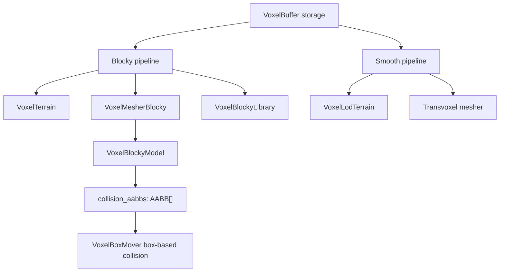

# Godot Voxel Pipeline

Zylann's `godot_voxel` module does not expose a single voxel pipeline. It runs two, side by side, over shared storage. This article covers how those two paths are structured, what they have in common, and where they diverge — in mesh topology and in collision data. The distinction matters because the pipeline you pick determines both the shape of the generated geometry and which collision strategy is available to your game.

## Two pipelines over one buffer

`godot_voxel` runs two parallel pipelines over the same `VoxelBuffer` storage: blocky (`VoxelTerrain` + `VoxelMesherBlocky` + `VoxelBlockyLibrary`) and smooth (`VoxelLodTerrain` + Transvoxel mesher) [2][5].

The important structural point is the shared `VoxelBuffer`. Both pipelines read the same voxel data; the divergence happens downstream, at the terrain-node and meshing layer. The blocky path is built from `VoxelTerrain`, `VoxelMesherBlocky`, and `VoxelBlockyLibrary`. The smooth path is built from `VoxelLodTerrain` and the Transvoxel mesher. Nothing in the storage layer forces a choice between them.

## Mesh topology: blocky versus surface nets

Surface nets on a cubic grid has the same topology as the blocky mesh, differing only in vertex placement [1][4].

This is worth stating plainly because it constrains what you should expect from switching pipelines. On a cubic grid, the connectivity of the surface-nets output is not fundamentally different from the blocky output. What changes is where the vertices sit. The grid topology is preserved; the geometry that fills it is not. If you are reasoning about how a mesh will connect, split, or seam, the blocky case is a valid mental model for the surface-nets case on the same grid — the difference is positional, not structural.

## Collision data

`VoxelBlockyModel` carries a `collision_aabbs: AABB[]` list of bounding boxes used for box-based collision with `VoxelBoxMover` [3][6]. These bounding boxes are not used with mesh-based collision [3][6].

That gives the blocky pipeline two distinct collision routes. With `VoxelBoxMover`, collision is resolved against the per-model AABB list — a small set of boxes rather than the generated mesh. With mesh-based collision, that AABB list is not consulted at all. The practical consequence is that the `collision_aabbs` data is only meaningful in the box-based path; if you switch to mesh-based collision, the list becomes inert.

## Summary of the split

| Concern | Blocky | Smooth |
|---|---|---|
| Storage | `VoxelBuffer` | `VoxelBuffer` |
| Terrain node | `VoxelTerrain` | `VoxelLodTerrain` |
| Mesher | `VoxelMesherBlocky` | Transvoxel mesher |
| Model/library | `VoxelBlockyLibrary`, `VoxelBlockyModel` | — |
| Collision | `collision_aabbs` + `VoxelBoxMover`, or mesh-based | mesh-based |

The two pipelines share input and nothing else. Mesh topology on a cubic grid is equivalent between blocky and surface nets apart from vertex placement [1][4], and the AABB collision data belongs to the blocky model and the box-based mover, not to mesh-based collision [3][6].

## See also

- `VoxelBuffer`
- `VoxelTerrain`
- `VoxelMesherBlocky`
- `VoxelBlockyLibrary`
- `VoxelBlockyModel`
- `VoxelBoxMover`
- `VoxelLodTerrain`
- Transvoxel mesher
- Surface nets

---

_Citations link to claims in evidence/claims/. Generated on 2026-09-21._
