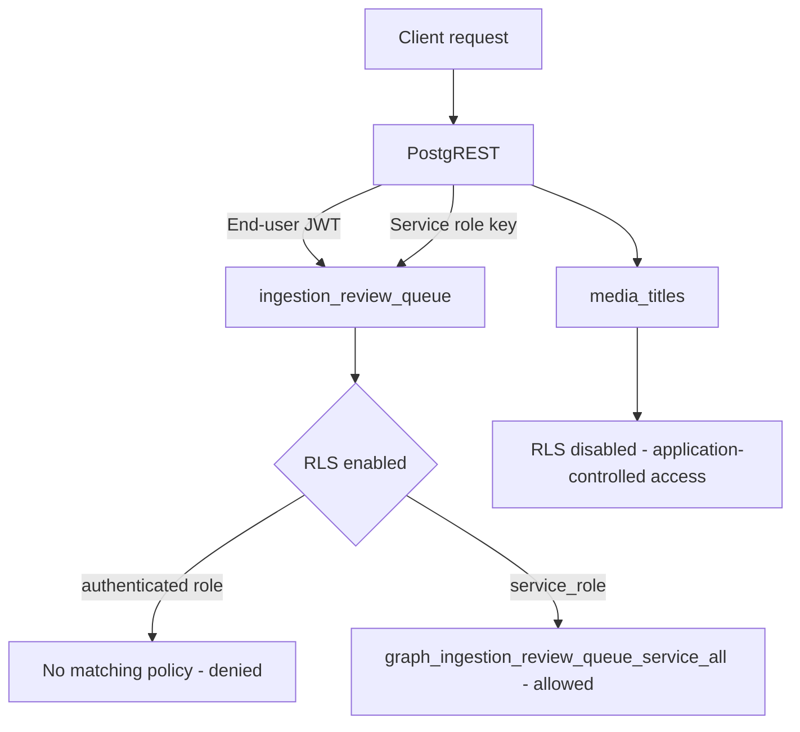

The Graph Critical RLS Contract is the set of row-level security (RLS) expectations that the graph ingestion path depends on. It defines, per table, whether RLS is enabled, which policies must exist, which roles those policies target, and what happens when a request arrives through PostgREST without the service role. It matters because the ingestion review queue sits between untrusted client traffic and the graph write path: if its policy set drifts, either end users gain a direct write channel into review data or the ingestion pipeline silently loses the ability to write at all. The contract is not documentation-only — it is enforced by migration and CI contract tests, so any divergence is a build failure rather than a runtime surprise [4][10].

## Contracted tables and their policies

The primary contracted table is `ingestion_review_queue`. RLS is enabled on it, and it carries exactly one policy: a service-role policy named `graph_ingestion_review_queue_service_all` [1][7]. That single policy is the whole access surface for the table.

There are no authenticated-role policies on the review queue. As a consequence, a direct PostgREST call carrying an end-user JWT is denied [2][8]. This is the intended behavior, not an oversight: the absence of a policy is the enforcement mechanism. An authenticated request reaches the table, RLS evaluates it, finds no matching policy, and the row set is empty or the write is rejected.

The second table in scope is `media_titles`. It has RLS disabled and no contracted policies, and its public read/write behavior remains application-controlled [6][12]. This is a deliberate contrast with the review queue: `media_titles` is not part of the service-only contract, so the contract tests do not assert a policy shape for it. Its access rules live in application code rather than in the database policy layer.

## The service-only access pattern

The review queue follows what the codebase calls the Service-Only Access pattern: no user policies exist, and all access goes through the service role [3][9]. Under this pattern, the database is not the place where per-user authorization is expressed. Instead, the table is effectively closed to end-user credentials, and the only principal that can read or write it is the service role used by trusted server-side code.

The practical implication is that any feature needing to read or mutate review-queue rows must run behind the service role. Client-side code cannot be given a scoped policy to reach the table without breaking the contract, because adding an authenticated-role policy would change the policy set that the contract tests assert.

## Enforcement: migration and CI contract tests

The contract is enforced in two places. First, migrations define the RLS state and policy definitions, so the expected shape is created declaratively rather than by hand. Second, CI contract tests assert that shape against the live schema [4][10].

Drift is treated as a failure. Any change to policy names, the commands a policy permits, or a table's RLS state causes the contract tests to fail [5][11]. This covers the obvious cases — dropping `graph_ingestion_review_queue_service_all`, renaming it, widening its command set, or disabling RLS on the review queue — and it also covers the quieter case of adding a policy that was never contracted. Because the check runs in CI, a schema change that would alter the access surface cannot merge without an explicit contract update.

The diagram summarizes the two paths: end-user credentials are denied at the review queue by the absence of a policy, while the service role is admitted by the single contracted policy. `media_titles` bypasses the RLS decision entirely because RLS is disabled there.

## See also

- Service-Only Access pattern
- Row-level security (RLS) in Postgres
- PostgREST role and JWT handling
- Graph ingestion pipeline
- Schema contract testing in CI
- Migration-managed policy definitions

---

_Citations link to claims in evidence/claims/. Generated on 2026-09-21._
