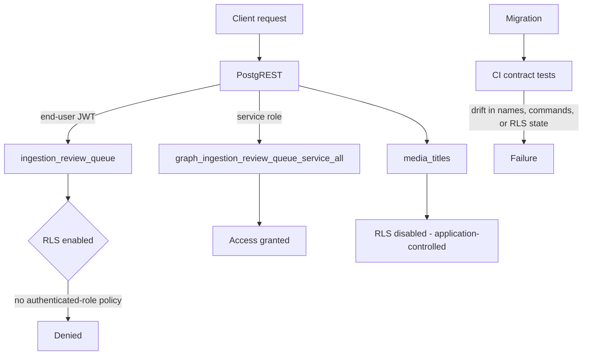

The Graph-Critical RLS Contract is the set of row-level security expectations that the graph data layer must satisfy at all times. It exists because RLS state is easy to change accidentally — a migration, a manual `ALTER TABLE`, or a policy rename can silently open or close an access path — and because PostgREST exposes tables directly to clients, meaning a missing policy is not a theoretical risk but an immediately reachable endpoint. The contract pins the RLS state, policy names, and policy commands for graph-critical tables, and it is enforced by migration and CI contract tests rather than by convention alone [4][10].

## What the contract pins

The contract covers three things per table: whether RLS is enabled, which policies exist, and what commands those policies permit. Any drift in policy names, commands, or table RLS state is treated as a failure [5][11]. That definition matters because it makes the contract checkable. A reviewer does not have to reason about intent; the migration and the CI contract tests compare the live schema against the expected shape and fail the build on any mismatch [4][10].

## Service-only tables: ingestion_review_queue

The `ingestion_review_queue` table is the clearest example of the contract in action. RLS is enabled on it, and it carries a single service-role policy named `graph_ingestion_review_queue_service_all` [1][7]. There are no authenticated-role policies on the review queue, so a direct PostgREST call with an end-user JWT is denied [2][8].

This is the Service-Only Access pattern: no user policies exist, and all access goes through the service role [3][9]. The practical consequence is that the review queue is not reachable from a browser session or any other client holding an end-user token. Only server-side code holding the service role can read or write it. The single `_service_all` policy is what makes that explicit — the policy name itself records both the role it applies to and the breadth of the commands it grants.

## Tables outside the contract: media_titles

Not every table is graph-critical in the same way. `media_titles` has RLS disabled and no contracted policies, with public read/write behavior remaining application-controlled [6][12]. That is a deliberate difference, not an oversight: the contract does not assert anything about `media_titles`, so its access behavior is governed by application logic rather than by database-level policy. The distinction is worth stating plainly, because "RLS disabled" on one table and "RLS enabled with a service-only policy" on another are both valid states under this contract — they are simply different entries in it.

## Enforcement path

The enforcement side is deliberately boring. The contract is applied by migration and verified by CI contract tests [4][10]. If a policy is renamed, a command is widened, or a table's RLS flag flips, the tests fail [5][11]. This keeps the access model from drifting one migration at a time, which is the failure mode the contract is designed to prevent.

## Why it matters

Without a contract, the security posture of the graph layer is only as good as the last person who read the migration. With it, the posture is a testable property: `ingestion_review_queue` is service-only and unreachable with an end-user JWT [2][8], `media_titles` is application-controlled [6][12], and any deviation from either state stops the pipeline [5][11].

## See also

- Service-Only Access pattern
- Row-Level Security (RLS)
- PostgREST role and JWT handling
- CI contract tests
- Migration-driven schema governance

---

_Citations link to claims in evidence/claims/. Generated on 2026-09-21._
