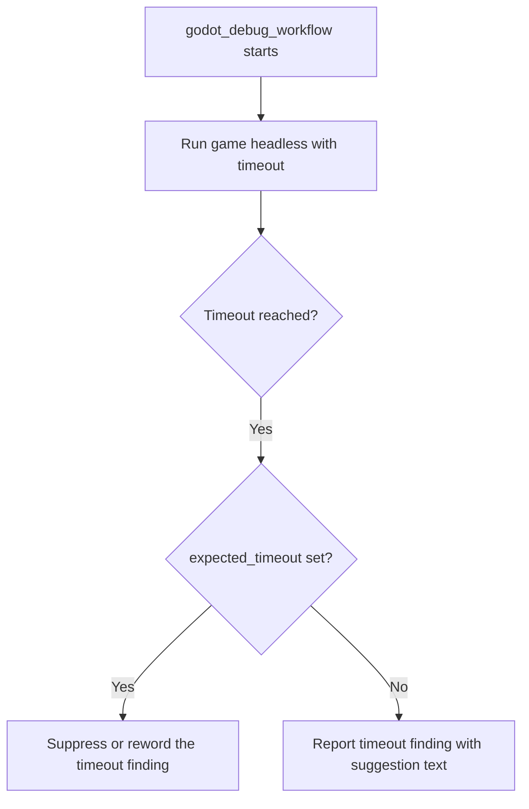

# Headless Run Timeout Handling

Headless run timeout handling covers how the `godot_debug_workflow` tooling decides what to report when a game launched without a display does not exit before its timeout expires. The topic matters because the current behavior produces findings that are wrong: a game that is running correctly but is designed to keep running is reported as if it were stuck. This article describes how the headless run works, why the timeout findings are false positives, and the proposed `expected_timeout` parameter that would let the tool distinguish the two cases.

## How the headless run works

The `godot_debug_workflow` tool runs the game headless with a timeout [2][7]. The game is started without a rendering window, and the tool waits for it to finish. If the process is still alive when the timeout elapses, the tool treats that as a finding and emits a suggestion to the user.

This workflow is the same one used to investigate runtime defects in the engine. One example is Issue #489, a closed bug report titled "[Bug] AnimationPlayer path resolution fails for instanced scenes" [1][6]. That report is closed, but it illustrates the class of runtime problem the headless debug run is meant to surface — problems that only appear when the scene tree is actually instantiated and executed.

## Why the timeout findings are false positives

The timeout findings are false positives because the game is working correctly and simply does not quit on its own [3][8]. A game that is meant to run indefinitely — a normal interactive game loop, for instance — has no reason to terminate. The absence of an exit is the expected behavior, not a symptom.

The problem is compounded by the wording of the output. The suggestion text incorrectly blames the game for infinite loops when the game is functioning correctly [4][9]. A developer reading that suggestion is pointed at a defect that does not exist, which costs time and can lead to unnecessary changes to working code. The tool has no way, in its current form, to tell "this game is hung" apart from "this game is supposed to keep running," so it reports both the same way.

## Proposed enhancement: the `expected_timeout` parameter

A proposed enhancement adds an `expected_timeout` boolean parameter for games meant to run indefinitely, so the timeout finding is suppressed or reworded [5][10]. Under this proposal, the caller declares up front whether a timeout is a legitimate outcome for the run. When `expected_timeout` is set, the tool either drops the finding entirely or restates it in neutral terms rather than blaming the game for an infinite loop.

The flow below shows where that decision would sit in the run.

The key point is that the timeout itself is not the signal — the caller's expectation about the timeout is. Without that input, the tool can only guess, and its current guess is wrong for any game that runs indefinitely.

## Summary

Headless runs are terminated by a timeout [2][7]. For games that do not quit on their own, that timeout is expected behavior, so the resulting findings are false positives [3][8] and the accompanying suggestion text misattributes the cause to infinite loops [4][9]. Adding an `expected_timeout` boolean lets callers mark runs where a timeout is normal, so the finding is suppressed or reworded [5][10].

## See also

- `godot_debug_workflow` — the tool that performs the headless run [2][7]
- False-positive findings in automated debug output [3][8]
- Suggestion text generation and its failure modes [4][9]
- `expected_timeout` parameter proposal [5][10]
- Issue #489, "[Bug] AnimationPlayer path resolution fails for instanced scenes" — an example of a runtime defect investigated through headless runs [1][6]

---

_Citations link to claims in evidence/claims/. Generated on 2026-09-21._
