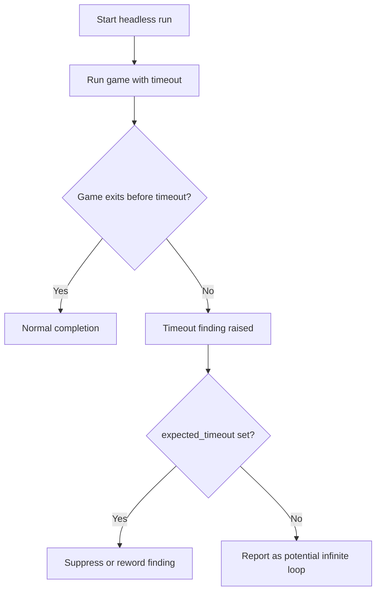

# Headless Run Timeout Handling

Headless run timeout handling covers how the `godot_debug_workflow` tool bounds a game's execution and how it interprets the case where that bound is reached. The tool runs the game headless with a timeout [2][7]. That timeout is a safety mechanism, but it produces findings that are not always defects: when a game is designed to keep running, the timeout fires even though nothing is wrong. Getting this distinction right matters because a misleading finding sends developers chasing bugs that do not exist.

## How the headless run is bounded

The workflow executes the game without a display and applies a timeout to the run [2][7]. The timeout exists so that a run cannot hang indefinitely and so the tool can return a result within a predictable window. When the game exits on its own before the timeout elapses, the run completes normally. When the timeout elapses first, the tool raises a timeout finding.

## Why timeout findings can be false positives

A timeout finding does not by itself prove a defect. In the observed case, the timeout findings are false positives because the game is working correctly and simply does not quit on its own [3][8]. The game is behaving as intended; it is the tool's assumption that a run should terminate that is wrong for this class of program.

The problem is compounded by the wording attached to the finding. The suggestion text incorrectly blames the game for infinite loops when the game is functioning correctly [4][9]. A developer reading that suggestion is pointed toward a loop defect that does not exist, which wastes triage time and erodes trust in the tool's output. The defect here is in the diagnostic message, not in the game.

## Proposed enhancement: `expected_timeout`

The proposed fix is a new parameter rather than a change to the timeout itself. A proposed enhancement adds an `expected_timeout` boolean parameter for games meant to run indefinitely so the timeout finding is suppressed or reworded [5][10]. Setting the flag declares that non-termination is the intended behavior for that run. The tool can then either drop the finding entirely or restate it in neutral terms, instead of asserting an infinite loop.

This keeps the timeout in place as a genuine safeguard for runs that are supposed to finish, while removing the false signal for runs that are not. The decision is left to the caller, who knows whether the game is expected to quit.

## Flow

The branch point is the `expected_timeout` flag: it determines whether a reached timeout is treated as a defect signal or as an anticipated outcome.

## Summary

Timeout handling in the headless workflow has two parts: bounding the run, and interpreting the bound when it is hit. The bounding is straightforward. The interpretation is where the current behavior falls short, because it reports a correct, non-terminating game as an infinite loop [3][4][8][9]. The `expected_timeout` parameter addresses this by letting the caller declare intent up front [5][10].

## See also

- `godot_debug_workflow` — the tool that runs the game headless with a timeout [2][7]
- `expected_timeout` parameter — proposed boolean flag for games meant to run indefinitely [5][10]
- False positive triage in automated test findings [3][8]
- Diagnostic message wording and its effect on developer triage [4][9]
- Issue #489 — closed bug report titled "[Bug] AnimationPlayer path resolution fails for instanced scenes" [1][6]

---

_Citations link to claims in evidence/claims/. Generated on 2026-09-21._
