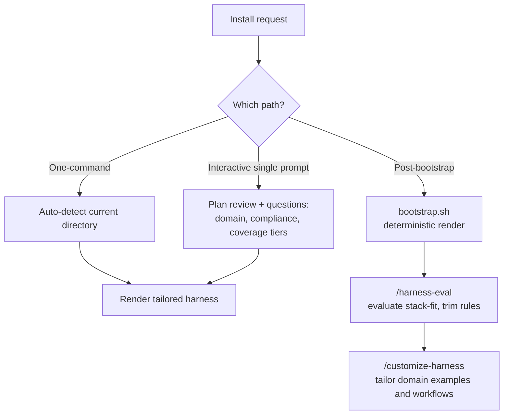

# Instructions and Rules Installation

This article covers how the harness installation instructions and rules are installed, and the three entry paths the instructions define: the one-command install, the interactive single prompt, and the post-bootstrap flow. The choice matters because each path decides how much of the harness is inferred automatically from the working directory and how much is specified by the operator. Picking the wrong path either leaves gaps that auto-detection cannot fill, or adds a review step you did not need.

## One-command install

The one-command install renders a harness tailored to the current directory via auto-detection [1][4]. The operator supplies no additional input; the tailoring is derived from the directory itself. This is the shortest path, and it is the appropriate one when the directory already carries enough signal for auto-detection to produce a usable result.

## Interactive single prompt

The interactive single prompt is used when you want a plan review and to be asked about things auto-detect can't infer — domain, compliance, and coverage tiers [2][5]. Two properties distinguish it from the one-command install: the plan is presented for review before it is applied, and the operator is prompted for the inputs that auto-detection cannot derive. Domain, compliance, and coverage tiers are the specific gaps this path closes.

## Post-bootstrap flow

The post-bootstrap flow is a three-stage sequence. It runs `bootstrap.sh` to render deterministically, then `/harness-eval` to evaluate stack-fit and trim rules, then `/customize-harness` to tailor domain examples and workflows [3][6].

The stages are ordered deliberately:

- **`bootstrap.sh`** performs a deterministic render. The output follows from the inputs rather than from inference, so the same inputs produce the same harness.
- **`/harness-eval`** evaluates stack-fit and trims rules. Rules that do not fit the detected stack are removed at this point, before any domain tailoring is applied.
- **`/customize-harness`** tailors domain examples and workflows, adapting the rendered harness to the specific domain it will operate in.

Because evaluation and trimming happen before customization, the tailoring stage operates on a rule set that has already been reduced to what fits the stack.

## Flow overview

## Choosing a path

The three paths differ along one axis: how much is inferred versus specified. The one-command install infers everything from the current directory [1][4]. The interactive single prompt infers what it can and asks about the rest, with a plan review before applying [2][5]. The post-bootstrap flow renders deterministically first, then evaluates and trims, then customizes [3][6] — it is the path that separates rendering, evaluation, and tailoring into distinct, inspectable stages.

## See also

- Harness auto-detection
- Plan review and operator prompts
- Coverage tiers
- Compliance configuration
- `bootstrap.sh` deterministic rendering
- `/harness-eval` stack-fit evaluation and rule trimming
- `/customize-harness` domain tailoring

---

_Citations link to claims in evidence/claims/. Generated on 2026-09-21._
