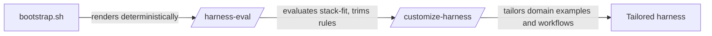

Installation of the harness is governed by a small set of instructions and rules that decide what gets rendered into a working directory. There are two entry points — a one-command install and an interactive single prompt — and a defined post-bootstrap sequence that follows either one. The choice of entry point matters because the two paths differ in how much they infer versus how much they ask, and the post-bootstrap steps are what turn a generic render into a stack-fit, domain-tailored harness.

## One-command install

The one-command install renders a harness tailored to the current directory via auto-detection [1][4]. No plan review is presented and no questions are asked; the tailoring is derived entirely from what auto-detection can infer about the directory. This is the path to use when the contents of the directory are sufficient to determine the shape of the harness.

## Interactive single prompt

The interactive single prompt is used when you want a plan review and to be asked about things auto-detect can't infer — domain, compliance, and coverage tiers [2][5]. The difference from the one-command install is therefore not the output format but the input: the interactive path surfaces the decisions that auto-detection cannot make on its own, and it gives you a chance to review the plan before it is applied.

## Post-bootstrap flow

After bootstrap, the flow runs three steps in order [3][6]:

1. `bootstrap.sh` — renders deterministically.
2. `/harness-eval` — evaluates stack-fit and trims rules.
3. `/customize-harness` — tailors domain examples and workflows.

The ordering is load-bearing. Rendering happens first and is deterministic, so the same inputs produce the same output. Evaluation then checks how well the rendered result fits the actual stack and removes rules that do not apply. Customization runs last, adding domain-specific examples and workflows on top of the already-trimmed rule set. Running customization before evaluation would mean tailoring against rules that may subsequently be trimmed away.

## Choosing a path

If auto-detection covers the decisions you need, the one-command install is sufficient on its own [1][4]. If domain, compliance, or coverage-tier decisions require input that auto-detection cannot supply, use the interactive single prompt instead [2][5]. Either way, both paths converge on the same post-bootstrap flow: deterministic render, stack-fit evaluation and rule trimming, then domain customization [3][6].

## See also

- Auto-detection
- Plan review
- `bootstrap.sh`
- `/harness-eval`
- `/customize-harness`
- Coverage tiers
- Compliance

---

_Citations link to claims in evidence/claims/. Generated on 2026-09-21._
