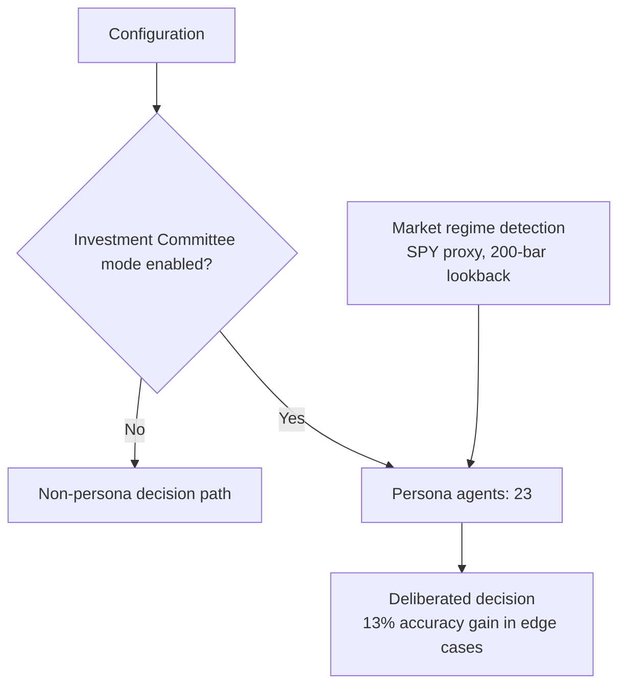

# Investor Persona System

The Investor Persona System is the part of the decision pipeline that runs multi-agent deliberation over a market view. It covers two distinct things: the configuration gate that decides whether persona-based deliberation runs at all, and the persona agents themselves, which are used to improve decision accuracy in edge cases. It matters because the persona path is optional rather than always-on, and because its measured benefit is concentrated in the cases where a single-pass decision is least reliable. Understanding the system therefore means understanding three separable pieces — the gate, the agents, and the market context they operate in.

## Configuration Gate: Investment Committee Mode

The system checks the configuration to determine if the Investment Committee mode should run using personas [3][6]. This is a runtime branch rather than a build-time choice: the persona path is entered only when the configuration says so. Two consequences follow directly. First, the persona system is not on the critical path for every run — a configuration that does not enable Investment Committee mode bypasses it. Second, the behavior of a given run is a function of configuration state, so reproducing a run requires capturing that state alongside the market inputs. Any evaluation that does not record the gate setting cannot distinguish a persona-driven result from a non-persona result.

## Persona Agents and Measured Accuracy

The persona layer is implemented with 23 persona agents [2][5]. The reported effect of using them is a 13% accuracy improvement in edge cases [2][5]. The qualifier carries weight: the improvement is stated for edge cases, not for the aggregate or the median case. An engineering reading is that the persona layer behaves as a variance-reduction mechanism — it pays off where the ordinary decision path is least confident — rather than as a uniform accuracy lift across all inputs. Evaluations of this system should therefore be stratified by case difficulty. A flat accuracy number computed over a mixed workload would dilute or hide the effect, and a benchmark composed only of routine cases would show little of it.

## Market Regime Detection

Market regime detection uses SPY as the market proxy and a 200-bar lookback period [1][4]. Both are fixed parameter choices that define the regime signal: SPY stands in for "the market," and 200 bars is the window over which the regime is characterized. Because the lookback is expressed in bars rather than calendar time, the effective horizon depends on the bar interval of the data being fed in — the same 200-bar window covers different wall-clock spans at different sampling frequencies. The regime output is the context in which persona deliberation is framed, so the same persona set evaluated under different regimes is not evaluating the same problem.

## Flow

The diagram reflects the three cited facts and nothing more: the configuration check gates the persona branch [3][6], the persona branch is populated by 23 agents [2][5], and regime detection supplies context using SPY over a 200-bar lookback [1][4].

## Operational Notes

- The persona path is gated by configuration [3][6]; treat the gate setting as part of the experiment record.
- Persona count is 23 [2][5]; the accuracy delta is 13% and is scoped to edge cases [2][5].
- Regime detection parameters are SPY and 200 bars [1][4]; the bar interval determines the wall-clock horizon of the lookback.

## See also

- Investment Committee Mode
- Market Regime Detection
- Persona Agents
- Configuration Gating
- Edge Case Evaluation

---

_Citations link to claims in evidence/claims/. Generated on 2026-09-21._
