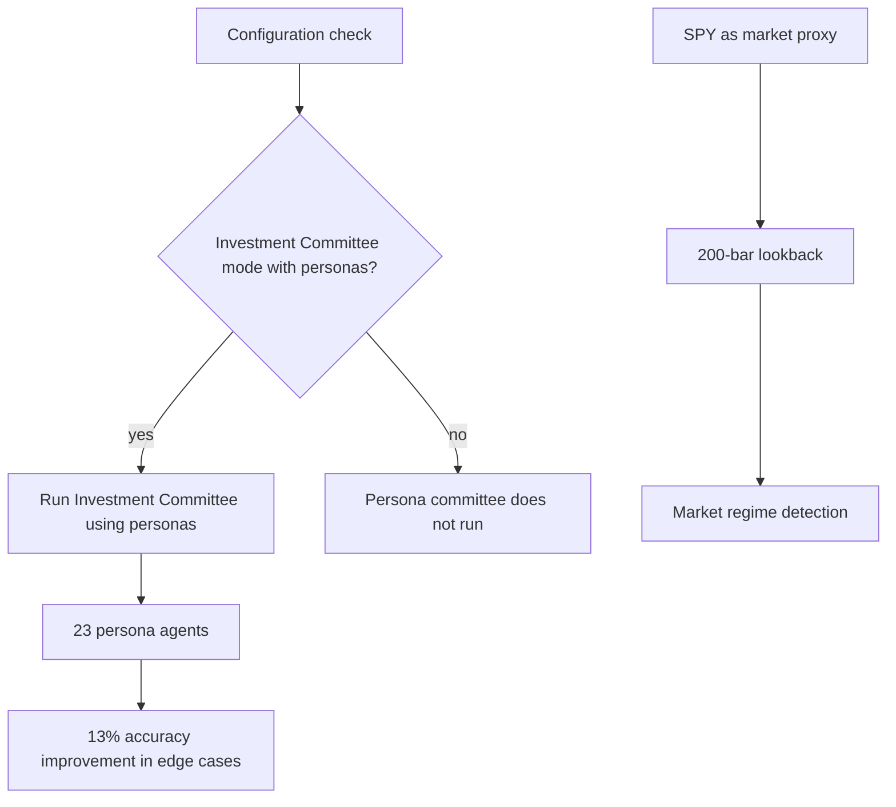

The Investor Persona System is the part of the decision stack that runs a set of persona agents as an Investment Committee, gated by configuration, alongside a market regime detector that supplies market context. It matters for two reasons: the persona layer is where a measurable accuracy gain in edge cases is reported, and the regime layer fixes the proxy and window that define what "the market" means to the rest of the system. This article covers the three mechanisms the evidence supports — regime detection, the persona agents themselves, and the configuration gate that decides whether the committee runs — and is explicit about where the evidence stops.

## Market regime detection

Market regime detection uses SPY as the market proxy and a 200-bar lookback period [1][4]. Two parameters are therefore fixed by definition: the instrument (SPY, standing in for the market as a whole) and the depth of history read (the trailing 200 bars). Regime classification is consequently a function of SPY price history over that window, not of a broader basket of instruments and not of a shorter or longer horizon.

This is the context layer. Because the proxy and the lookback are both pinned, the regime label is reproducible: the same SPY history produces the same classification. That property is what makes the regime output usable as an input elsewhere in the system rather than as a discretionary judgement.

## Persona agents and edge-case accuracy

The system uses 23 persona agents, and their use resulted in a 13% accuracy improvement in edge cases [2][5]. The claim has two separable parts and they should not be conflated. The first is structural: 23 distinct persona agents participate. The second is measured: a 13% improvement, reported specifically for edge cases.

The qualifier matters. The improvement is attributed to edge cases, not to aggregate accuracy and not to the bulk of routine decisions. Edge cases are where a single undifferentiated decision path is most likely to be underdetermined, so a gain concentrated there is consistent with the personas contributing differentiated reasoning rather than redundant agreement. The evidence does not break the 13% down further, and no per-persona contribution is stated.

## Configuration gate for Investment Committee mode

The system checks the configuration to determine whether the Investment Committee mode should run using personas [3][6]. This is a gate rather than a default. Persona-based committee operation is conditional on configuration state, and the check occurs before the mode runs. The practical consequence is that the same codebase can operate with or without the persona committee depending on how it is configured, without requiring a separate build or a code change.

## Flow

The diagram below is a schematic of the cited claims only. It deliberately does not draw an edge between regime detection and the persona committee, because the evidence does not specify how, or whether, the two are coupled.

## What the evidence does not cover

Three gaps are worth recording so the article is not read as more complete than it is. First, the coupling between the regime detector and the persona committee is unspecified — the regime detector's proxy and window are known [1][4], and the committee's gating and agent count are known [3][6][2][5], but no claim links them. Second, the 13% figure is scoped to edge cases only; no aggregate accuracy number is given [2][5]. Third, the composition of the 23 personas, their individual roles, and how their outputs are aggregated into a committee decision are not described in the available claims.

## See also

- Market Regime Detection
- Investment Committee Mode
- Persona Agents
- Configuration Gating
- SPY Market Proxy
- Edge-Case Accuracy

---

_Citations link to claims in evidence/claims/. Generated on 2026-09-21._
