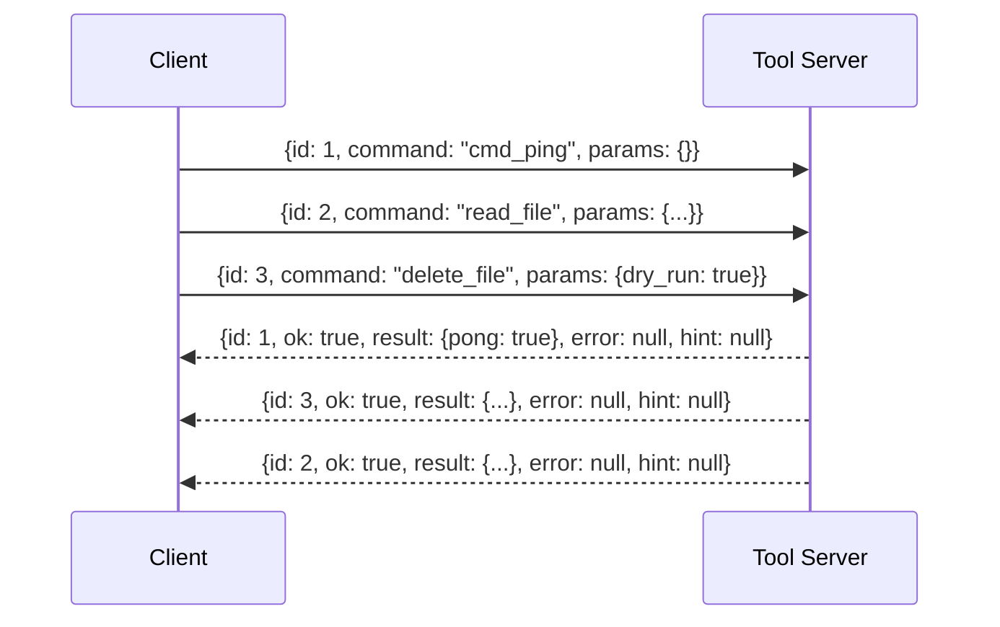

# JSON Envelope Protocol

The JSON Envelope Protocol is the framing convention used for command/response traffic between a client and a tool server. It defines three things: the shape of a command, the shape of the reply, and the metadata that lets a caller decide whether a command is safe to issue. It matters because it is the contract that makes concurrent tool execution tractable — without a stable envelope and a correlation key, a caller cannot tell which reply belongs to which request, and without safety tagging, a caller cannot tell a read from a deletion.

## Command and response shape

A command is a JSON object with three fields: `id`, `command`, and `params`. The response is a JSON object with five fields: `id`, `ok`, `result`, `error`, and `hint` [2][6]. The `id` field appears in both directions and is the join key between a request and its reply [2][6]. The `ok` flag distinguishes success from failure, with `result` carrying the payload on success and `error` carrying the failure detail; `hint` is available alongside either outcome [2][6].

## Correlation and concurrency

Many requests may be in flight at the same time, and each response is matched to its request by `id` [4][8]. Correlation is concurrency-safe, and the protocol relies on no shared mutable per-request state [4][8]. The practical consequence is that replies need not arrive in the order the commands were sent — the `id` field, not arrival order, determines which caller receives which result. This is what allows a single connection to carry overlapping work without the caller maintaining a side table of in-flight state that would have to be synchronized.

The diagram shows three commands issued back to back and three replies returned out of order. Each reply is routed by its `id` [4][8].

## Safety classes

Every tool is tagged with a safety class: `read_only`, `mutating`, `destructive`, or `runtime` [1][5]. The class determines what the envelope must carry. Mutating and destructive tools take a `dry_run` parameter, and destructive tools additionally require `confirm=True` [1][5]. This puts the risk level of an operation into the protocol itself rather than into documentation: a caller can inspect the tag before constructing `params`, and the server can reject a destructive command that arrives without explicit confirmation [1][5]. The `dry_run` parameter gives mutating and destructive tools a rehearsal path, so a caller can observe the intended effect before committing to it [1][5].

## Liveness

A `cmd_ping` command that returns `{pong: true}` is the liveness health check [3][7]. It uses the same envelope as any other command, so a health check is just another correlated request rather than a separate channel or out-of-band mechanism [3][7].

## Why the pieces fit together

The envelope, the correlation rule, and the safety tags are complementary. The envelope gives every exchange a uniform shape [2][6]; the `id` correlation rule makes concurrent exchanges safe without shared mutable state [4][8]; the safety class tells the caller which envelope fields are mandatory for a given tool [1][5]; and `cmd_ping` provides a minimal, always-available exchange that exercises the same path [3][7]. A client that implements these four rules can drive a tool server without special-casing individual tools.

## See also

- Tool safety classes (`read_only`, `mutating`, `destructive`, `runtime`)
- Dry-run and confirmation semantics
- Request correlation and multiplexing
- Liveness and health checks
- Tool server command dispatch

---

_Citations link to claims in evidence/claims/. Generated on 2026-09-21._
