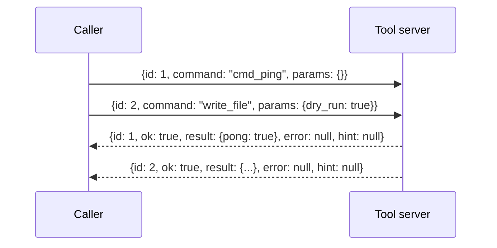

# JSON Envelope Protocol

The JSON Envelope Protocol is the message format used for request/response communication between a caller and a tool server. It fixes the shape of every command and every reply, defines how a reply is matched back to the request that produced it, and attaches a safety classification to each tool. It matters because it makes concurrent tool invocation predictable: a caller can have many commands outstanding at once, route each reply correctly without shared state, and know before dispatch whether a command is safe to run, needs a dry run, or requires explicit confirmation.

## Command envelope shape

Every command is a JSON object with three fields: `id`, `command`, and `params`. Every response is a JSON object with five fields: `id`, `ok`, `result`, `error`, and `hint` [2][6]. The `id` field appears in both directions and is the only element tying a reply to its request.

The `ok` field carries the success/failure verdict, `result` carries the payload on success, `error` carries the failure detail, and `hint` carries supplementary guidance alongside the outcome [2][6]. Because the envelope is fixed, a client can parse any response without knowing which command produced it.

## Correlation and concurrency

Many requests may be in flight simultaneously. Each response is matched to its request by `id`, and this correlation is concurrency-safe with no shared mutable per-request state [4][8]. Nothing in the protocol depends on arrival order or on a per-connection cursor; the identifier in the envelope carries the routing information, so replies may be processed in any order they arrive.

This is the property that makes the envelope usable for parallel work. A caller that issues several commands does not need to serialize them or maintain a mutable slot table to know which reply belongs where — the `id` field answers that question on its own [4][8].

## Safety classes

Every tool is tagged with a safety class drawn from `read_only`, `mutating`, `destructive`, or `runtime` [1][5]. Tools in the `mutating` and `destructive` classes accept a `dry_run` parameter, and `destructive` tools additionally require `confirm=True` before they will execute [1][5].

The classification is a property of the tool rather than of an individual call, so the safety posture of a command is determined by which tool it targets. The `dry_run` and `confirm` parameters are the mechanism by which a caller signals intent for the classes that require it [1][5].

## Liveness

A `cmd_ping` command that returns `{pong: true}` is the liveness health check [3][7]. Because it travels through the same envelope as any other command, the health check exercises the same correlation path as ordinary traffic rather than a separate side channel.

## Flow

The two requests are dispatched without waiting for the first reply. Responses may return in any order; the `id` field, not arrival order, determines which request each reply belongs to [4][8].

## Summary of the contract

| Element | Role |
| --- | --- |
| `id` | Correlates request and response; safe under concurrency [2][4][6][8] |
| `command` | Names the tool to invoke [2][6] |
| `params` | Carries arguments, including `dry_run` and `confirm` where required [1][2][5][6] |
| `ok` / `result` / `error` / `hint` | Report outcome, payload, failure detail, and guidance [2][6] |
| Safety class | `read_only`, `mutating`, `destructive`, or `runtime` [1][5] |

## See also

- Tool safety classes
- Dry run and confirmation semantics
- Request correlation and concurrency
- Liveness and health checks

---

_Citations link to claims in evidence/claims/. Generated on 2026-09-21._
