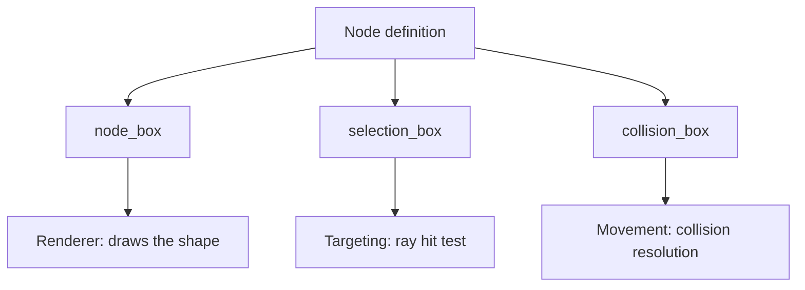

# Luanti Nodebox

A Luanti nodebox is the mechanism that lets a node — normally a full cube — take a non-cubic shape. The shape is expressed as a list of boxes inside the node definition, and the engine consumes that list for three separate purposes: drawing the node, targeting it with the selection ray, and colliding with it during movement. Because those purposes are configured independently, nodeboxes are the primary tool for partial geometry such as stairs, slabs, fences, and signs, and they are what keeps a block-based world from being limited to uniform cubes.

## Box lists in node definitions

A nodebox is a list of boxes written as `{x1,y1,z1,x2,y2,z2}` in node units, which run from −0.5 to 0.5 [2][5]. The list may contain any number of boxes, so one node can be assembled from several disjoint or overlapping volumes instead of being restricted to a single primitive [2][5]. The definition is typed, and the available types are `regular`, `fixed`, `leveled`, `wallmounted`, and `connected` [2][5]. The type governs how the box list is interpreted — for instance whether the shape stays fixed in place or adapts to neighbouring nodes — while the box list itself remains the geometric payload.

## Three independent box types

A Luanti node carries three independent box types: the visual `node_box`, the `selection_box` used for targeting, and the `collision_box` used for movement, and these can differ from each other [3][6]. This separation is the central design point. A fence post can be drawn as a thin post but selected as a slightly larger volume so it is easy to point at. A slab can be drawn as a half-height box while its collision box matches that same half-height volume. A decorative plant can be given a node box and a selection box while its collision box is empty or minimal. Because the three lists are configured separately, visual fidelity, interaction ergonomics, and physical behaviour do not have to agree [3][6].

The diagram shows the flow from a single node definition to three consumers. Each box list is resolved independently, so changing the collision box does not alter what is drawn, and changing the selection box does not alter what blocks movement.

## Comparison with other voxel engines

The same underlying problem — non-cubic shapes inside a voxel world — is solved differently elsewhere. godot_voxel runs two separate pipelines, a blocky one and a Transvoxel smooth one, over a single VoxelBuffer, and non-cubic shapes are handled by VoxelBlockyModel, which carries a `collision_aabbs` list for the box mover [1][4]. The structural similarity is that both systems reduce a non-cubic shape to a list of axis-aligned boxes, and both keep collision geometry as a list separate from the shape used for rendering [1][4]. The difference is scope. godot_voxel attaches its box list to a blocky model inside a dual-pipeline terrain system, whereas Luanti attaches it to a node definition and splits it into three independently configurable lists [1][4][3][6].

## Practical consequences

Two properties follow from the design. First, because a nodebox is an arbitrary-length list of boxes, shape complexity is bounded by the number of boxes an author is willing to write rather than by a fixed set of primitives [2][5]. Second, because the three box types are independent, an author can tune each one against a different constraint: the node box against appearance, the selection box against how easy the node is to point at, and the collision box against how the player moves around it [3][6]. The typed variants — `regular`, `fixed`, `leveled`, `wallmounted`, and `connected` — then determine how the box list is resolved in context, which is what allows the same box-list format to cover both static decorative shapes and shapes that respond to their neighbours [2][5].

## See also

- VoxelBlockyModel
- collision_aabbs
- VoxelBuffer
- Transvoxel
- Selection box and raycast targeting
- Node definition
- Collision box

---

_Citations link to claims in evidence/claims/. Generated on 2026-09-21._
