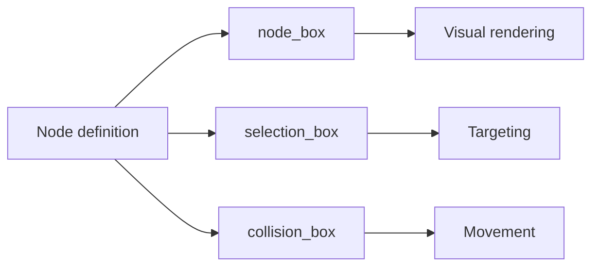

# Luanti Nodebox

A nodebox is Luanti's mechanism for giving a node a shape other than a full cube. Rather than one cube per node, the node definition carries a list of axis-aligned boxes that describe the node's geometry. This matters because it lets a voxel world contain non-cubic shapes — partial blocks, thin panels, multi-part constructions — while the underlying world representation stays on the node grid. The nodebox is the point where a grid-aligned world admits geometry that is not itself grid-shaped.

## Box lists in node definitions

Luanti nodeboxes are box lists in node definitions, given as `{x1,y1,z1,x2,y2,z2}` in node units spanning −0.5 to 0.5 [2][5]. A definition may contain any number of boxes [2][5]. The box list is typed, and the available types are `regular`, `fixed`, `leveled`, `wallmounted`, and `connected` [2][5].

Two properties follow from this format. First, because coordinates are expressed in node units centred on the node origin, a box list is a local description of shape rather than a world-space one — the same list applies wherever the node is placed. Second, because the count of boxes is unbounded, a single node can be composed of several disjoint or overlapping parts rather than being limited to one convex volume.

## Three independent box roles

A Luanti node has three independent box types: the visual `node_box`, the `selection_box` used for targeting, and the `collision_box` used for movement [3][6]. These can differ from each other [3][6].

That independence is the substantive part of the design. What a player sees, what a player can point at, and what a player can walk into are three separate decisions, each with its own box list. A node can render as a thin decorative shape while presenting a full-cube collision volume, or render as a full cube while offering a smaller selection target. Nothing in the model forces the three to agree, so the shape a node presents to the renderer, to the targeting system, and to the movement system is configurable per node.

## Comparison with godot_voxel

Another voxel engine, godot_voxel, addresses the same problem differently. It runs two separate pipelines — blocky and Transvoxel smooth — over one VoxelBuffer [1][4]. Non-cubic shapes there are handled by VoxelBlockyModel, which carries a `collision_aabbs` list for the box mover [1][4].

The contrast is structural rather than a matter of one approach being better. In godot_voxel, non-cubic shape data is attached to a model object consumed by the blocky pipeline, and collision is a single list of AABBs read by the box mover [1][4]. In Luanti, the shape description lives in the node definition and is split across three named box fields with distinct consumers [2][3][5][6]. Both keep collision as a list of axis-aligned boxes; they differ in where that list lives and how many roles it is divided into.

## Why the split matters

The three-way split in Luanti means a node's visual, targeting, and movement geometry are decoupled at the definition level [3][6]. Combined with an unbounded box count and a typed box list [2][5], this gives node authors a shape vocabulary that is expressed entirely in node-local coordinates and does not require the world representation to change. The engine's voxel grid stays uniform; the irregularity is confined to the per-node box lists.

## See also

- Node definition
- `node_box`
- `selection_box`
- `collision_box`
- VoxelBlockyModel
- `collision_aabbs`
- VoxelBuffer
- Transvoxel smooth pipeline

---

_Citations link to claims in evidence/claims/. Generated on 2026-09-21._
