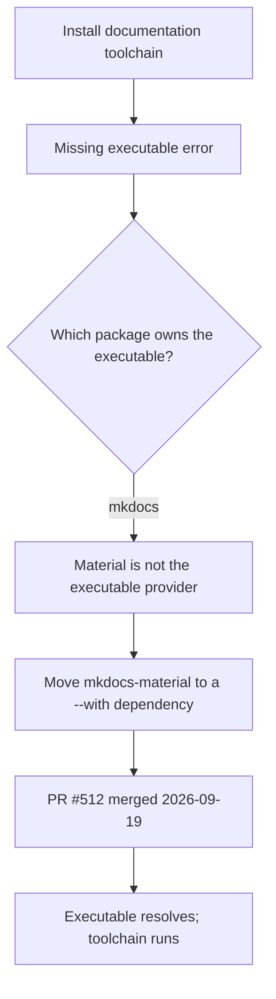

# MkDocs Material Installation Issue

This article covers a packaging defect in the MkDocs Material toolchain: installations that declared the Material theme as an ordinary dependency failed with a missing executable error. It matters because the failure is not a bug in the theme itself — it is a dependency-declaration problem, and the fix is a one-line change in how the package is attached to the command that runs it. Understanding which package owns the executable is the whole of the diagnosis.

## Symptom

The observable failure was a missing executable error during installation or first run. The Material theme package was requested, but the command the build expected to invoke was not present on the path, so the toolchain could not start. The error surfaced as an installation problem even though nothing was wrong with the installed files themselves [3][6].

## Root cause: the executable belongs to `mkdocs`

The key diagnostic fact is that the executable belongs to `mkdocs`, not to the theme package. Material is a theme that rides alongside the core tool; it does not provide the entry point. Therefore Material must ride as a `--with` dependency rather than as the primary package being installed [2][5].

This distinction is easy to miss. A `--with` dependency attaches a package to a command invocation without making it the package that supplies the executable. When Material was declared the other way around, the resolver satisfied the theme requirement but never placed the `mkdocs` executable where the invocation expected it — producing exactly the missing executable error observed [2][5].

## Fix

The resolution was to move `mkdocs-material` to a `--with` dependency. That change directly addressed the missing executable error, because it restored the correct relationship between the executable provider (`mkdocs`) and the theme that accompanies it [3][6].

The change was carried in PR #512, which was merged on 2026-09-19 [1][4]. After the merge, the dependency declaration matched the ownership model: the core tool supplies the executable, and Material is attached as a companion dependency.

## Flow of the diagnosis and fix

The diagram reflects the actual reasoning order recorded in the evidence: the error is observed first, the ownership question is answered second, and the dependency change follows from that answer rather than from trial and error [2][5][3][6].

## Practical takeaway

When a toolchain reports a missing executable, check which package in the dependency set actually ships that executable before adjusting versions or reinstalling. In this case the answer was unambiguous — the executable belongs to `mkdocs`, and Material must ride as a `--with` dependency [2][5]. Any future change to the dependency declaration should preserve that split; collapsing Material back into the primary dependency position would reintroduce the same failure mode.

## See also

- MkDocs — the core tool that provides the executable [2][5]
- MkDocs Material — the theme package attached as a `--with` dependency [3][6]
- `--with` dependencies — attaching a package to a command without making it the executable provider [2][5]
- PR #512 — the merged change that moved `mkdocs-material` to a `--with` dependency, merged 2026-09-19 [1][4]
- Missing executable errors — diagnosing which package owns a command before changing dependency declarations [3][6]

---

_Citations link to claims in evidence/claims/. Generated on 2026-09-21._
