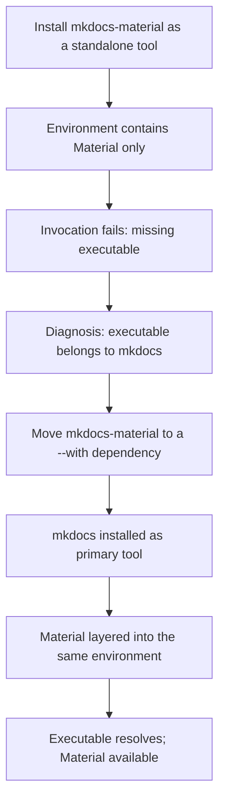

# MkDocs Material Installation Issue

This article covers the installation failure that occurs when MkDocs Material is set up as a standalone tool instead of as a companion dependency of MkDocs, and the change that resolved it. It matters because the failure presents as a missing executable rather than as a configuration error, which makes the cause non-obvious: the package that provides the theme is not the package that provides the command being invoked. The fix was a packaging change, not a code change, and it was merged as PR #512 on 2026-09-19 [1][4].

## Symptom

The observable failure is a missing executable error. The command that the user expects to run is not present on the system after installation, even though the Material package itself was installed successfully [3][6]. Because the install step reports success, the error surfaces later, at invocation time, and points at the executable rather than at the dependency graph that produced it.

## Root cause

The executable belongs to `mkdocs`; Material must ride as a `--with` dependency [2][5]. In other words, the entry point that users invoke is owned by the core MkDocs package. Material is a theme and extension layer that attaches to that entry point. When Material is installed on its own, the theme files are present but the executable they are meant to extend is not, so the invocation fails.

This is a dependency-ownership problem rather than a version or compatibility problem. The two packages have different roles:

- `mkdocs` provides the executable and the build pipeline.
- `mkdocs-material` provides the theme and its supporting assets, and is expected to be layered onto the `mkdocs` environment.

Treating Material as a top-level tool inverts that relationship. The installer creates an isolated environment containing only Material, and the executable that Material depends on is never pulled in.

## Resolution

`mkdocs-material` was moved to a `--with` dependency to resolve the missing executable error [3][6]. The `--with` mechanism attaches an additional package to the environment created for a primary tool, so the primary tool's executable and the companion package coexist in the same environment. Moving Material into that position means the `mkdocs` executable is installed as the primary tool and Material is layered alongside it, which matches the ownership model described above [2][5].

The change was merged as PR #512 on 2026-09-19 [1][4].

## Flow

## Practical takeaway

When a plugin, theme, or extension package is installed as a standalone tool and the resulting command is missing, check which package actually owns the executable before changing versions or reinstalling. If the executable belongs to a different package than the one being installed, the correct fix is to install that package as the primary tool and attach the companion package as a `--with` dependency [2][5]. That is exactly the shape of the change made in PR #512 [1][4].

## See also

- MkDocs
- Material for MkDocs
- `--with` dependency
- Missing executable error
- PR #512

---

_Citations link to claims in evidence/claims/. Generated on 2026-09-21._
