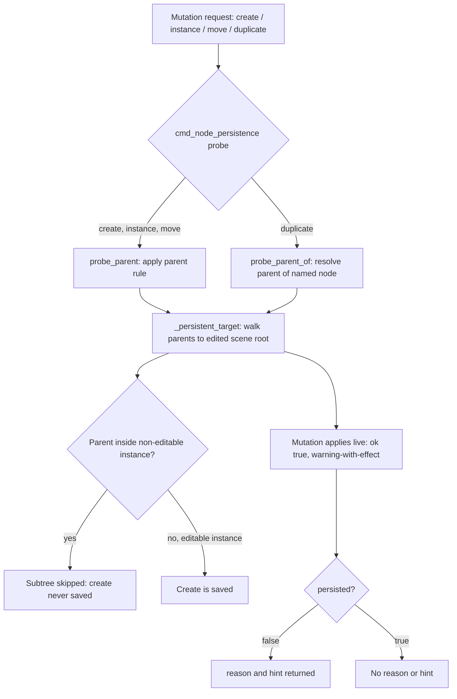

Multi-target handling in Godot covers how editor-side mutations decide whether a change to a node will actually be written back to a scene file. The problem is that a node's parent may live inside an instanced scene, and whether that instance is editable determines whether a create, instance, move, or duplicate operation survives a save. Getting this wrong produces the worst class of bug: an operation that reports success, applies visibly in the editor, and then silently disappears. This article describes the parent rule the engine applies, the target-resolution walk that backs it, and the probe commands that let callers ask about persistence before committing to a mutation.

## The parent rule and skipped subtrees

The engine's traversal is the root of the behaviour. It visits the children of a skipped node's subtree, which means the skip is not a hard stop for the whole branch — descendants are still considered. The practical consequence is a create whose parent sits inside a non-editable instance is never saved, while the same create under an editable instance is saved [1][4]. The deciding factor is therefore not the node being created, but the editability of the instance that owns its parent. Any tooling that reasons about persistence has to resolve the parent chain rather than inspect the node in isolation.

## Resolving the persistent target

`_persistent_target` implements that resolution. It walks parents upward to the edited scene root, establishing the node that a mutation will actually be attributed to for persistence purposes [2][5]. The walk is what connects a deeply nested node back to the scene that owns the save.

The result contract is deliberately split. Mutations apply live, returning `ok: true` together with a warning-with-effect — the change happens in the running editor state, and the warning signals that persistence is not guaranteed [2][5]. Separately, the result carries `persisted`, and when that value is false it also carries `reason` and `hint` [2][5]. This separation matters: `ok` describes whether the mutation was applied, while `persisted` describes whether it will survive. Callers that conflate the two will report success for changes that are never written.

## Probing before mutating

`cmd_node_persistence` exposes the rule as a query so callers can check before acting. It gains two probes: `probe_parent`, which applies the parent rule for create, instance, and move operations, and `probe_parent_of`, which resolves the parent of the named node for duplicate operations [3][6]. The split reflects the fact that duplicate needs to resolve a parent from a node name rather than from an operation's own parent argument.

## Why the split contract is useful

Because `ok` and `persisted` are independent, a caller can apply a mutation immediately and still surface an accurate warning to the user. The `reason` and `hint` fields give that warning something actionable to say when `persisted` is false [2][5]. Combined with the probes, this lets a tool either pre-check with `probe_parent` or `probe_parent_of` and avoid the mutation entirely, or apply it and report the persistence outcome afterwards [3][6]. Both paths depend on the same underlying walk to the edited scene root [2][5] and the same parent rule about skipped subtrees [1][4].

## See also

- Editable instances and scene instancing
- Scene save and persistence semantics
- `_persistent_target` parent resolution
- `cmd_node_persistence` probe commands
- Editor mutation result contracts (`ok`, `persisted`, `reason`, `hint`)

---

_Citations link to claims in evidence/claims/. Generated on 2026-09-21._
