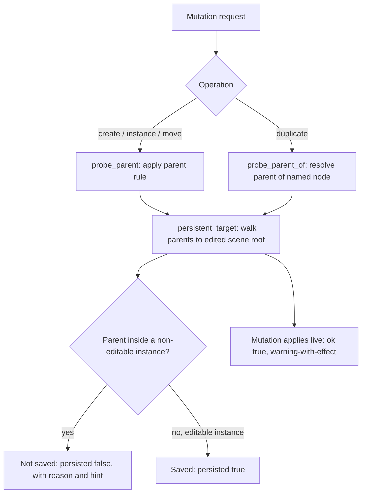

# Multi-Target Handling in Godot

In Godot's editor tooling, a single mutation command — create a node, instance a scene, move a node, duplicate one — can be aimed at a node whose ancestry crosses one or more scene instance boundaries. Multi-target handling is the set of rules and probes that decide which scene file, if any, actually receives that change. The distinction matters because a mutation can apply successfully in the running editor and still never be written to disk, so the result is lost the next time the scene is loaded [1][4].

## The persistence rule: skipped subtrees and editable instances

The engine visits the children of a skipped node's subtree [1][4]. That traversal detail is what makes the parent rule observable in practice: a create whose parent sits inside a non-editable instance is never saved, while the same create under an editable instance is saved [1][4]. The deciding factor is therefore not the node being created, but the editability of the instance that owns its parent.

## Resolving the target: `_persistent_target`

`_persistent_target` is the resolver for this decision. It walks parents up to the edited scene root to determine which scene should own the mutation [2][5]. Two behaviours follow from that design:

- **Mutations apply live.** The change takes effect in the editor immediately, reported with `ok: true` and a warning-with-effect — the warning signals that persistence is uncertain, not that the operation failed [2][5].
- **Persistence is reported separately.** The result carries `persisted`, and when that value is false it also carries `reason` and `hint`, so callers can distinguish "applied but not saved" from "rejected" [2][5].

Keeping these two signals apart is what allows a caller to react correctly: a live mutation with `persisted: false` is a different situation from a command that never ran.

## Probing before mutating: `probe_parent` and `probe_parent_of`

`cmd_node_persistence` gains two probes that let a caller ask the persistence question before committing to it [3][6]:

- `probe_parent` covers create, instance, and move — the operations governed by the parent rule [3][6].
- `probe_parent_of` covers duplicate, and resolves the parent of the named node rather than assuming the caller already knows it [3][6].

Splitting the probes this way reflects that duplicate does not follow the same path as the other three operations: it has to locate the source node's parent first, which is why it takes a node name and resolves the parent itself [3][6].

## Flow

The diagram shows the two entry points converging on the same resolver, and the two outcomes that the resolver can report. Note that the live application of the mutation is not conditional on the persistence outcome — it happens either way, with the warning-with-effect attached [2][5].

## See also

- Editable instances
- Skipped nodes and subtree traversal
- `_persistent_target`
- `cmd_node_persistence`
- `probe_parent` and `probe_parent_of`
- Create, instance, move, and duplicate commands
- Warning-with-effect semantics
- `persisted`, `reason`, and `hint` result fields

---

_Citations link to claims in evidence/claims/. Generated on 2026-09-21._
